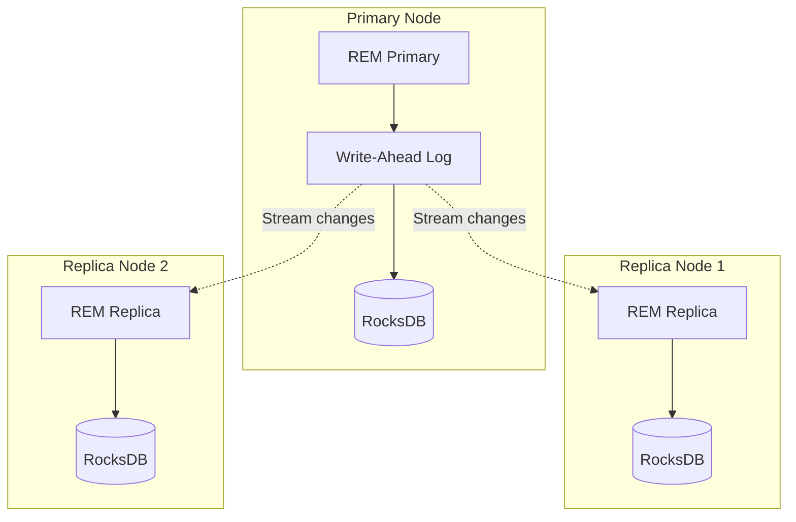

# REM Database Replication

## Overview

This document describes the replication strategy for REM (Resources-Entities-Moments) databases across multiple nodes. The goal is to enable n-way replication (n >= 2) with built-in sync features that can be tested locally before deployment to Kubernetes.

## Design Goals

1. **N-way replication** - Support 2+ replica nodes
2. **Change log streaming** - Real-time replication via WAL
3. **Built-in sync** - RocksDB-native replication protocol
4. **Local testing** - Verify sync between two local RocksDB instances
5. **Pod-managed** - Replication handled by application code
6. **Crash recovery** - Replicas can recover from primary failure

## Architecture



## Replication Protocol

### Change Log Format

```rust
#[derive(Serialize, Deserialize)]
pub struct ChangeLogEntry {
    /// Sequence number (monotonically increasing)
    pub sequence: u64,

    /// Timestamp of change
    pub timestamp: i64,

    /// Operation type
    pub operation: Operation,

    /// Column family
    pub cf: String,

    /// Key
    pub key: Vec<u8>,

    /// Value (None for deletes)
    pub value: Option<Vec<u8>>,

    /// Checksum for validation
    pub checksum: u64,
}

#[derive(Serialize, Deserialize)]
pub enum Operation {
    Put,
    Delete,
    Merge,
}
```

### Replication Stream

Primary streams changes to replicas:

```rust
pub struct ReplicationStream {
    /// Primary database
    db: Arc<DB>,

    /// Replica endpoints
    replicas: Vec<ReplicaEndpoint>,

    /// Current sequence number
    sequence: AtomicU64,

    /// Replication buffer
    buffer: VecDeque<ChangeLogEntry>,
}

impl ReplicationStream {
    pub async fn stream_changes(&mut self) -> Result<()> {
        loop {
            // Wait for changes in WAL
            let changes = self.db.get_updates_since(self.sequence.load())?;

            for change in changes {
                let entry = ChangeLogEntry {
                    sequence: self.sequence.fetch_add(1),
                    timestamp: Utc::now().timestamp(),
                    operation: change.operation,
                    cf: change.cf,
                    key: change.key,
                    value: change.value,
                    checksum: calculate_checksum(&change),
                };

                // Buffer entry
                self.buffer.push_back(entry.clone());

                // Send to all replicas
                for replica in &self.replicas {
                    replica.send(entry.clone()).await?;
                }
            }

            tokio::time::sleep(Duration::from_millis(10)).await;
        }
    }
}
```

### Replica Application

Replicas apply changes from primary:

```rust
pub struct ReplicaNode {
    /// Replica database
    db: Arc<DB>,

    /// Expected next sequence
    next_sequence: AtomicU64,

    /// Sync state
    sync_state: Arc<RwLock<SyncState>>,
}

impl ReplicaNode {
    pub async fn apply_changes(&self, entry: ChangeLogEntry) -> Result<()> {
        // Verify sequence
        let expected = self.next_sequence.load();
        if entry.sequence != expected {
            return Err(Error::SequenceMismatch {
                expected,
                actual: entry.sequence,
            });
        }

        // Verify checksum
        if !verify_checksum(&entry) {
            return Err(Error::ChecksumFailed);
        }

        // Apply change
        let cf = self.db.cf_handle(&entry.cf)?;
        match entry.operation {
            Operation::Put => {
                self.db.put_cf(cf, &entry.key, entry.value.unwrap())?;
            }
            Operation::Delete => {
                self.db.delete_cf(cf, &entry.key)?;
            }
            Operation::Merge => {
                self.db.merge_cf(cf, &entry.key, entry.value.unwrap())?;
            }
        }

        // Update sequence
        self.next_sequence.fetch_add(1);

        // Update sync state
        let mut state = self.sync_state.write().await;
        state.last_applied = entry.sequence;
        state.last_applied_time = Utc::now();

        Ok(())
    }
}
```

## Sync State Tracking

### Sync State

```rust
#[derive(Debug, Clone)]
pub struct SyncState {
    /// Last sequence applied
    pub last_applied: u64,

    /// Last applied timestamp
    pub last_applied_time: DateTime<Utc>,

    /// Lag in sequences
    pub lag: u64,

    /// Lag in time
    pub time_lag_ms: i64,

    /// Sync status
    pub status: SyncStatus,
}

#[derive(Debug, Clone, PartialEq)]
pub enum SyncStatus {
    Syncing,
    Synced,
    Lagging,
    Disconnected,
}
```

### Lag Monitoring

```rust
impl ReplicationStream {
    pub async fn monitor_lag(&self) -> Vec<ReplicaLag> {
        let mut lags = Vec::new();

        for replica in &self.replicas {
            let status = replica.get_sync_state().await;
            let current_seq = self.sequence.load();

            let lag = ReplicaLag {
                replica_id: replica.id.clone(),
                sequence_lag: current_seq - status.last_applied,
                time_lag_ms: (Utc::now() - status.last_applied_time)
                    .num_milliseconds(),
                status: if status.lag < 100 {
                    SyncStatus::Synced
                } else if status.lag < 1000 {
                    SyncStatus::Lagging
                } else {
                    SyncStatus::Disconnected
                },
            };

            lags.push(lag);
        }

        lags
    }
}
```

## Local Testing

### Two-Node Setup

Test replication between two local RocksDB instances:

```rust
#[cfg(test)]
mod tests {
    use super::*;

    #[tokio::test]
    async fn test_two_node_replication() {
        // Create primary
        let primary = ReplicationStream::new(
            "/tmp/rocksdb-primary",
            vec![
                ReplicaEndpoint::new("replica1", "localhost:9001"),
            ],
        ).await.unwrap();

        // Create replica
        let replica = ReplicaNode::new(
            "/tmp/rocksdb-replica1",
            "localhost:9001",
        ).await.unwrap();

        // Start replication
        tokio::spawn(async move {
            primary.stream_changes().await.unwrap();
        });

        tokio::spawn(async move {
            replica.receive_changes().await.unwrap();
        });

        // Write to primary
        primary.db.put(b"key1", b"value1").unwrap();
        primary.db.put(b"key2", b"value2").unwrap();

        // Wait for sync
        tokio::time::sleep(Duration::from_millis(100)).await;

        // Verify replica has data
        let value1 = replica.db.get(b"key1").unwrap();
        assert_eq!(value1, Some(b"value1".to_vec()));

        let value2 = replica.db.get(b"key2").unwrap();
        assert_eq!(value2, Some(b"value2".to_vec()));

        // Verify sync state
        let state = replica.get_sync_state().await;
        assert_eq!(state.status, SyncStatus::Synced);
        assert!(state.lag < 10);
    }

    #[tokio::test]
    async fn test_replica_failover() {
        // Create primary and replica
        let primary = ReplicationStream::new(...).await.unwrap();
        let replica = ReplicaNode::new(...).await.unwrap();

        // Start replication
        // ... (as above)

        // Write data
        for i in 0..1000 {
            primary.db.put(format!("key{}", i).as_bytes(), b"value").unwrap();
        }

        // Wait for sync
        wait_for_sync(&replica).await;

        // Kill primary
        drop(primary);

        // Promote replica to primary
        let new_primary = replica.promote_to_primary().await.unwrap();

        // Verify data is intact
        for i in 0..1000 {
            let value = new_primary.db.get(format!("key{}", i).as_bytes()).unwrap();
            assert_eq!(value, Some(b"value".to_vec()));
        }
    }

    #[tokio::test]
    async fn test_consistency_after_network_partition() {
        // Create primary and two replicas
        let primary = ReplicationStream::new(...).await.unwrap();
        let replica1 = ReplicaNode::new(...).await.unwrap();
        let replica2 = ReplicaNode::new(...).await.unwrap();

        // Start replication
        // ...

        // Write initial data
        primary.db.put(b"key", b"v1").unwrap();
        wait_for_sync(&replica1).await;
        wait_for_sync(&replica2).await;

        // Simulate network partition (disconnect replica2)
        replica2.disconnect().await;

        // Write more data
        primary.db.put(b"key", b"v2").unwrap();
        primary.db.put(b"key", b"v3").unwrap();

        // Only replica1 should be synced
        wait_for_sync(&replica1).await;
        assert_eq!(replica1.db.get(b"key").unwrap(), Some(b"v3".to_vec()));

        // Reconnect replica2
        replica2.reconnect().await;
        wait_for_sync(&replica2).await;

        // Verify replica2 caught up
        assert_eq!(replica2.db.get(b"key").unwrap(), Some(b"v3".to_vec()));
    }
}
```

## Network Protocol

### TCP Stream

Use TCP for reliable change streaming:

```rust
pub struct ReplicaEndpoint {
    pub id: String,
    pub addr: SocketAddr,
    stream: Option<TcpStream>,
}

impl ReplicaEndpoint {
    pub async fn connect(&mut self) -> Result<()> {
        let stream = TcpStream::connect(self.addr).await?;
        self.stream = Some(stream);
        Ok(())
    }

    pub async fn send(&mut self, entry: ChangeLogEntry) -> Result<()> {
        let stream = self.stream.as_mut().ok_or(Error::NotConnected)?;

        // Serialize entry
        let bytes = bincode::serialize(&entry)?;

        // Send length prefix
        let len = bytes.len() as u32;
        stream.write_all(&len.to_be_bytes()).await?;

        // Send entry
        stream.write_all(&bytes).await?;
        stream.flush().await?;

        Ok(())
    }
}
```

## Crash Recovery

### Primary Crash

Replica promotion:

```rust
impl ReplicaNode {
    pub async fn promote_to_primary(self) -> Result<ReplicationStream> {
        // Wait for pending writes to complete
        self.db.flush()?;

        // Convert to primary
        let primary = ReplicationStream::new(
            self.db.path(),
            vec![], // No replicas initially
        ).await?;

        // Start accepting writes
        Ok(primary)
    }
}
```

### Replica Crash

Replica recovery:

```rust
impl ReplicaNode {
    pub async fn recover(&mut self, primary: &ReplicationStream) -> Result<()> {
        // Get last applied sequence
        let last_applied = self.next_sequence.load();

        // Request catch-up from primary
        let changes = primary.get_changes_since(last_applied).await?;

        // Apply all missed changes
        for change in changes {
            self.apply_changes(change).await?;
        }

        // Resume normal replication
        Ok(())
    }
}
```

## Performance Considerations

### Batching

Batch changes for efficiency:

```rust
pub struct ReplicationBatch {
    entries: Vec<ChangeLogEntry>,
    max_size: usize,
    max_wait: Duration,
}

impl ReplicationBatch {
    pub async fn flush(&mut self) -> Result<()> {
        if self.entries.is_empty() {
            return Ok(());
        }

        // Send batch to replicas
        for replica in &self.replicas {
            replica.send_batch(&self.entries).await?;
        }

        self.entries.clear();
        Ok(())
    }
}
```

### Compression

Compress change log for network efficiency:

```rust
pub async fn send_compressed_batch(entries: &[ChangeLogEntry]) -> Result<()> {
    // Serialize
    let bytes = bincode::serialize(entries)?;

    // Compress with zstd
    let compressed = zstd::encode_all(&bytes[..], 3)?;

    // Send compressed
    stream.write_all(&compressed).await?;

    Ok(())
}
```

## Next Steps

1. **Implement replication protocol** - Build Rust implementation
2. **Local testing** - Verify two-node sync
3. **Performance testing** - Measure replication lag
4. **Failure testing** - Test crash recovery scenarios
5. **Integration** - Connect to Kubernetes pod lifecycle
6. **Monitoring** - Add metrics for replication health
