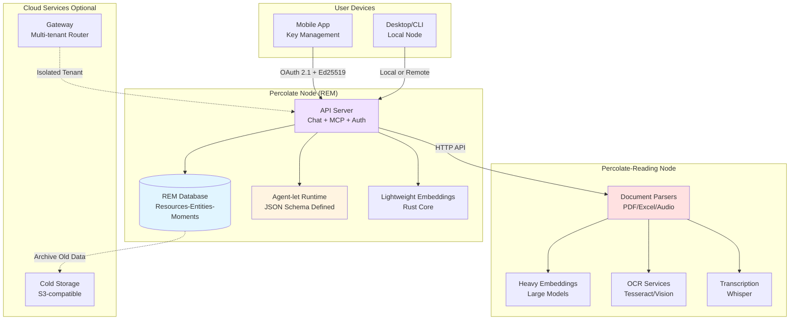
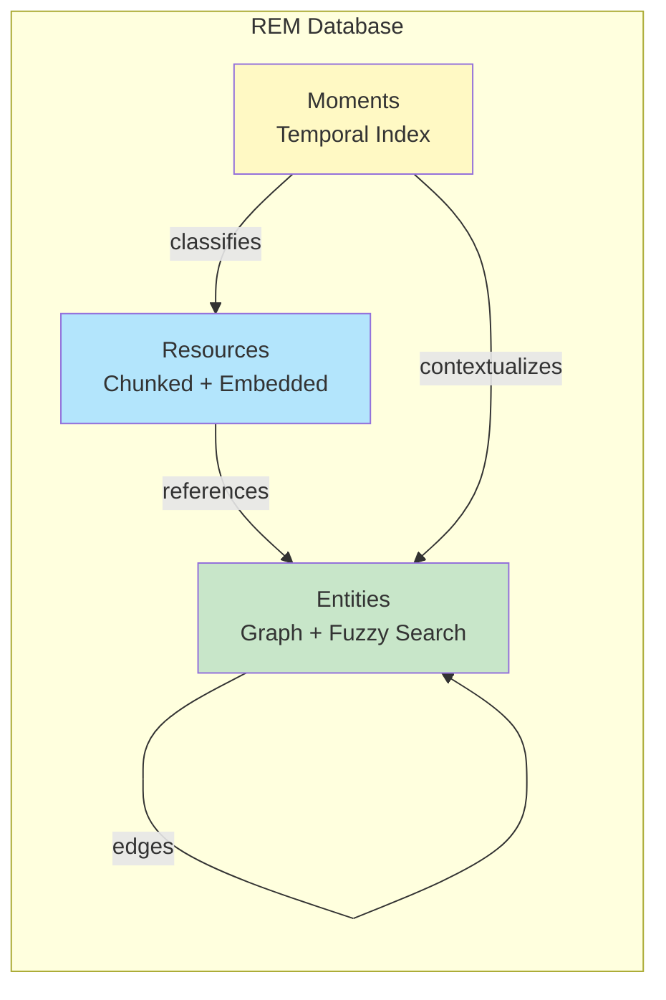
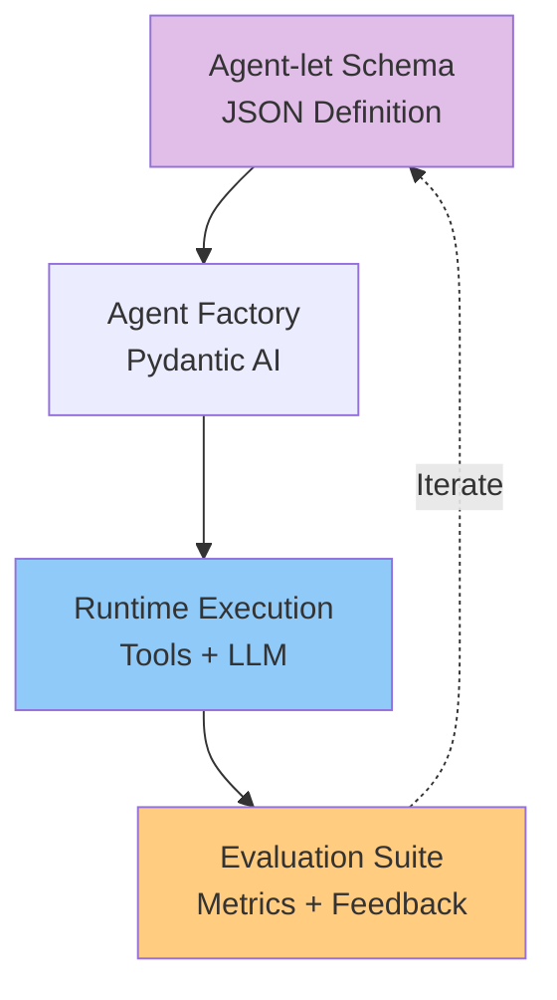
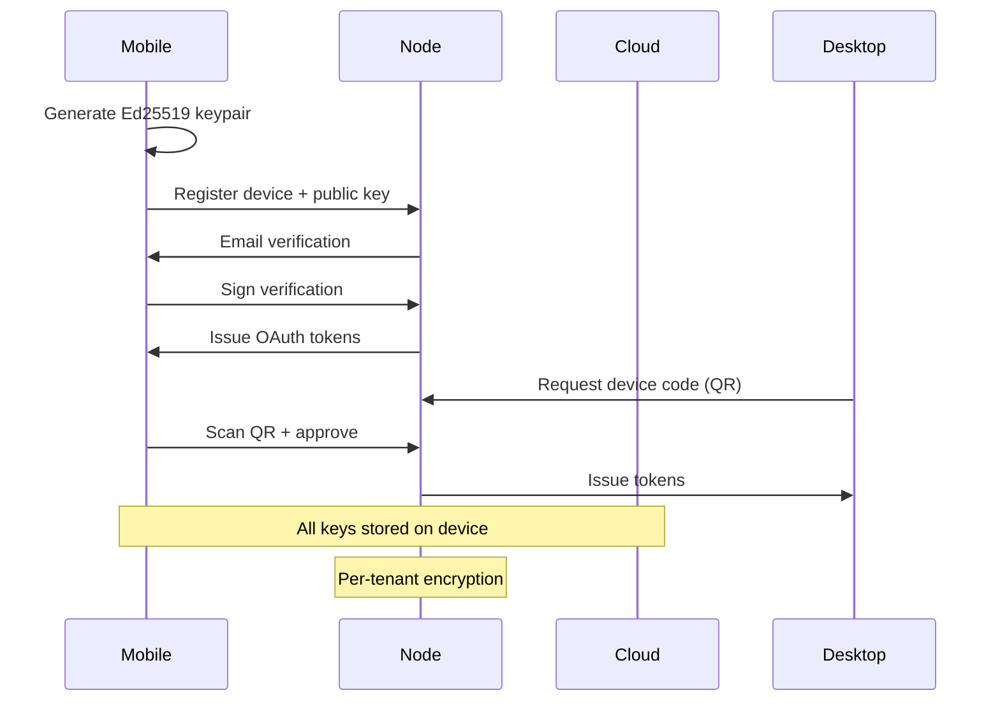

# Percolate

**Personal AI Node for Privacy-First Agentic Intelligence**

Percolate is a run-anywhere personal AI node designed for individuals who want full control over their AI assistants and data. It combines bio-inspired memory systems, privacy-first architecture, and trainable agent-lets into a unified platform that runs on desktop, mobile, or cloud infrastructure with complete tenant isolation.

## Overview

Percolate enables users to:
- **Own their AI memory**: Store years of personal context in an embedded database with semantic, temporal, and procedural memory systems
- **Train personal assistants**: Create and refine agent-lets (AI skills) through evaluation and feedback loops
- **Run anywhere**: Deploy locally on devices or in the cloud with complete data isolation
- **Control privacy**: End-to-end encryption with mobile-first key management
- **Interoperate seamlessly**: OpenAI-compatible chat API and Model Context Protocol (MCP) support

## Architecture Philosophy

### Two-Node Architecture

Percolate uses a **specialized node architecture** for optimal performance and resource usage:

1. **Percolate (REM Node)**: Lightweight memory, agents, and API server
2. **Percolate-Reading (Reader Node)**: Heavy multimedia processing services



**Why Two Nodes?**

- **Percolate**: Runs everywhere (desktop, mobile, cloud) with minimal resources
- **Percolate-Reading**: Deployed separately for heavy processing, scales independently
- **Lightweight embeddings**: Rust core provides fast, small-footprint embeddings for basic operations
- **Heavy models**: Large embedding models, OCR, and transcription in dedicated reading node
- **API boundary**: Clean separation via HTTP API, both use Pydantic Settings

## Core Components

### 1. REM Memory System

**Resources-Entities-Moments** is a bio-inspired memory architecture that mirrors human memory systems:

| Memory Type | Description | Storage | Use Case |
|------------|-------------|---------|----------|
| **Resources** | Semantic searchable chunks | Vector embeddings | Documents, files, uploaded content |
| **Entities** | Key-value domain knowledge | Graph + KV | People, concepts, learned patterns |
| **Moments** | Temporal classifications | Time-indexed | Events, conversations, workflow history |



**Features:**
- **Iterated retrieval**: Navigate entity relationships for context discovery
- **Hybrid search**: Combine semantic vectors, fuzzy matching, and graph traversal
- **Tenant scoped**: Complete data isolation per user
- **Efficient storage**: Years of metadata in embedded RocksDB or PostgreSQL

### 2. Agent-let Framework

Agent-lets are AI skills defined as JSON schemas (not code) that can be trained, evaluated, and versioned:



**Agent-let Characteristics:**
- **Data-driven**: System prompts, tools, and outputs defined in JSON
- **Versioned**: Treat agents as artifacts with semantic versioning
- **Evaluable**: Built-in evaluation framework with cost/quality metrics
- **Composable**: Agents can call other agents via MCP tools
- **Observable**: OpenTelemetry instrumentation for tracing and feedback

### 3. Document Processing Pipeline

Advanced document parsing with semantic extraction and visual verification:

| Format | Capability | Output |
|--------|-----------|--------|
| **PDF** | Semantic + OCR + visual verification | Markdown + tables + images |
| **Excel** | Multi-sheet analysis + structure detection | Structured data + metadata |
| **Audio** | Speech-to-text + speaker diarization | Transcripts + timestamps |
| **Office** | Document extraction | Clean markdown |

**Processing Strategy:**
1. Fast semantic extraction (primary path)
2. Quality flags for uncertain content
3. On-demand visual verification (LLM vision models)
4. Structured artifacts (tables, images, metadata)

### 4. Privacy-First Authentication



**Security Features:**
- **Mobile as keychain**: Private keys never leave device
- **OAuth 2.1 compliance**: PKCE mandatory, no implicit flow
- **Ed25519 signatures**: Device authentication
- **Per-tenant encryption**: RocksDB encrypted at rest
- **S3 credential derivation**: HKDF-based scoped credentials

## API Endpoints

Percolate exposes a standard API surface:

| Endpoint | Purpose | Protocol |
|----------|---------|----------|
| `/v1/chat/completions` | OpenAI-compatible chat | HTTP/SSE streaming |
| `/v1/ingest/upload` | Document upload + parsing | HTTP multipart |
| `/mcp` | Model Context Protocol | SSE |
| `/oauth/*` | OAuth 2.1 flows | HTTP |
| `/.well-known/openid-configuration` | OIDC discovery | HTTP |

**MCP Tools Exposed:**
- `search_knowledge_base`: Unified search across all REM data
- `lookup_entity`: Entity graph navigation
- `parse_document`: Document processing
- `create_agent`: Dynamic agent-let instantiation
- `submit_feedback`: Evaluation feedback collection

## Deployment Models

### Local (Desktop/Mobile)

```
percolate run --local
```

- Embedded RocksDB database
- Local file storage
- Optional cloud LLM API calls
- Full offline operation (with local models)

### Cloud (Multi-tenant)

```
tenant.percolationlabs.ai
```

- Isolated RocksDB per tenant
- Encrypted S3 storage
- Gateway routing to tenant nodes
- Shared embedding/LLM services
- Cold archival for old data

### Hybrid

- Primary node on device
- Cloud sync for backup
- Shared agent-lets across devices
- Gateway for mobile app API

## Technology Stack

| Layer | Technology | Purpose |
|-------|-----------|---------|
| **Runtime** | Python (uv) | API server, orchestration |
| **Core** | Rust (PyO3) | Memory engine, embeddings, parsing |
| **Database** | RocksDB (default) / PostgreSQL | Embedded / enterprise |
| **Storage Provider** | Pluggable interface | RocksDB or PostgreSQL backend |
| **Vectors** | HNSW (Rust) / pgvector | Semantic search |
| **API** | FastAPI | HTTP server |
| **Auth** | OAuth 2.1 + JWT | Authentication |
| **Agents** | Pydantic AI | Agent framework |
| **MCP** | FastMCP | Tool protocol |
| **Observability** | OpenTelemetry + Phoenix | Tracing and evaluation |

## Project Structure

```
percolation/
├── percolate/              # REM Node (Python package)
│   ├── src/percolate/
│   │   ├── api/            # FastAPI server + MCP
│   │   ├── agents/         # Agent-let runtime
│   │   ├── memory/         # REM database interface (wraps Rust)
│   │   ├── auth/           # OAuth 2.1 + encryption
│   │   ├── client/         # Client for percolate-reading API
│   │   ├── cli/            # Command-line interface
│   │   └── settings.py     # Pydantic Settings
│   ├── schema/             # Agent-let definitions (JSON)
│   │   ├── agentlets/
│   │   └── evaluators/
│   └── pyproject.toml
│
├── percolate-reading/      # Reader Node (Python package)
│   ├── src/percolate_reading/
│   │   ├── api/            # FastAPI server for processing
│   │   ├── parsers/        # Document parsing (PDF/Excel/Audio)
│   │   ├── embeddings/     # Heavy embedding models
│   │   ├── ocr/            # OCR services
│   │   ├── transcription/  # Audio transcription
│   │   ├── cli/            # CLI for reader node
│   │   └── settings.py     # Pydantic Settings
│   └── pyproject.toml
│
├── percolate-rust/         # Shared Rust components (PyO3)
│   ├── src/
│   │   ├── lib.rs          # Python bindings
│   │   ├── memory/         # REM engine (RocksDB/PostgreSQL)
│   │   ├── crypto/         # Ed25519, ChaCha20, HKDF
│   │   ├── embeddings/     # Lightweight HNSW
│   │   └── parsers/        # Fast document parsing
│   ├── Cargo.toml
│   └── README.md
│
├── docs/                   # Architecture documentation
├── Claude.md               # Coding standards
└── README.md               # This file
```

### Package Responsibilities

**1. percolate** (REM Node - Python)
- REM memory storage and retrieval
- Agent-let runtime and execution
- Chat API and MCP server
- OAuth 2.1 authentication
- Orchestration and user-facing API
- Uses: percolate-rust for memory engine and crypto

**2. percolate-reading** (Reader Node - Python)
- Document parsing (PDF, Excel, DOCX, audio)
- Heavy embedding model inference
- OCR with Tesseract and vision models
- Audio transcription with Whisper
- Visual verification for quality flags
- Processing API for REM node
- Uses: percolate-rust for fast parsing (future)

**3. percolate-rust** (Shared Components - Rust + PyO3)
- REM storage providers (RocksDB, PostgreSQL)
- Cryptographic primitives (Ed25519, ChaCha20, HKDF)
- Lightweight embeddings (HNSW)
- Fast document parsing
- Used by: Both percolate and percolate-reading

## Design Principles

### From Carrier Project
- **Conciseness**: Minimal, precise code
- **No hacks**: Fail fast, explicit errors
- **Separation of concerns**: Single responsibility per module
- **Modularity**: Functions 5-15 lines, modules <200 lines
- **Type safety**: Full type hints everywhere
- **Observable**: OpenTelemetry instrumentation built-in

### From P8FS Research
- **No agents, only state**: Agents are data, not objects
- **Context engineering**: Sophisticated retrieval per LLM call
- **Hybrid storage**: Graph + relational + vector
- **Mobile-first security**: Device as root of trust
- **Tenant isolation**: Complete data separation

## Challenges & Solutions

| Challenge | Solution |
|-----------|----------|
| **Multi-tenant isolation** | Encrypted RocksDB per tenant, gateway routing |
| **Years of metadata** | Efficient embedded DB with cold archival |
| **Document parsing** | Rust-based fast path with Python orchestration |
| **Agent training** | Evaluation framework with Phoenix observability |
| **Mobile encryption** | Ed25519 keys in secure enclave, OAuth device flow |
| **Run anywhere** | Embedded DB, optional cloud services |

## Comparison to Related Projects

| Feature | Percolate | Carrier | P8FS-Modules |
|---------|-----------|---------|--------------|
| **Purpose** | Personal AI node | Domain agents | Research platform |
| **Memory** | REM (bio-inspired) | Session-based | Cortex-mode (aspirational) |
| **Agents** | Trainable agent-lets | JSON schema agents | Stateless LLM + state |
| **Deployment** | Anywhere | Cloud API | Cloud multi-tenant |
| **Auth** | Mobile-first OAuth 2.1 | OIDC optional | Mobile + cryptographic |
| **Target** | Individuals | Enterprises | Research |

## Status

**Current Phase**: Foundation & Architecture

This project is in the initial design phase. We are:
1. Defining core component interfaces
2. Setting up project structure (Python + Rust)
3. Documenting architecture decisions
4. Planning implementation roadmap

See `docs/` for detailed component designs and `Claude.md` for coding standards.

## Cloud Deployment

Percolate supports **tiered multi-tenant deployment** with independent horizontal scaling:

**Tenant Tiers:**

- **Tier A (Premium)**: Keep-warm, 6 tenants/pod, 99.9% SLA
- **Tier B (Standard)**: 5min idle, 12 tenants/pod, 99% SLA
- **Tier C (Free)**: 1min idle, 20 tenants/pod, best effort

**Architecture:**

```text
Gateway → Tier A Deployment (2-50 pods)
       → Tier B Deployment (1-100 pods)
       → Tier C Deployment (1-200 pods)
```

**Key Features:**

- Independent HPA per tier
- Context blob caching for instant cold-start response
- Tier-aware routing with consistent hashing
- Cost optimization: 74% margin at 1,000+ tenants

See `docs/07-multi-tenant-allocation.md` for complete specification.

## References

- **Carrier**: `/Users/sirsh/code/tribe/carrier` - Agent-let framework and evaluation patterns
- **P8FS-Modules**: `/Users/sirsh/code/p8fs-modules` - Authentication and memory research
- **Pydantic AI**: https://ai.pydantic.dev - Agent framework
- **FastMCP**: https://github.com/jlowin/fastmcp - MCP implementation
- **OAuth 2.1**: https://oauth.net/2.1/ - Modern OAuth standard

## Query Layer

REM provides a **SQL-like predicate interface** for expressive queries over RocksDB:

```python
from percolate_rust import Query, Predicate

# Find active entities with vector search
query = (Query()
    .filter(Predicate.vector_similar(
        field="embedding",
        query=embedding_vector,
        top_k=20,
        min_score=0.7
    ))
    .filter(Predicate.eq("status", "active"))
    .filter(Predicate.in_("tags", ["important", "urgent"]))
    .order_by("created_at", "desc")
    .limit(10))

results = memory.query_resources(query)
```

**Supported Predicates:**

- **Comparison**: `eq`, `ne`, `gt`, `gte`, `lt`, `lte`
- **Set**: `in_`, `not_in`
- **String**: `contains`, `starts_with`, `ends_with`, `matches` (regex)
- **Logical**: `and_`, `or_`, `not_`
- **Vector**: `vector_similar` (semantic search with filters)
- **Existence**: `exists`, `not_exists`

**Performance:** Predicates are pushed down to RocksDB scan level for efficiency. Secondary indexes can be created for frequently queried fields.

See `docs/components/query-layer.md` for complete reference.
