# Cluster Nodes Architecture

## Table of Contents

- [Overview](#overview)
- [Node Affinity](#node-affinity)
- [Data Replication](#data-replication)
- [Tenant Tiers](#tenant-tiers)
- [Kubernetes Scaling](#kubernetes-scaling)
- [Tenant-Based Routing in Kubernetes](#tenant-based-routing-in-kubernetes)
- [Encryption and Key Management](#encryption-and-key-management)
- [Staging Gateway](#staging-gateway)

## Overview

Percolate uses Kubernetes for multi-tenant deployment with a **peer discovery protocol** for routing and replication. All communication happens via standard IP-based protocols (HTTP/gRPC).

**Core Architecture:**

1. **Platform Database**: Central registry mapping tenants → pods (with IPs)
2. **Gateway**: Routes client requests to pods based on tenant_id (from JWT)
3. **Pod Discovery**: Pods query platform DB to find peer IPs for replication
4. **Replication**: gRPC streaming between cloud pods, HTTP sync for edge devices

**Key Principles:**

- **IP-based peer discovery**: No DNS/mDNS, just IP addresses from platform DB
- **JWT-based routing**: Gateway extracts tenant_id, queries DB, proxies to pod IP
- **Node affinity**: Tenants assigned to specific nodes via round-robin allocation
- **N-way replication**: Pods replicate to peers using gRPC streaming (WAL-based)
- **Tier-based resource allocation**: Separate deployments per tier
- **Standard protocols**: HTTP for clients/edge, gRPC for pod-to-pod replication

### Architecture Diagram

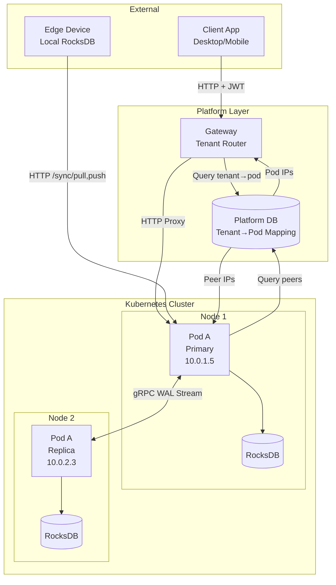

**Data Flow:**

1. **Client → Gateway**: HTTP request with JWT (contains tenant_id)
2. **Gateway → Platform DB**: "Which pods serve tenant-a?"
3. **Platform DB → Gateway**: `[{"ip": "10.0.1.5", "role": "primary"}]`
4. **Gateway → Pod**: HTTP proxy to 10.0.1.5:8000
5. **Pod → Pod**: gRPC replication stream (discovered via Platform DB)
6. **Edge → Pod**: HTTP sync (pull changes, push local ops)

## Node Affinity

### Tenant-to-Node Binding

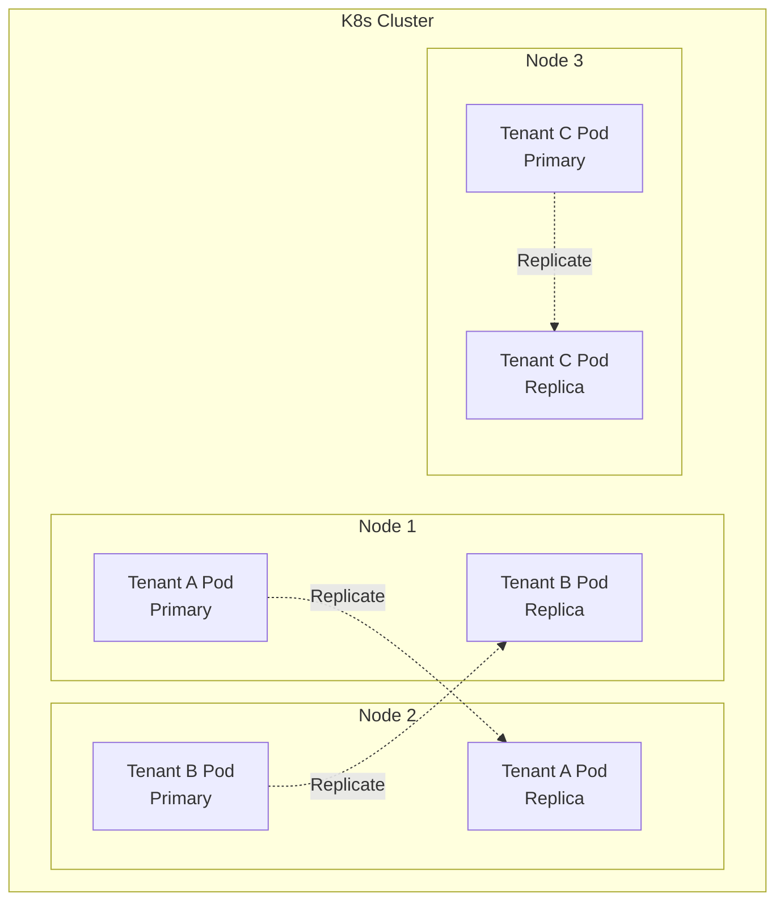

**Pod Deployment Rules:**
- Each tenant has node affinity to specific nodes
- Primary pod runs on designated node
- Replica pods run on backup nodes (n >= 2 replicas)
- Pods can launch on any replica node
- Node selection based on availability and load

**Node Allocation Strategy:**

Node affinity is configured in the central tenant context stored in the platform database. When a tenant is provisioned, an allocation algorithm assigns the tenant to two (or more) designated nodes. This assignment is deterministic and persists for the tenant's lifetime.

**Allocation Algorithm:**
- Round-robin distribution across available nodes
- Ensures even tenant distribution per node
- Respects tier-based node pools (premium nodes for Tier A, etc.)
- Primary and replica nodes are pre-determined, not dynamic
- Node assignments stored in tenant metadata: `{"tenant_id": "...", "nodes": ["node-1", "node-2"]}`

**Example Allocation Flow:**
1. Tenant created via platform API
2. Allocation service queries available nodes in tier's node pool
3. Round-robin selects next two nodes with lowest tenant count
4. Node assignment written to tenant context: `nodes: [node-3, node-7]`
5. Kubernetes pod affinity configured based on stored node list
6. All future pod launches for this tenant constrained to these nodes

### Kubernetes Pod Specification

```yaml
apiVersion: v1
kind: Pod
metadata:
  name: percolate-tenant-a-primary
  labels:
    tenant: tenant-a
    role: primary
spec:
  affinity:
    nodeAffinity:
      requiredDuringSchedulingIgnoredDuringExecution:
        nodeSelectorTerms:
        - matchExpressions:
          - key: percolate.io/tenant-group
            operator: In
            values:
            - group-1
  containers:
  - name: percolate
    image: percolate:latest
    env:
    - name: TENANT_ID
      value: tenant-a
    - name: REPLICATION_NODES
      value: "node-1,node-2"
```

## Data Replication

### N-Way Replication

| Tier | Replica Count | Nodes | RPO | RTO |
|------|--------------|-------|-----|-----|
| **Free** | 2 | 2 nodes | 5 min | 2 min |
| **Standard** | 2 | 2 nodes | 1 min | 1 min |
| **Premium** | 3 | 3 nodes | 30 sec | 30 sec |
| **Enterprise** | 3+ | 3+ nodes | Real-time | 10 sec |

### Replication Architecture

Percolate uses a **peer discovery protocol** where each process/database discovers and replicates with its designated peers using standard IP-based protocols (gRPC for replication, HTTP for client sync).

**Replication Topology:**

- **Cloud-to-Cloud**: Pods replicate to peer pods (internal IPs in K8s)
- **Cloud-to-Edge**: Desktop/mobile sync to cloud pods (external IPs/domains)
- **Edge-to-Edge**: Desktop sync to mobile (both peer to cloud, not direct)

**Key Principle:** All replication uses IP addresses + standard protocols. No special discovery mechanisms.

### Peer Discovery Protocol

Each process maintains a **peer list** with IP addresses of replication targets:

```
# Tenant context in platform database
{
  "tenant_id": "tenant-a",
  "peers": [
    {"id": "pod-1", "ip": "10.0.1.5", "port": 9000, "type": "cloud"},
    {"id": "pod-2", "ip": "10.0.2.3", "port": 9000, "type": "cloud"},
    {"id": "desktop-1", "ip": "203.0.113.45", "port": 9000, "type": "edge"},
    {"id": "mobile-1", "ip": "198.51.100.22", "port": 9000, "type": "edge"}
  ]
}
```

**Peer Discovery Flow:**

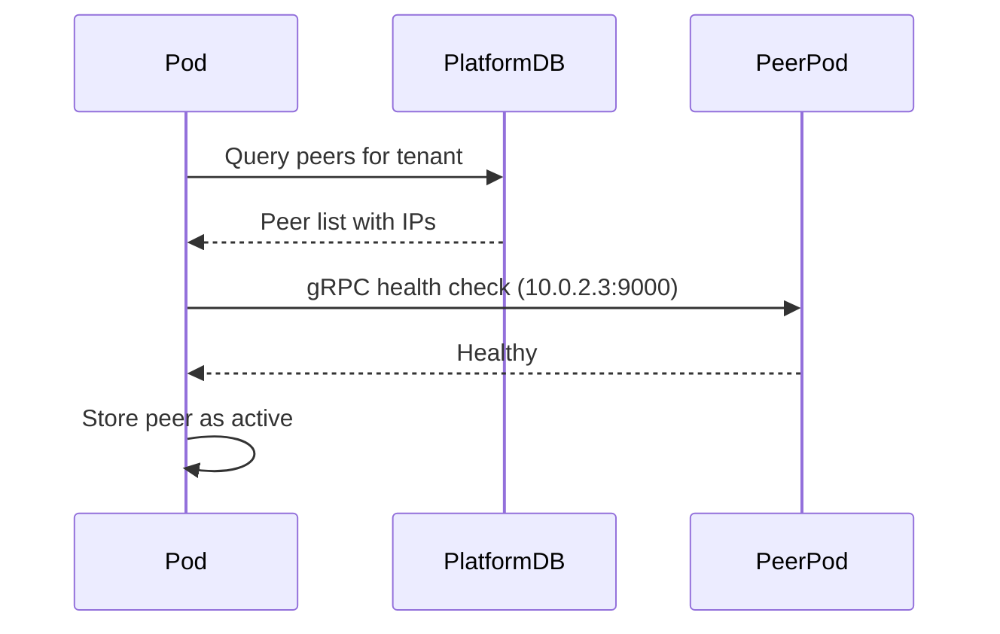

**Peer Types:**

- **Cloud peers**: Internal K8s IPs (10.x.x.x), always reachable within cluster
- **Edge peers**: External IPs/NAT, may be offline, sync when available

### Pod-to-Pod Replication (Cloud)

Pods replicate using the **same gRPC streaming protocol** as edge devices, just with different parameters. This unified approach simplifies implementation.

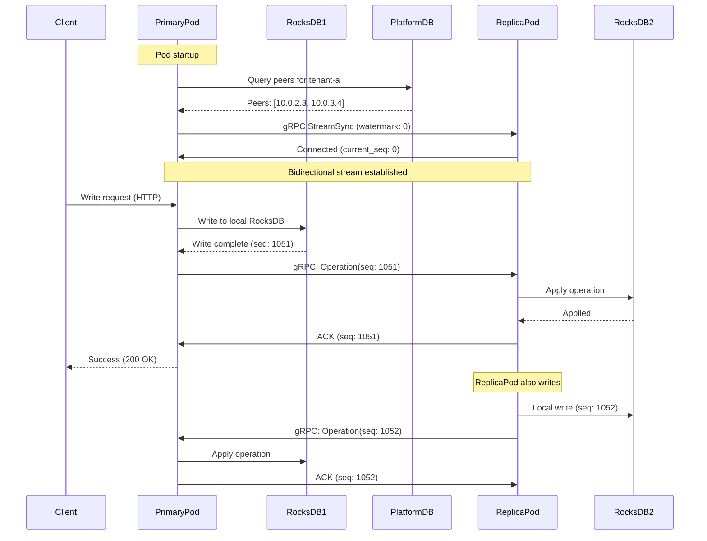

**Unified gRPC Replication Protocol:**

Pods use the **same SyncService** as edge devices (defined earlier), with minimal differences:

```protobuf
// percolate-core/proto/sync.proto (same service, same encryption!)

// Edge device subscription:
// - Values encrypted at rest (stored encrypted in RocksDB)
// - May go offline for hours
// - External IP (NAT traversal)

// Pod-to-pod replication:
// - Values already encrypted at rest (just replicate encrypted bytes)
// - Always connected (same K8s cluster)
// - Internal IP (10.x.x.x)
// - Both pods can write (bidirectional)

// Key insight: Since RocksDB stores encrypted values anyway,
// pods replicate encrypted data directly. No need to decrypt/re-encrypt!
```

**Encryption Strategy:**

All data is **encrypted at rest** in RocksDB using tenant-specific keys:

```python
# Tenant writes data (encrypted before RocksDB)
plaintext = b"sensitive data"
tenant_key = load_tenant_key(tenant_id)
encrypted = encrypt_chacha20(plaintext, tenant_key)
await rocksdb.put(key, encrypted)  # Store encrypted

# Replication: just copy encrypted bytes
op = Operation(
    key=key,
    value=encrypted,  # Already encrypted!
    seq_num=seq_num
)
await replicate_to_peers(op)

# Peer pod: write encrypted bytes directly
await rocksdb.put(op.key, op.value)  # Store as-is (encrypted)

# Reading: decrypt after retrieval
encrypted = await rocksdb.get(key)
plaintext = decrypt_chacha20(encrypted, tenant_key)
```

**Benefits:**

- **Simpler replication**: No decrypt/re-encrypt, just copy encrypted bytes
- **Network security**: Data encrypted in transit via gRPC TLS (optional)
- **Storage security**: Data encrypted at rest in RocksDB (always)
- **Key management**: Pods load tenant key from node key store at startup
- **Same everywhere**: Edge devices, pods, all replicate encrypted data

**Pod Replication Setup (Python):**

```python
# percolate/src/percolate/replication/pod_replicator.py

import grpc
from percolate.proto import sync_pb2, sync_pb2_grpc

class PodReplicator:
    """Handles replication between pods in same cluster"""

    def __init__(self, tenant_id: str, my_pod_id: str):
        self.tenant_id = tenant_id
        self.my_pod_id = my_pod_id
        self.platform_db = get_platform_db()
        self.peer_streams = {}  # peer_ip → gRPC stream
        self.checkpoint_store = get_checkpoint_store()

    async def start_replication(self):
        """Discover peers and establish replication streams"""

        # Query platform DB for peer pods
        tenant_config = await self.platform_db.get_tenant_config(self.tenant_id)
        my_ip = self.get_my_ip()

        for pod in tenant_config["pods"]:
            if pod["ip"] != my_ip:
                # Connect to peer pod
                await self.connect_to_peer(pod["ip"])

    async def connect_to_peer(self, peer_ip: str):
        """Establish bidirectional replication stream with peer pod"""

        # Load last checkpoint for this peer
        watermark = await self.checkpoint_store.get_checkpoint(
            self.tenant_id,
            peer_pod_id=peer_ip
        )

        # Create gRPC channel (internal cluster, no TLS)
        channel = grpc.aio.insecure_channel(f"{peer_ip}:9000")
        stub = sync_pb2_grpc.SyncServiceStub(channel)

        # Create bidirectional stream
        async def request_generator():
            # Initial subscribe
            yield sync_pb2.SyncRequest(
                tenant_id=self.tenant_id,
                device_id=self.my_pod_id,
                watermark=watermark,
                subscribe=sync_pb2.SubscribeRequest(
                    device_public_key=b"",  # No encryption for pod-to-pod
                    auth_token=b""  # Mutual TLS or internal auth
                )
            )

            # Send local writes to peer
            while True:
                # Wait for local write to replicate
                local_op = await self.local_write_queue.get()
                yield sync_pb2.SyncRequest(
                    push_ops=sync_pb2.OperationBatch(ops=[local_op])
                )

        # Start streaming
        response_stream = stub.StreamSync(request_generator())

        # Handle responses from peer
        async for response in response_stream:
            if response.HasField("connected"):
                print(f"Connected to peer {peer_ip}, seq: {response.connected.current_seq}")

            elif response.HasField("historical"):
                # Apply historical batch from peer
                batch = response.historical
                for op in batch.ops:
                    await self.apply_peer_op(op)
                await self.checkpoint_store.save_checkpoint(
                    self.tenant_id,
                    peer_ip,
                    batch.batch_end
                )

            elif response.HasField("operation"):
                # Apply real-time operation from peer
                op = response.operation
                await self.apply_peer_op(op)
                await self.checkpoint_store.save_checkpoint(
                    self.tenant_id,
                    peer_ip,
                    op.seq_num
                )

                # ACK immediately
                # (sent via request_generator in next iteration)

        # Store stream for broadcasting
        self.peer_streams[peer_ip] = response_stream

    async def apply_peer_op(self, op: sync_pb2.Operation):
        """Apply operation from peer pod to local RocksDB"""

        # Values are already encrypted - just write directly
        # (both pods have same tenant key for reading, but replication
        #  operates on encrypted bytes without decrypting)
        if op.operation_type == "PUT":
            await self.local_db.put(op.key, op.value)  # op.value is encrypted
        elif op.operation_type == "DELETE":
            await self.local_db.delete(op.key)

        print(f"Applied peer op {op.seq_num}: {op.operation_type} {op.key}")

    async def broadcast_local_write(self, op: sync_pb2.Operation):
        """Broadcast local write to all peer pods"""

        # Add to queue for each peer
        for peer_ip in self.peer_streams.keys():
            await self.local_write_queue.put(op)

        # Also broadcast to edge devices (if subscribed)
        await subscription_manager.broadcast_op(self.tenant_id, op)
```

**Multi-Writer Conflict Resolution:**

Since both pods can write, we need conflict resolution:

```python
# percolate/src/percolate/replication/conflict_resolution.py

class ConflictResolver:
    """Handle conflicts when multiple pods write same key"""

    async def apply_op(self, op: sync_pb2.Operation):
        """Apply operation with conflict detection"""

        # Check if local version exists
        local_value = await self.db.get(op.key)

        if local_value is None:
            # No conflict - just write
            await self.db.put(op.key, op.value)
            return

        # Conflict detected - use timestamp to resolve
        local_timestamp = await self.get_local_timestamp(op.key)

        if op.timestamp > local_timestamp:
            # Remote write is newer - accept it
            await self.db.put(op.key, op.value)
            print(f"Conflict resolved: accepted remote write for {op.key}")
        else:
            # Local write is newer - ignore remote
            print(f"Conflict resolved: kept local write for {op.key}")

    async def get_local_timestamp(self, key: str) -> int:
        """Get timestamp of local value"""
        # Store timestamp alongside value in RocksDB
        metadata_key = f"{key}:metadata"
        metadata = await self.db.get(metadata_key)
        return int(metadata) if metadata else 0
```

**Node Affinity Integration:**

Pods only replicate to peers **on their assigned nodes**:

```python
# Platform DB query returns pods with node affinity

{
  "tenant_id": "tenant-a",
  "nodes": ["node-1", "node-2"],  # Assigned via round-robin
  "pods": [
    {"id": "pod-abc123", "ip": "10.0.1.5", "node": "node-1", "role": "primary"},
    {"id": "pod-def456", "ip": "10.0.2.3", "node": "node-2", "role": "replica"}
  ]
}

# Each pod connects ONLY to peers on different assigned nodes
# This ensures:
# - Fault tolerance (data on 2+ nodes)
# - No cross-node chatter for unrelated tenants
# - Predictable replication topology
```

**Replication Topology:**

```
Node 1 (assigned to tenant-a):
  Pod A (10.0.1.5)
    └─> gRPC stream to Pod B (10.0.2.3) on Node 2
    └─> gRPC stream to Pod C (10.0.3.4) on Node 3

Node 2 (assigned to tenant-a):
  Pod B (10.0.2.3)
    └─> gRPC stream to Pod A (10.0.1.5) on Node 1
    └─> gRPC stream to Pod C (10.0.3.4) on Node 3

Node 3 (assigned to tenant-a):
  Pod C (10.0.3.4)
    └─> gRPC stream to Pod A (10.0.1.5) on Node 1
    └─> gRPC stream to Pod B (10.0.2.3) on Node 2
```

**Full mesh within assigned nodes** - each pod connects to every other pod for that tenant.

**Replication Features:**

- **Same protocol**: Edge devices and pods use identical gRPC streaming
- **Bidirectional**: Any pod can write, changes stream both ways
- **Watermark-based**: Each pod tracks checkpoint per peer
- **Conflict resolution**: Timestamp-based (last-write-wins)
- **Node-aware**: Only replicate to pods on assigned nodes
- **Fault tolerance**: Data on N nodes (N = replica count from tier)

### Edge Device Sync (Desktop/Mobile)

Edge devices sync using HTTP REST API (simpler, works through NAT/firewalls):

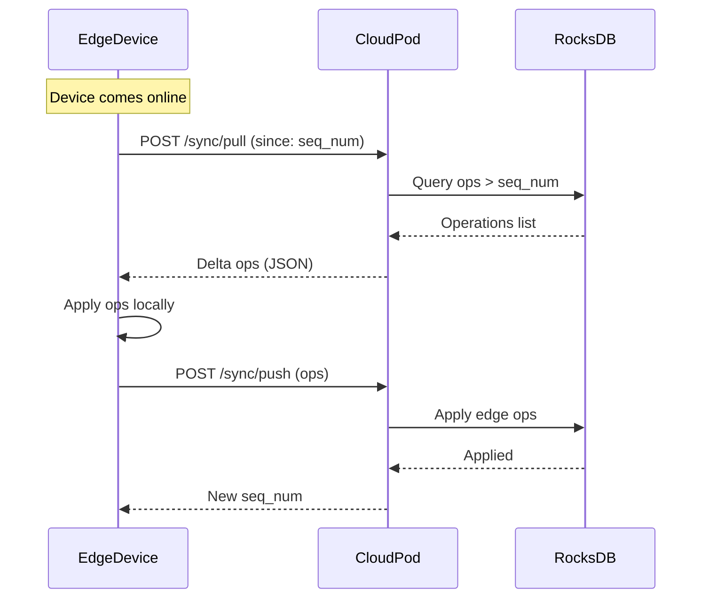

**HTTP Sync API:**

```python
# percolate/src/percolate/api/routers/sync.py

from fastapi import APIRouter, Depends

router = APIRouter(prefix="/sync")

@router.post("/pull")
async def pull_ops(
    tenant_id: str,
    since_seq: int,
    auth: Auth = Depends(authenticate)
) -> SyncPullResponse:
    """Pull operations from cloud since sequence number"""
    ops = await db.get_ops_since(tenant_id, since_seq)
    return SyncPullResponse(ops=ops, current_seq=db.current_seq(tenant_id))

@router.post("/push")
async def push_ops(
    tenant_id: str,
    ops: List[Operation],
    auth: Auth = Depends(authenticate)
) -> SyncPushResponse:
    """Push local operations to cloud"""
    await db.apply_ops(tenant_id, ops)
    return SyncPushResponse(current_seq=db.current_seq(tenant_id))
```

**Edge Sync Protocol:**

1. **Pull first**: Get server changes since last sync
2. **Apply locally**: Merge server ops (CRDT semantics)
3. **Push local**: Send uncommitted local ops
4. **Store seq_num**: Track sync position for next time

**Conflict Resolution:** Last-write-wins with HLC timestamps (simple, works for most cases)

### Real-Time Subscriptions (Edge Devices)

Edge devices can subscribe to real-time change notifications instead of polling. The pod pushes changes as they occur.

**2025 Best Practices (Signal, WhatsApp patterns):**

Modern messaging apps use these patterns for multi-device sync:

1. **gRPC bidirectional streaming** (not WebSocket) for cloud pods and native apps
2. **Server-Sent Events (SSE)** for web clients (simpler, native browser support)
3. **Encrypted backups** for initial sync (Signal pattern: AES-256 one-time key)
4. **Watermark-based resumption** with checkpoint streams
5. **Per-device encryption** (each device gets separately encrypted copy)

**Why gRPC over WebSocket (2025):**

- **Multiplexing**: Multiple streams over single connection (HTTP/2)
- **Type safety**: Protobuf schemas prevent serialization errors
- **Better mobile**: Reconnection handling, binary protocol (less battery)
- **Backpressure**: Flow control built-in (prevent overwhelming clients)
- **Code generation**: Client libraries auto-generated from proto files

**Fallback strategy:**
- **Native apps**: gRPC streaming (iOS, Android, desktop)
- **Web browsers**: SSE for server→client, HTTP POST for client→server
- **Degraded mode**: HTTP polling as last resort

**Subscription Flow:**

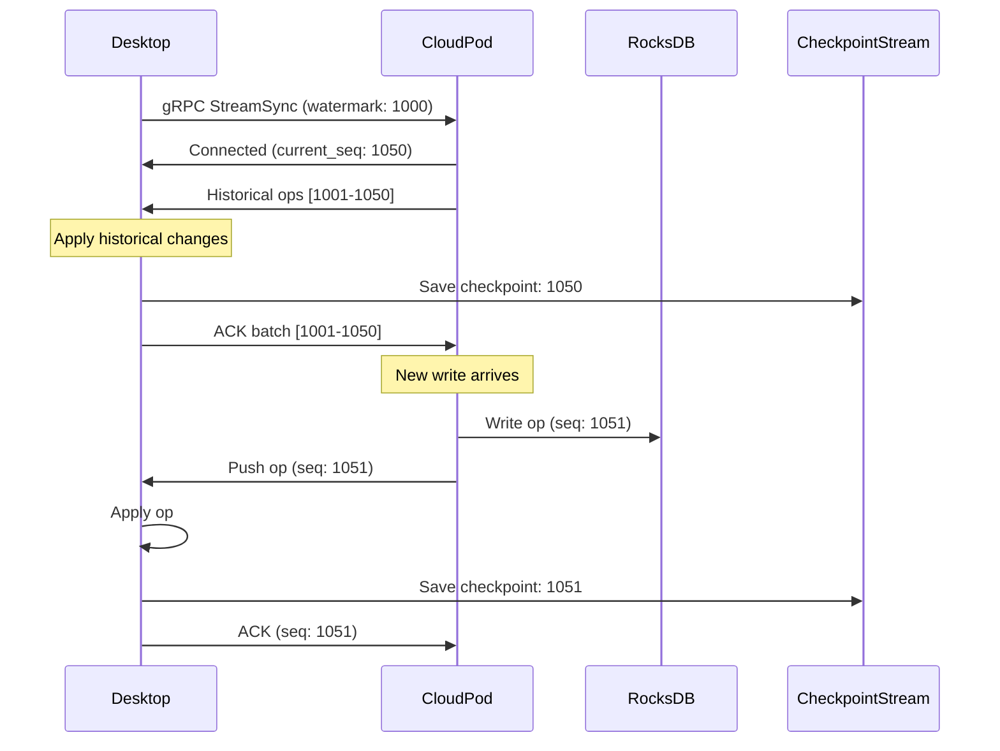

**gRPC Streaming API (Protobuf):**

```protobuf
// percolate-core/proto/sync.proto

service SyncService {
  // Bidirectional streaming for edge device sync
  rpc StreamSync(stream SyncRequest) returns (stream SyncResponse);

  // Server-Sent Events alternative (unary stream for web)
  rpc SubscribeSSE(SubscribeRequest) returns (stream SyncEvent);
}

message SyncRequest {
  string tenant_id = 1;
  string device_id = 2;
  uint64 watermark = 3;  // Last known sequence number

  oneof request {
    SubscribeRequest subscribe = 4;
    AckRequest ack = 5;
    OperationBatch push_ops = 6;
  }
}

message SubscribeRequest {
  bytes device_public_key = 1;  // Ed25519 for authentication
  bytes auth_token = 2;
}

message AckRequest {
  uint64 seq_num = 1;  // Acknowledge up to this sequence
}

message SyncResponse {
  oneof response {
    ConnectedResponse connected = 1;
    HistoricalBatch historical = 2;
    Operation operation = 3;
    ErrorResponse error = 4;
  }
}

message ConnectedResponse {
  uint64 current_seq = 1;
  bytes server_public_key = 2;
}

message HistoricalBatch {
  repeated Operation ops = 1;
  uint64 batch_start = 2;
  uint64 batch_end = 3;
}

message Operation {
  uint64 seq_num = 1;
  string key = 2;
  bytes value = 3;  // Encrypted with device key
  uint64 timestamp = 4;
  string operation_type = 5;  // PUT, DELETE, etc.
}

message OperationBatch {
  repeated Operation ops = 1;
}

message ErrorResponse {
  string code = 1;
  string message = 2;
}

// For web clients (SSE alternative)
message SubscribeRequest {
  string tenant_id = 1;
  string device_id = 2;
  uint64 watermark = 3;
}

message SyncEvent {
  uint64 seq_num = 1;
  bytes data = 2;  // JSON or protobuf
  string event_type = 3;  // "op", "batch", "checkpoint"
}
```

**Server Implementation (Python + gRPC):**

```python
# percolate/src/percolate/grpc/sync_service.py

import grpc
from percolate.proto import sync_pb2, sync_pb2_grpc
import asyncio

class SyncServicer(sync_pb2_grpc.SyncServiceServicer):
    """gRPC service for edge device sync"""

    def __init__(self):
        # tenant_id → {device_id → asyncio.Queue}
        self.subscriptions: Dict[str, Dict[str, asyncio.Queue]] = {}
        self.checkpoint_store = get_checkpoint_store()

    async def StreamSync(
        self,
        request_iterator,
        context: grpc.aio.ServicerContext
    ):
        """Bidirectional streaming for real-time sync"""

        device_queue = asyncio.Queue()
        tenant_id = None
        device_id = None

        try:
            # Process first request (subscribe)
            first_request = await request_iterator.__anext__()
            tenant_id = first_request.tenant_id
            device_id = first_request.device_id
            watermark = first_request.watermark

            # Authenticate device
            if not await self.authenticate_device(first_request.subscribe):
                yield sync_pb2.SyncResponse(
                    error=sync_pb2.ErrorResponse(
                        code="UNAUTHORIZED",
                        message="Invalid device credentials"
                    )
                )
                return

            # Register subscription
            if tenant_id not in self.subscriptions:
                self.subscriptions[tenant_id] = {}
            self.subscriptions[tenant_id][device_id] = device_queue

            # Send connection response
            current_seq = await db.current_seq(tenant_id)
            yield sync_pb2.SyncResponse(
                connected=sync_pb2.ConnectedResponse(
                    current_seq=current_seq,
                    server_public_key=self.get_server_public_key()
                )
            )

            # Send historical operations (batched for efficiency)
            if watermark < current_seq:
                historical_ops = await db.get_ops_since(tenant_id, watermark)

                # Send in batches of 100
                batch_size = 100
                for i in range(0, len(historical_ops), batch_size):
                    batch = historical_ops[i:i + batch_size]
                    yield sync_pb2.SyncResponse(
                        historical=sync_pb2.HistoricalBatch(
                            ops=batch,
                            batch_start=batch[0].seq_num,
                            batch_end=batch[-1].seq_num
                        )
                    )

            # Handle incoming client messages and outgoing server pushes
            async def process_client_requests():
                async for request in request_iterator:
                    if request.HasField("ack"):
                        # Client ACKed up to seq_num - save checkpoint
                        await self.checkpoint_store.save(
                            tenant_id,
                            device_id,
                            request.ack.seq_num
                        )
                    elif request.HasField("push_ops"):
                        # Client pushing local operations
                        await self.handle_client_ops(
                            tenant_id,
                            request.push_ops
                        )

            async def send_server_pushes():
                while True:
                    # Wait for operation to broadcast
                    op = await device_queue.get()
                    yield sync_pb2.SyncResponse(operation=op)

            # Run both tasks concurrently
            client_task = asyncio.create_task(process_client_requests())

            # Stream server pushes
            async for response in send_server_pushes():
                yield response

        except Exception as e:
            print(f"Stream error: {e}")
        finally:
            # Clean up subscription
            if tenant_id and device_id:
                if tenant_id in self.subscriptions:
                    self.subscriptions[tenant_id].pop(device_id, None)

    async def broadcast_op(self, tenant_id: str, op: sync_pb2.Operation):
        """Broadcast operation to all subscribed devices"""

        if tenant_id not in self.subscriptions:
            return

        # Push to all device queues
        # Note: op.value is already encrypted with tenant key
        # No need to re-encrypt per-device!
        for device_id, queue in self.subscriptions[tenant_id].items():
            try:
                await queue.put(op)  # Send encrypted op as-is
            except:
                # Queue full or device disconnected - skip
                pass

    async def authenticate_device(
        self,
        subscribe_request: sync_pb2.SubscribeRequest
    ) -> bool:
        """Verify device Ed25519 signature"""
        # Verify device public key is registered
        # Verify auth token signature
        return True  # Placeholder
```

**Triggering Notifications on Write:**

```python
# percolate/src/percolate/memory/operations.py

class TenantMemory:
    """REM memory operations for a tenant"""

    def __init__(self, tenant_id: str):
        self.tenant_id = tenant_id
        self.db = RocksDB(f"/data/{tenant_id}")
        self.tenant_key = load_tenant_key(tenant_id)  # ChaCha20 key

    async def write_operation(self, key: str, plaintext_value: bytes) -> int:
        """Write operation with encryption and replication"""

        # 1. Encrypt value with tenant key
        encrypted_value = encrypt_chacha20(plaintext_value, self.tenant_key)

        # 2. Write encrypted value to RocksDB
        await self.db.put(key, encrypted_value)

        # 3. Get sequence number from RocksDB
        seq_num = await self.db.get_sequence_number()

        # 4. Create operation object (with encrypted value)
        op = sync_pb2.Operation(
            seq_num=seq_num,
            key=key,
            value=encrypted_value,  # Already encrypted!
            timestamp=time.time_ns(),
            operation_type="PUT"
        )

        # 5. Broadcast to subscribed edge devices (encrypted)
        await subscription_manager.broadcast_op(self.tenant_id, op)

        # 6. Replicate to peer pods (encrypted)
        await pod_replicator.broadcast_local_write(op)

        return seq_num

    async def read_operation(self, key: str) -> bytes:
        """Read and decrypt value"""

        # 1. Read encrypted value from RocksDB
        encrypted_value = await self.db.get(key)
        if not encrypted_value:
            return None

        # 2. Decrypt with tenant key
        plaintext_value = decrypt_chacha20(encrypted_value, self.tenant_key)

        return plaintext_value
```

**Complete Data Flow (Encrypted):**

```
1. Client writes: POST /data {"key": "foo", "value": "secret"}

2. Pod encrypts:
   encrypted = encrypt_chacha20(b"secret", tenant_key)

3. Pod writes to RocksDB:
   rocksdb.put("foo", encrypted)  # Stored encrypted

4. Pod creates operation:
   op = Operation(key="foo", value=encrypted, seq=1051)

5. Pod broadcasts to edge devices:
   websocket.send(op)  # Sends encrypted value

6. Edge device writes:
   rocksdb.put("foo", encrypted)  # Stores encrypted (same bytes!)

7. Edge device reads:
   encrypted = rocksdb.get("foo")
   plaintext = decrypt_chacha20(encrypted, tenant_key)

8. Pod replicates to peer pods:
   grpc.send(op)  # Sends encrypted value

9. Peer pod writes:
   rocksdb.put("foo", encrypted)  # Stores encrypted (same bytes!)
```

**Key Insights:**

- **One encryption**: Encrypt once on write, decrypt on read
- **Same bytes everywhere**: All RocksDB instances store identical encrypted bytes
- **No per-device encryption**: Not needed - tenant key is shared secret
- **Simpler code**: Replication just copies encrypted bytes
- **Better performance**: No decrypt/re-encrypt in replication path

**Desktop Client Implementation (gRPC):**

```python
# Desktop/mobile client code

import grpc
import asyncio
from percolate.proto import sync_pb2, sync_pb2_grpc

class EdgeSyncClient:
    """Real-time sync client using gRPC (2025 best practice)"""

    def __init__(self, tenant_id: str, device_id: str, cloud_url: str):
        self.tenant_id = tenant_id
        self.device_id = device_id
        self.cloud_url = cloud_url
        self.checkpoint_stream = CheckpointStream(tenant_id, device_id)
        self.local_db = RocksDB(f"./data/{tenant_id}")
        self.device_key = load_device_key()  # Ed25519 private key

    async def subscribe(self):
        """Subscribe to real-time changes via gRPC streaming"""

        # Load checkpoint (last acknowledged seq_num)
        watermark = await self.checkpoint_stream.get_checkpoint()

        # Create gRPC channel
        channel = grpc.aio.insecure_channel(self.cloud_url)
        stub = sync_pb2_grpc.SyncServiceStub(channel)

        # Create request iterator (bidirectional stream)
        async def request_generator():
            # Send initial subscribe request
            yield sync_pb2.SyncRequest(
                tenant_id=self.tenant_id,
                device_id=self.device_id,
                watermark=watermark,
                subscribe=sync_pb2.SubscribeRequest(
                    device_public_key=self.device_key.public_bytes(),
                    auth_token=await self.get_auth_token()
                )
            )

            # Keep connection alive with heartbeats
            while True:
                await asyncio.sleep(30)
                # Can send ACKs or local ops here
                yield sync_pb2.SyncRequest(
                    ack=sync_pb2.AckRequest(
                        seq_num=await self.checkpoint_stream.get_checkpoint()
                    )
                )

        # Start streaming
        try:
            response_stream = stub.StreamSync(request_generator())

            async for response in response_stream:
                if response.HasField("connected"):
                    print(f"Connected. Current seq: {response.connected.current_seq}")

                elif response.HasField("historical"):
                    # Apply historical batch
                    batch = response.historical
                    print(f"Receiving historical batch [{batch.batch_start}-{batch.batch_end}]")

                    for op in batch.ops:
                        await self.apply_op(op)

                    # Checkpoint batch end
                    await self.checkpoint_stream.save_checkpoint(batch.batch_end)

                elif response.HasField("operation"):
                    # Apply real-time operation
                    op = response.operation
                    await self.apply_op(op)

                    # Checkpoint immediately
                    await self.checkpoint_stream.save_checkpoint(op.seq_num)

                elif response.HasField("error"):
                    print(f"Error: {response.error.message}")
                    break

        except grpc.aio.AioRpcError as e:
            print(f"gRPC error: {e.code()}, {e.details()}")
            # Reconnect with exponential backoff
            await self.reconnect_with_backoff()

    async def apply_op(self, op: sync_pb2.Operation):
        """Apply operation to local RocksDB"""

        # Values are already encrypted with tenant key
        # Just write encrypted bytes directly (same as cloud pods)
        if op.operation_type == "PUT":
            await self.local_db.put(op.key, op.value)  # op.value is encrypted
        elif op.operation_type == "DELETE":
            await self.local_db.delete(op.key)

        print(f"Applied op {op.seq_num}: {op.operation_type} {op.key}")

        # Application layer decrypts when reading:
        # encrypted = await self.local_db.get(key)
        # plaintext = decrypt_chacha20(encrypted, tenant_key)

    async def reconnect_with_backoff(self):
        """Exponential backoff reconnection"""
        backoff = 1
        while True:
            try:
                print(f"Reconnecting in {backoff}s...")
                await asyncio.sleep(backoff)
                await self.subscribe()
                break
            except:
                backoff = min(backoff * 2, 60)  # Max 60s

# Checkpoint Stream (event sourcing pattern)
class CheckpointStream:
    """Persist watermarks in separate checkpoint stream"""

    def __init__(self, tenant_id: str, device_id: str):
        self.checkpoint_file = f"./data/{tenant_id}/.checkpoint"
        self.current_checkpoint = 0

    async def get_checkpoint(self) -> int:
        """Get last checkpoint from disk"""
        if self.current_checkpoint > 0:
            return self.current_checkpoint

        try:
            with open(self.checkpoint_file, "r") as f:
                self.current_checkpoint = int(f.read())
        except:
            self.current_checkpoint = 0

        return self.current_checkpoint

    async def save_checkpoint(self, seq_num: int):
        """Save checkpoint to disk (atomic write)"""
        self.current_checkpoint = seq_num

        # Atomic write
        temp_file = f"{self.checkpoint_file}.tmp"
        with open(temp_file, "w") as f:
            f.write(str(seq_num))
            f.flush()
            os.fsync(f.fileno())

        # Atomic rename
        os.rename(temp_file, self.checkpoint_file)

# Usage
async def main():
    client = EdgeSyncClient(
        tenant_id="tenant-a",
        device_id="desktop-1",
        cloud_url="grpc://api.percolationlabs.ai:9000"
    )

    # Subscribe and listen for changes
    await client.subscribe()

if __name__ == "__main__":
    asyncio.run(main())
```

**Subscription Protocol Summary (gRPC):**

```
1. Desktop connects: gRPC StreamSync(watermark: 1000)
2. Pod responds: ConnectedResponse(current_seq: 1050)
3. Pod sends historical: HistoricalBatch([1001-1050], batch_size: 100)
4. Desktop applies batch, saves checkpoint: 1050
5. Desktop ACKs: AckRequest(seq_num: 1050)
6. Pod writes new op (seq: 1051)
7. Pod broadcasts: Operation(seq_num: 1051, encrypted per-device)
8. Desktop applies op, saves checkpoint: 1051
9. Desktop sends heartbeat ACK every 30s
10. Connection stays open, steps 6-8 repeat for each new op
```

**Key Improvements (2025 vs 2020):**

- **Batched historical**: Send 100 ops at once (not one-by-one)
- **Checkpoint stream**: Separate atomic checkpoint file (not inline watermark)
- **Per-device encryption**: Each device gets separately encrypted copy (Signal pattern)
- **Multiplexing**: Multiple tenants can stream over single gRPC connection
- **Backpressure**: gRPC flow control prevents overwhelming slow clients
- **Type safety**: Protobuf schema prevents deserialization bugs

**Benefits:**

- **Real-time**: <100ms latency (gRPC streaming)
- **Efficient**: Binary protocol, batched operations, multiplexing
- **Resumable**: Checkpoint stream persisted, reconnect from last position
- **Reliable**: ACKs ensure delivery, exponential backoff reconnection
- **Mobile-friendly**: Binary protocol saves battery vs JSON parsing
- **Type-safe**: Protobuf prevents serialization errors

**Protocol Comparison:**

| Method | Latency | Bandwidth | Type Safety | Mobile Battery | Use Case |
|--------|---------|-----------|-------------|----------------|----------|
| **gRPC Streaming** | <50ms | Very Low (binary + multiplex) | High (protobuf) | Excellent | Native apps (2025 best practice) |
| **WebSocket** | <100ms | Low (JSON overhead) | None | Good | Legacy web apps |
| **Server-Sent Events (SSE)** | <200ms | Low (text/event-stream) | None | Good | Web browsers (read-only) |
| **HTTP Polling** | 1-5s | High (repeated requests) | None | Poor | Degraded fallback |

**Recommendation:**
- **Native apps** (iOS/Android/Desktop): gRPC bidirectional streaming
- **Web browsers**: SSE for server→client + HTTP POST for client→server
- **Legacy clients**: HTTP polling as fallback

**How Signal Does It (2025 Implementation):**

Signal's recent multi-device sync update (2025) uses these patterns:

1. **Encrypted backups for initial sync**: Main device creates AES-256 encrypted backup with one-time key
2. **Per-device message copies**: Each message encrypted separately for every linked device
3. **45-day media retention**: Links to media on servers (not full copies), auto-deleted after 45 days
4. **Ratchet secret sharing**: Each device sends ratchet keys to other devices for E2E encryption
5. **Watermark-based resumption**: Devices track last synced position, resume from checkpoint

**Percolate's Adaptation:**

We adopt Signal's proven patterns with key simplifications:

- **gRPC instead of custom protocol**: Leverage HTTP/2 multiplexing, backpressure
- **RocksDB sequence numbers**: Natural watermark (monotonic, gap-free)
- **ChaCha20-Poly1305 tenant-level**: One key per tenant (not per-device like Signal)
- **Checkpoint streams**: Event sourcing pattern for watermark persistence
- **Batched operations**: Reduce roundtrips (100 ops/batch for historical sync)
- **Encrypt-once**: Data encrypted at write, replicated encrypted, decrypted at read

**Difference from Signal:**

Signal encrypts per-device (each device gets uniquely encrypted copy) for E2E encryption between users. Percolate uses tenant-level encryption (all devices share tenant key) because:

- **Same user's devices**: All desktop/mobile belong to same tenant
- **Simpler key management**: One tenant key vs N device keys
- **Better performance**: No decrypt/re-encrypt in replication
- **Encrypted at rest**: RocksDB stores encrypted bytes everywhere

**Result**: Signal-level security and reliability with simpler encryption model and better performance.

### Cross-Tenant Sharing (Public Key Encryption)

For sharing data **between tenants** or with external users, we use public key encryption to re-encrypt data for the receiver.

**Use Cases:**

- Share document with another Percolate user (different tenant)
- Real-time collaboration (multiple tenants editing same resource)
- One-time data transfer (export/import)
- Public sharing (anyone with link can subscribe)

**Sharing Flow:**

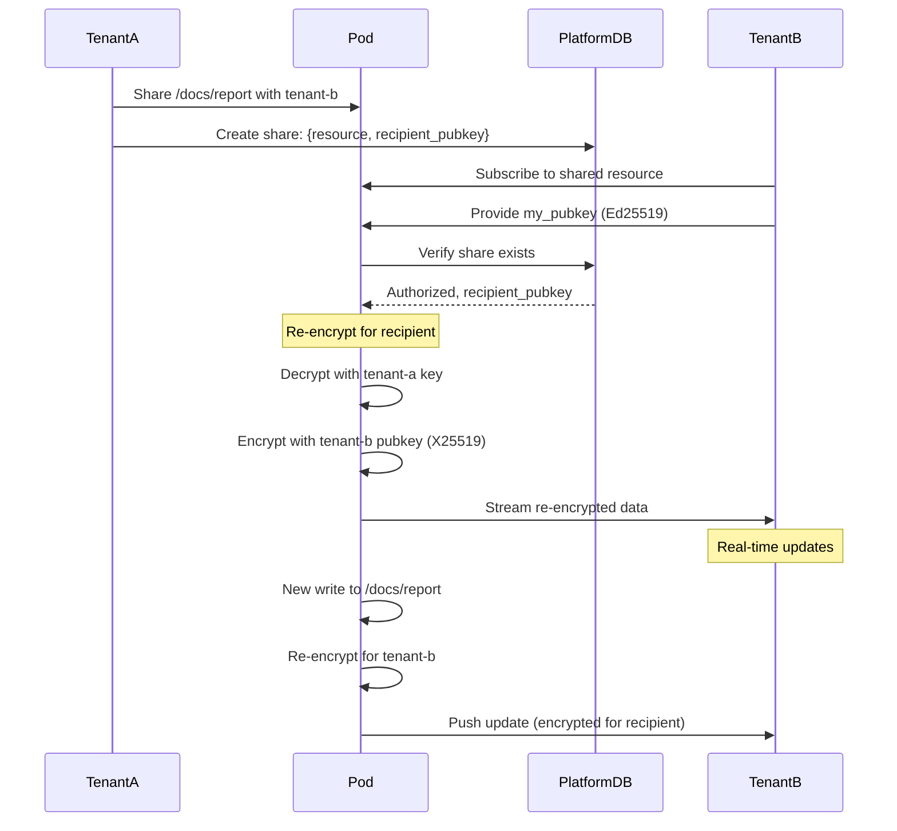

**Share Protocol (Protobuf):**

```protobuf
// percolate-core/proto/sharing.proto

service SharingService {
  // Create a share
  rpc CreateShare(CreateShareRequest) returns (ShareResponse);

  // Subscribe to shared resource (real-time sync)
  rpc SubscribeToShare(stream ShareSubscribeRequest) returns (stream ShareUpdate);

  // One-time fetch
  rpc FetchShare(FetchShareRequest) returns (ShareData);
}

message CreateShareRequest {
  string tenant_id = 1;
  string resource_path = 2;  // e.g., "/docs/report"

  oneof recipient {
    string recipient_tenant_id = 3;  // Known tenant
    bytes recipient_public_key = 4;  // External user (X25519)
    string share_link_id = 5;        // Anyone with link
  }

  SharePermissions permissions = 6;
  int64 expiration_timestamp = 7;  // Unix timestamp (0 = never)
}

message SharePermissions {
  bool can_read = 1;
  bool can_write = 2;
  bool can_reshare = 3;
}

message ShareResponse {
  string share_id = 1;
  string share_url = 2;  // https://percolate.ai/share/{share_id}
}

message ShareSubscribeRequest {
  oneof request {
    SubscribeRequest subscribe = 1;
    ShareWriteRequest write = 2;
    AckRequest ack = 3;
  }
}

message SubscribeRequest {
  string share_id = 1;
  bytes subscriber_public_key = 2;  // X25519 for encryption
  bytes auth_signature = 3;         // Ed25519 signature
  uint64 watermark = 4;             // Resume from checkpoint
}

message ShareWriteRequest {
  string key = 1;
  bytes value = 2;  // Encrypted with share's symmetric key
  string operation_type = 3;
}

message ShareUpdate {
  oneof update {
    ConnectedResponse connected = 1;
    HistoricalBatch historical = 2;
    SharedOperation operation = 3;
  }
}

message SharedOperation {
  uint64 seq_num = 1;
  string key = 2;
  bytes value = 3;  // Re-encrypted for subscriber
  uint64 timestamp = 4;
  string operation_type = 5;
  string author_tenant_id = 6;  // Who made the change
}
```

**Server Implementation:**

```python
# percolate/src/percolate/sharing/share_manager.py

from nacl.public import PrivateKey, PublicKey, Box
from nacl.encoding import Base64Encoder

class ShareManager:
    """Manage cross-tenant data sharing"""

    def __init__(self):
        self.platform_db = get_platform_db()
        self.active_shares = {}  # share_id → subscriber queues

    async def create_share(
        self,
        tenant_id: str,
        resource_path: str,
        recipient_pubkey: bytes,
        permissions: SharePermissions
    ) -> str:
        """Create a share and store in platform DB"""

        # Generate share ID
        share_id = generate_share_id()

        # Store share metadata
        share = {
            "share_id": share_id,
            "owner_tenant_id": tenant_id,
            "resource_path": resource_path,
            "recipient_pubkey": recipient_pubkey,
            "permissions": permissions.to_dict(),
            "created_at": time.time(),
            "expiration": None  # or timestamp
        }

        await self.platform_db.create_share(share)

        return share_id

    async def subscribe_to_share(
        self,
        share_id: str,
        subscriber_pubkey: bytes,
        watermark: int
    ):
        """Subscribe to real-time updates for shared resource"""

        # Verify share exists and is valid
        share = await self.platform_db.get_share(share_id)
        if not share:
            raise ValueError("Share not found")

        # Verify recipient
        if share["recipient_pubkey"] != subscriber_pubkey:
            raise ValueError("Unauthorized subscriber")

        # Get owner tenant's data
        owner_tenant_id = share["owner_tenant_id"]
        resource_path = share["resource_path"]

        # Load owner's tenant key for decryption
        owner_key = await load_tenant_key(owner_tenant_id)

        # Stream operations, re-encrypting for subscriber
        async for op in self.stream_resource_ops(
            owner_tenant_id,
            resource_path,
            watermark
        ):
            # Decrypt with owner's tenant key
            plaintext = decrypt_chacha20(op.value, owner_key)

            # Re-encrypt for subscriber using X25519 box
            re_encrypted = self.encrypt_for_recipient(
                plaintext,
                subscriber_pubkey
            )

            # Send re-encrypted operation
            yield SharedOperation(
                seq_num=op.seq_num,
                key=op.key,
                value=re_encrypted,
                timestamp=op.timestamp,
                operation_type=op.operation_type,
                author_tenant_id=owner_tenant_id
            )

    def encrypt_for_recipient(
        self,
        plaintext: bytes,
        recipient_pubkey: bytes
    ) -> bytes:
        """Encrypt data for recipient using X25519"""

        # Generate ephemeral keypair for this share
        ephemeral_private = PrivateKey.generate()
        ephemeral_public = ephemeral_private.public_key

        # Create encryption box
        recipient_public = PublicKey(recipient_pubkey)
        box = Box(ephemeral_private, recipient_public)

        # Encrypt
        encrypted = box.encrypt(plaintext)

        # Return: ephemeral_pubkey + encrypted_data
        return ephemeral_public.encode() + encrypted

    async def handle_share_write(
        self,
        share_id: str,
        subscriber_pubkey: bytes,
        key: str,
        encrypted_value: bytes
    ):
        """Handle write from subscriber (if permissions allow)"""

        share = await self.platform_db.get_share(share_id)

        # Verify write permission
        if not share["permissions"]["can_write"]:
            raise ValueError("Write not permitted")

        # Decrypt from subscriber
        plaintext = self.decrypt_from_sender(
            encrypted_value,
            subscriber_pubkey
        )

        # Write to owner tenant's database (encrypted with owner key)
        owner_tenant_id = share["owner_tenant_id"]
        owner_key = await load_tenant_key(owner_tenant_id)
        encrypted_for_owner = encrypt_chacha20(plaintext, owner_key)

        # Write to owner's RocksDB
        await self.write_to_tenant(
            owner_tenant_id,
            key,
            encrypted_for_owner
        )

        # Broadcast to other subscribers (re-encrypted for each)
        await self.broadcast_share_update(share_id, key, plaintext)
```

**Client-Side (Subscriber):**

```python
# Desktop client subscribing to shared resource

import grpc
from nacl.public import PrivateKey, PublicKey, Box

class ShareSubscriber:
    """Subscribe to shared resources from other tenants"""

    def __init__(self, my_private_key: PrivateKey):
        self.private_key = my_private_key
        self.public_key = my_private_key.public_key

    async def subscribe(self, share_url: str):
        """Subscribe to shared resource"""

        # Parse share ID from URL
        share_id = parse_share_url(share_url)

        # Connect to sharing service
        channel = grpc.aio.insecure_channel("api.percolationlabs.ai:9000")
        stub = sharing_pb2_grpc.SharingServiceStub(channel)

        # Subscribe with our public key
        async def request_generator():
            yield sharing_pb2.ShareSubscribeRequest(
                subscribe=sharing_pb2.SubscribeRequest(
                    share_id=share_id,
                    subscriber_public_key=self.public_key.encode(),
                    auth_signature=self.sign_request(share_id),
                    watermark=0
                )
            )

            # Keep alive
            while True:
                await asyncio.sleep(30)
                yield sharing_pb2.ShareSubscribeRequest(
                    ack=sharing_pb2.AckRequest(seq_num=self.last_seq)
                )

        # Receive updates
        response_stream = stub.SubscribeToShare(request_generator())

        async for update in response_stream:
            if update.HasField("operation"):
                op = update.operation

                # Decrypt value (encrypted for us)
                plaintext = self.decrypt_shared_value(op.value)

                # Store locally (our own encryption)
                my_tenant_key = load_my_tenant_key()
                encrypted_for_me = encrypt_chacha20(plaintext, my_tenant_key)
                await self.local_db.put(op.key, encrypted_for_me)

                print(f"Received shared update from {op.author_tenant_id}")

    def decrypt_shared_value(self, encrypted_data: bytes) -> bytes:
        """Decrypt value encrypted for us"""

        # Extract ephemeral public key (first 32 bytes)
        ephemeral_pubkey = PublicKey(encrypted_data[:32])
        ciphertext = encrypted_data[32:]

        # Create box with our private key
        box = Box(self.private_key, ephemeral_pubkey)

        # Decrypt
        plaintext = box.decrypt(ciphertext)
        return plaintext
```

**Use Case Examples:**

**1. Share Document (One-Time):**
```python
# Tenant A shares report with Tenant B
share_id = await share_manager.create_share(
    tenant_id="tenant-a",
    resource_path="/docs/q4-report",
    recipient_pubkey=tenant_b_pubkey,
    permissions=SharePermissions(can_read=True, can_write=False)
)
# Returns: share_id="abc123"
# Share URL: https://percolate.ai/share/abc123
```

**2. Real-Time Collaboration:**
```python
# Tenant B subscribes to real-time updates
async for update in subscribe_to_share("abc123", my_pubkey):
    # Receive updates as Tenant A modifies the document
    print(f"Update: {update.key} changed by {update.author_tenant_id}")
```

**3. Public Sharing (Anyone with Link):**
```python
# Create public share (no recipient pubkey required)
share_id = await share_manager.create_share(
    tenant_id="tenant-a",
    resource_path="/public/dataset",
    share_link_id=generate_share_link(),
    permissions=SharePermissions(can_read=True, can_write=False)
)
# Anyone with link can access (provide their pubkey to decrypt)
```

**Encryption Flow:**

```
Owner's data:
  plaintext → encrypt(tenant-a-key) → RocksDB

Share creation:
  1. Subscriber provides their X25519 public key
  2. Server decrypts: tenant-a-encrypted → plaintext
  3. Server re-encrypts: plaintext → encrypt(subscriber-pubkey)
  4. Server sends re-encrypted data

Subscriber receives:
  1. Decrypt with their X25519 private key → plaintext
  2. Encrypt with their tenant key → store in local RocksDB

Result: Data encrypted in transit, encrypted at rest everywhere
```

**Security Properties:**

- **No shared keys**: Each tenant keeps their own keys
- **Server can't read shared data**: Server only re-encrypts (briefly decrypts in memory)
- **Forward secrecy**: Ephemeral keys for each share operation
- **Revocable**: Delete share record to stop subscription
- **Auditable**: All share access logged in platform DB

**Comparison to Signal's Approach:**

| Aspect | Signal (Per-Message) | Percolate (Share-Based) |
|--------|---------------------|------------------------|
| **Encryption** | Double Ratchet (E2E) | X25519 Box (re-encryption) |
| **Scope** | Every message | Per shared resource |
| **Performance** | High overhead | Low overhead (re-encrypt on share) |
| **Use case** | Untrusted server | Semi-trusted server (brief decrypt) |
| **Collaboration** | Limited | Full real-time collaboration |

This enables powerful collaboration features while maintaining strong encryption!

### Pod Shutdown Flow

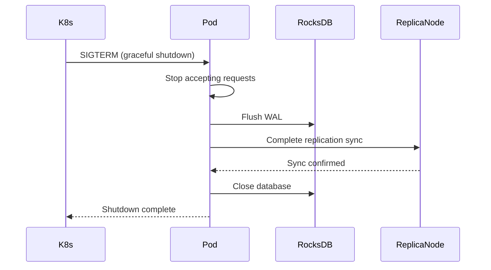

## Tenant Tiers

### Tier Configuration

```
┌─────────────────────────────────────────────────────────────┐
│                       Tenant Tiers                          │
├─────────┬──────────┬──────────┬──────────┬─────────────────┤
│ Tier    │ Price    │ Memory   │ Storage  │ Features        │
├─────────┼──────────┼──────────┼──────────┼─────────────────┤
│ Free    │ $0       │ 512 MB   │ 1 GB     │ 2 replicas      │
│         │          │          │          │ Cold start      │
│         │          │          │          │ 1 min idle      │
├─────────┼──────────┼──────────┼──────────┼─────────────────┤
│ Std     │ $10/mo   │ 1 GB     │ 10 GB    │ 2 replicas      │
│         │          │          │          │ 5 min idle      │
│         │          │          │          │ Faster start    │
├─────────┼──────────┼──────────┼──────────┼─────────────────┤
│ Premium │ $50/mo   │ 2 GB     │ 50 GB    │ 3 replicas      │
│         │          │          │          │ Always on       │
│         │          │          │          │ Dedicated CPU   │
├─────────┼──────────┼──────────┼──────────┼─────────────────┤
│ Ent     │ Custom   │ Custom   │ Custom   │ 3+ replicas     │
│         │          │          │          │ Always on       │
│         │          │          │          │ SLA guarantees  │
└─────────┴──────────┴──────────┴──────────┴─────────────────┘
```

### Tier-Based Resource Allocation

```yaml
# Free Tier
resources:
  requests:
    memory: "512Mi"
    cpu: "250m"
  limits:
    memory: "512Mi"
    cpu: "500m"

# Standard Tier
resources:
  requests:
    memory: "1Gi"
    cpu: "500m"
  limits:
    memory: "1Gi"
    cpu: "1000m"

# Premium Tier
resources:
  requests:
    memory: "2Gi"
    cpu: "1000m"
  limits:
    memory: "2Gi"
    cpu: "2000m"
```

## Kubernetes Scaling

### Tree-Based Tiered Horizontal Pod Autoscaler

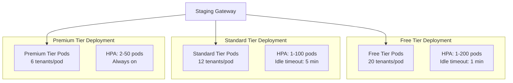

### HPA Configuration

```yaml
apiVersion: autoscaling/v2
kind: HorizontalPodAutoscaler
metadata:
  name: percolate-free-tier
spec:
  scaleTargetRef:
    apiVersion: apps/v1
    kind: Deployment
    name: percolate-free
  minReplicas: 1
  maxReplicas: 200
  metrics:
  - type: Resource
    resource:
      name: cpu
      target:
        type: Utilization
        averageUtilization: 70
  - type: Resource
    resource:
      name: memory
      target:
        type: Utilization
        averageUtilization: 80
  behavior:
    scaleDown:
      stabilizationWindowSeconds: 60
      policies:
      - type: Percent
        value: 50
        periodSeconds: 60
```

## Tenant-Based Routing in Kubernetes

### Gateway to Pod Routing

The gateway routes incoming requests to the correct pod based on tenant ID. This uses the **peer discovery protocol** to find which pod(s) currently hold a tenant's data.

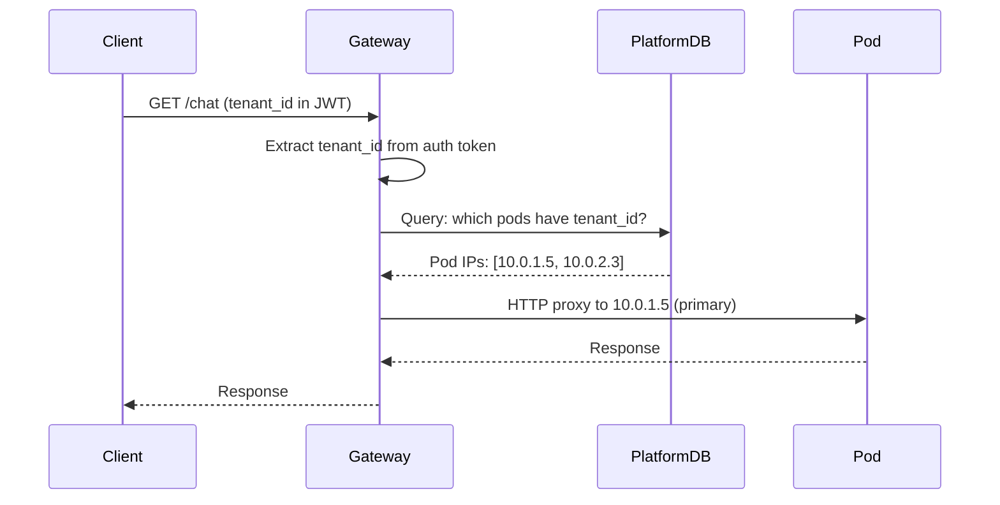

**Routing Flow:**

1. **Extract tenant_id** from JWT token in request
2. **Query platform DB** for tenant's pod assignments (from node affinity config)
3. **Select target pod** (primary, or replica if primary unavailable)
4. **Proxy request** to pod's internal IP via HTTP/gRPC

### Tenant-to-Pod Mapping

Platform database maintains tenant→pod assignments:

```json
{
  "tenant_id": "tenant-a",
  "tier": "premium",
  "nodes": ["node-1", "node-2"],
  "pods": [
    {"id": "pod-abc123", "ip": "10.0.1.5", "node": "node-1", "role": "primary"},
    {"id": "pod-def456", "ip": "10.0.2.3", "node": "node-2", "role": "replica"}
  ],
  "last_updated": "2025-10-24T13:00:00Z"
}
```

**How pods get assigned:**

1. **Pod starts**: Queries K8s API for its own IP/node
2. **Registers with platform DB**: `POST /platform/pods/register`
3. **Platform assigns tenants**: Based on node affinity and capacity
4. **Pod loads tenant data**: From local disk or S3
5. **Pod updates status**: "ready" for routing

### Gateway Implementation

```python
# Platform gateway (separate from tenant pods)

from fastapi import FastAPI, Request, Header
import httpx

app = FastAPI()

class TenantRouter:
    """Routes requests to tenant pods"""

    def __init__(self):
        self.platform_db = get_platform_db()
        self.pod_cache = {}  # Cache tenant→pod mapping

    async def get_pod_for_tenant(self, tenant_id: str) -> str:
        """Get primary pod IP for tenant"""
        # Check cache first
        if tenant_id in self.pod_cache:
            pod_ip = self.pod_cache[tenant_id]
            if await self.check_pod_health(pod_ip):
                return pod_ip

        # Query platform DB
        tenant_config = await self.platform_db.get_tenant_config(tenant_id)

        # Try primary first
        for pod in tenant_config["pods"]:
            if pod["role"] == "primary":
                if await self.check_pod_health(pod["ip"]):
                    self.pod_cache[tenant_id] = pod["ip"]
                    return pod["ip"]

        # Fallback to any healthy replica
        for pod in tenant_config["pods"]:
            if await self.check_pod_health(pod["ip"]):
                self.pod_cache[tenant_id] = pod["ip"]
                return pod["ip"]

        # No healthy pods - return None (gateway will handle cold start)
        return None

    async def check_pod_health(self, pod_ip: str) -> bool:
        """Health check via gRPC or HTTP"""
        try:
            async with httpx.AsyncClient(timeout=1.0) as client:
                response = await client.get(f"http://{pod_ip}:8000/health")
                return response.status_code == 200
        except:
            return False

router = TenantRouter()

@app.api_route("/{path:path}", methods=["GET", "POST", "PUT", "DELETE"])
async def gateway_route(
    path: str,
    request: Request,
    authorization: str = Header(...)
):
    """Route all requests to appropriate tenant pod"""

    # Extract tenant_id from JWT
    tenant_id = extract_tenant_from_jwt(authorization)

    # Find pod
    pod_ip = await router.get_pod_for_tenant(tenant_id)

    if not pod_ip:
        # No pod available - cold start or error
        return JSONResponse(
            status_code=503,
            content={"error": "Tenant pod unavailable, starting..."}
        )

    # Proxy to pod
    async with httpx.AsyncClient() as client:
        response = await client.request(
            method=request.method,
            url=f"http://{pod_ip}:8000/{path}",
            headers=dict(request.headers),
            content=await request.body(),
        )
        return Response(
            content=response.content,
            status_code=response.status_code,
            headers=dict(response.headers)
        )
```

### Pod Discovery in Kubernetes

Pods discover each other using **Kubernetes API + Platform DB**:

```python
# Running inside a pod

from kubernetes import client, config

class PodDiscovery:
    """Discover peer pods for replication"""

    def __init__(self, tenant_id: str):
        self.tenant_id = tenant_id
        config.load_incluster_config()
        self.k8s = client.CoreV1Api()
        self.platform_db = get_platform_db()

    async def discover_peers(self) -> List[str]:
        """Get peer pod IPs for this tenant"""

        # Query platform DB for tenant config
        config = await self.platform_db.get_tenant_config(self.tenant_id)

        # Extract peer IPs (exclude self)
        my_ip = self.get_my_ip()
        peer_ips = [
            pod["ip"] for pod in config["pods"]
            if pod["ip"] != my_ip
        ]

        # Verify peers are reachable
        healthy_peers = []
        for ip in peer_ips:
            if await self.check_peer_health(ip):
                healthy_peers.append(ip)

        return healthy_peers

    def get_my_ip(self) -> str:
        """Get this pod's IP from K8s metadata"""
        pod_name = os.getenv("HOSTNAME")
        pod = self.k8s.read_namespaced_pod(
            name=pod_name,
            namespace="default"
        )
        return pod.status.pod_ip

    async def check_peer_health(self, ip: str) -> bool:
        """Check if peer responds to gRPC health check"""
        # Use gRPC health check protocol
        channel = grpc.aio.insecure_channel(f"{ip}:9000")
        stub = health_pb2_grpc.HealthStub(channel)
        try:
            response = await stub.Check(
                health_pb2.HealthCheckRequest(service="replication"),
                timeout=2.0
            )
            return response.status == health_pb2.HealthCheckResponse.SERVING
        except:
            return False
```

### Complete Routing Flow

```
1. Client Request
   │
   ├─→ Gateway (external LB)
   │   ├─ Extract tenant_id from JWT
   │   ├─ Query Platform DB: "which pods for tenant-a?"
   │   └─ Response: [{"ip": "10.0.1.5", "role": "primary"}]
   │
   ├─→ Proxy to Pod (10.0.1.5:8000)
   │   ├─ Pod receives request
   │   ├─ Loads tenant data (if not loaded)
   │   ├─ Processes request
   │   └─ Returns response
   │
   └─→ Gateway returns to client
```

**Key Points:**

- **No DNS per tenant**: All requests go to gateway, not subdomain per tenant
- **JWT-based routing**: Tenant ID in auth token, not in hostname
- **Platform DB as registry**: Single source of truth for tenant→pod mapping
- **Health-aware**: Gateway only routes to healthy pods
- **Failover automatic**: Gateway tries replicas if primary unavailable

## Encryption and Key Management

### User Keys on Nodes

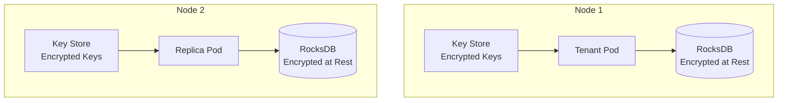

**Key Management:**
- User keys stored on nodes (not in S3)
- Keys encrypted with node-specific master key
- Pod mounts key store volume
- Keys loaded into memory at pod start
- Keys never leave node boundary

### Encryption Flow

```python
# Pod startup - load tenant keys
async def initialize_tenant_keys(tenant_id: str) -> TenantKeys:
    """Load tenant encryption keys from node key store."""

    # Load from node-local key store
    key_path = f"/keys/{tenant_id}/encryption.key"
    encrypted_key = read_file(key_path)

    # Decrypt with node master key
    node_master_key = get_node_master_key()
    tenant_key = decrypt(encrypted_key, node_master_key)

    # Initialize RocksDB with encryption
    db = RocksDB(
        path=f"/data/{tenant_id}",
        encryption_key=tenant_key
    )

    return TenantKeys(db_key=tenant_key, db=db)
```

## Job Scheduler

### Gateway-Based Scheduling

The staging gateway includes a scheduler that can send work to tenant pods on behalf of tenants:

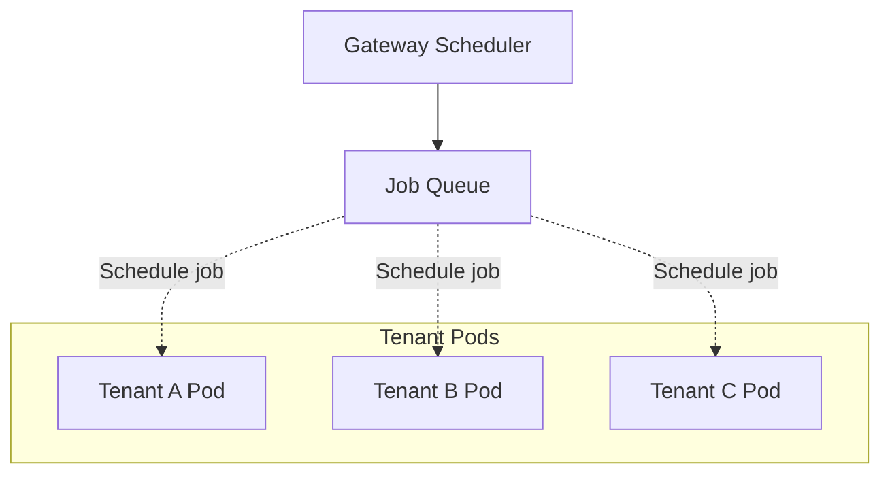

### Scheduled Job Types

| Job Type | Trigger | Example |
|----------|---------|---------|
| **Cron** | Time-based | Daily summary generation |
| **Event** | Webhook | Process uploaded document |
| **Recurring** | Interval | Sync external data every hour |
| **One-time** | API call | Generate report now |

### Job Specification

```json
{
  "job_id": "daily-summary-tenant-a",
  "tenant_id": "tenant-a",
  "type": "cron",
  "schedule": "0 9 * * *",
  "agent_uri": "percolate-agents-summarizer",
  "prompt": "Generate daily summary",
  "webhook_url": "https://tenant-a.com/webhook",
  "retry_policy": {
    "max_retries": 3,
    "backoff": "exponential"
  }
}
```

### Scheduler Implementation

```python
class TenantJobScheduler:
    """Gateway scheduler for tenant jobs."""

    async def schedule_job(self, job: ScheduledJob) -> str:
        """Schedule a job for a tenant."""

        # Validate tenant exists
        tenant = await self.get_tenant(job.tenant_id)

        # Store job in database
        job_id = await self.db.insert_job(job)

        # Add to scheduler queue
        if job.type == "cron":
            self.cron_scheduler.add_job(
                func=self.execute_job,
                args=[job_id],
                trigger="cron",
                **parse_cron(job.schedule),
            )
        elif job.type == "interval":
            self.cron_scheduler.add_job(
                func=self.execute_job,
                args=[job_id],
                trigger="interval",
                seconds=job.interval_seconds,
            )

        return job_id

    async def execute_job(self, job_id: str) -> None:
        """Execute a scheduled job."""

        # Load job
        job = await self.db.get_job(job_id)

        # Check if pod is running
        pod = await self.k8s_client.get_tenant_pod(job.tenant_id)

        if not pod or pod.status != "Running":
            # Wake up pod
            await self.k8s_client.create_tenant_pod(job.tenant_id)
            await self.wait_for_pod_ready(job.tenant_id)

        # Send job to pod
        try:
            result = await self.send_job_to_pod(pod, job)

            # Store result
            await self.db.update_job_result(job_id, result)

            # Call webhook if configured
            if job.webhook_url:
                await self.call_webhook(job.webhook_url, result)

        except Exception as e:
            # Handle retry
            await self.handle_job_failure(job_id, e)
```

### Job Queue

Jobs are queued and dispatched to tenant pods:

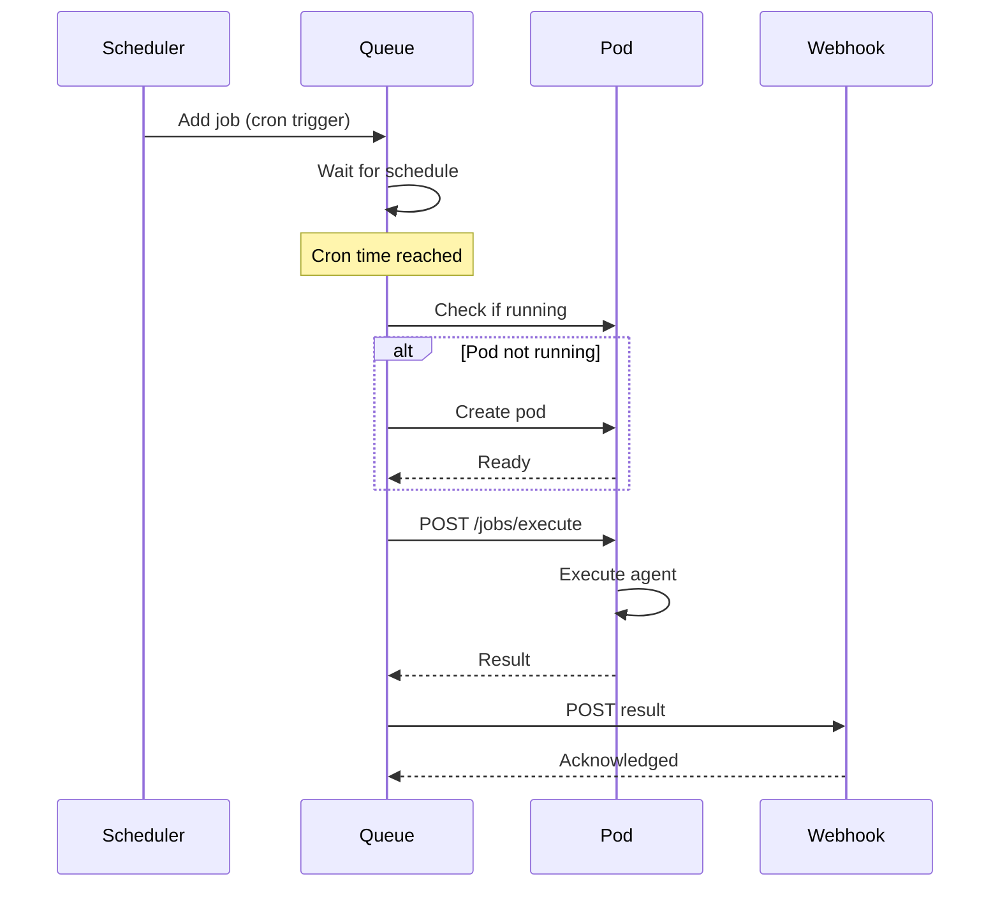

### Job API

Tenants can manage scheduled jobs:

```bash
# Create scheduled job
POST /v1/jobs
{
  "type": "cron",
  "schedule": "0 9 * * *",
  "agent_uri": "percolate-agents-summarizer",
  "prompt": "Generate daily summary"
}

# List jobs
GET /v1/jobs

# Get job status
GET /v1/jobs/{job_id}

# Cancel job
DELETE /v1/jobs/{job_id}

# Manual trigger
POST /v1/jobs/{job_id}/trigger
```

## Staging Gateway

### Architecture

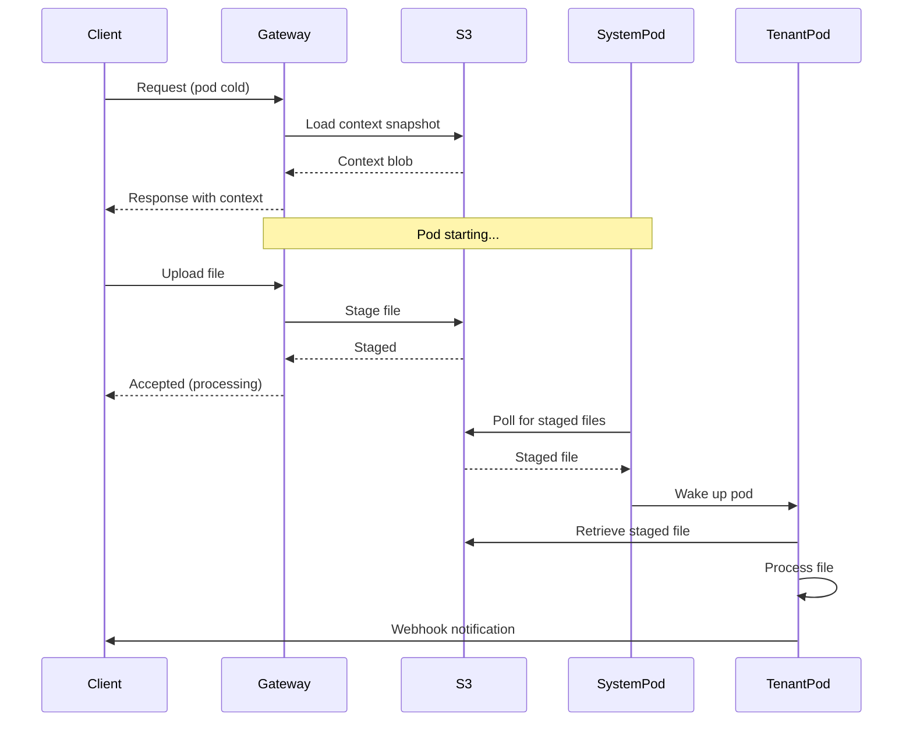

### Context Blob Caching

Instant response for cold pods using cached context:

```json
{
  "tenant_id": "tenant-a",
  "snapshot_time": "2025-10-24T13:00:00Z",
  "context": {
    "recent_conversations": [...],
    "active_agentlets": [...],
    "user_preferences": {...}
  },
  "metadata": {
    "size_bytes": 50000,
    "compression": "zstd"
  }
}
```

**Context Cache Strategy:**
- Updated every 5 minutes (configurable per tier)
- Stored in S3 for fast retrieval
- Compressed with zstd
- Max 100 KB per tenant
- Includes recent conversation history

### Staged File Processing

When pod is unavailable:

1. **Stage to S3** - Gateway uploads file to staging bucket
2. **Return accepted** - Client receives 202 Accepted
3. **System pod polls** - Background process checks for staged files
4. **Wake pod** - System pod triggers pod creation if needed
5. **Process** - Pod retrieves and processes staged file
6. **Notify** - Webhook or polling endpoint for completion

### System Pod Responsibilities

The system pod manages cold tenant lifecycle:

```python
async def system_pod_main():
    """System pod main loop."""
    while True:
        # Check for staged files
        staged = await s3_client.list_staged_files()

        for file in staged:
            tenant_id = file.tenant_id

            # Check if pod exists
            pod = await k8s_client.get_tenant_pod(tenant_id)

            if not pod:
                # Create pod
                await k8s_client.create_tenant_pod(tenant_id)

            # Wait for pod to be ready
            await wait_for_pod_ready(tenant_id)

            # Pod will auto-retrieve staged files

        await asyncio.sleep(10)
```

## Testing Plan

### Local Testing

See `.spikes/rem-db/replication.md` for replication testing.

1. **Two-node sync** - Test RocksDB replication locally
2. **Change log streaming** - Verify WAL sync
3. **Failover** - Test replica promotion
4. **Data consistency** - Verify replicas converge

### Cluster Testing

1. **Node affinity** - Verify pods launch on correct nodes
2. **Replication** - Test n-way replication
3. **Routing** - Verify subdomain to pod routing
4. **Scaling** - Test HPA under load
5. **Cold start** - Test staging gateway flow
6. **Encryption** - Verify keys stay on nodes

### Production Validation

1. **Multi-tenant isolation** - Verify no cross-tenant access
2. **Performance** - Latency within SLA
3. **Availability** - Meet RPO/RTO targets
4. **Security** - Penetration testing
5. **Cost** - Validate per-tenant economics
