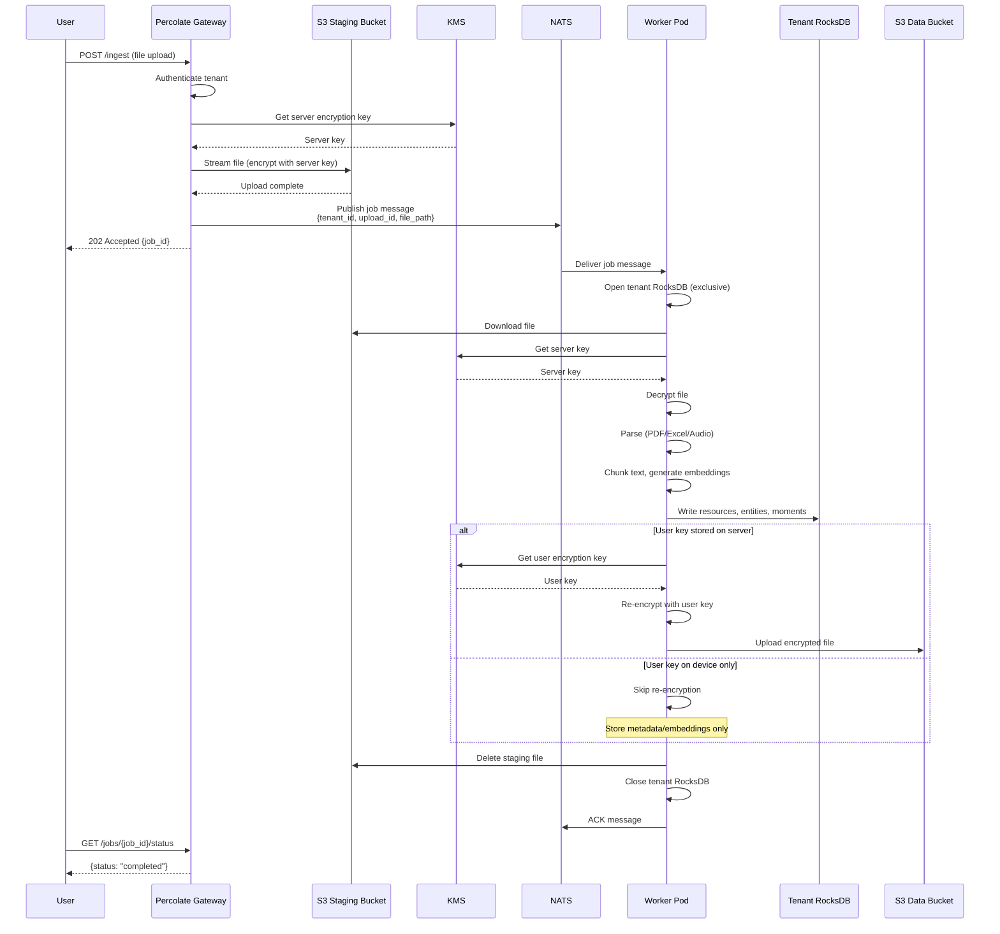
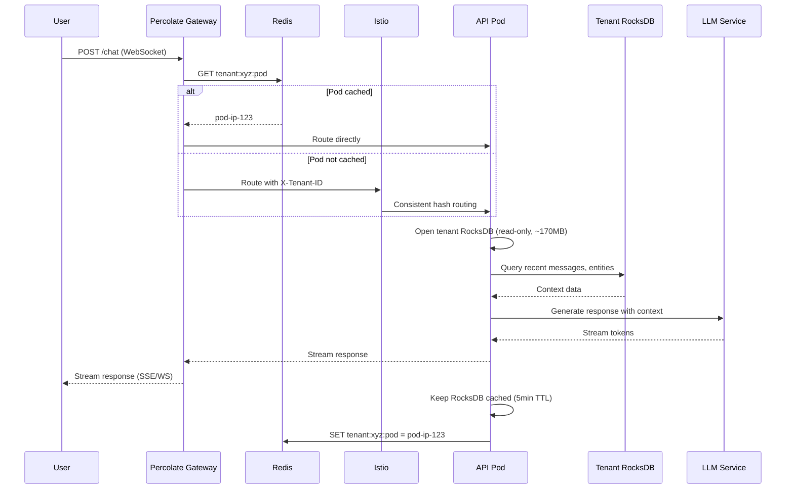
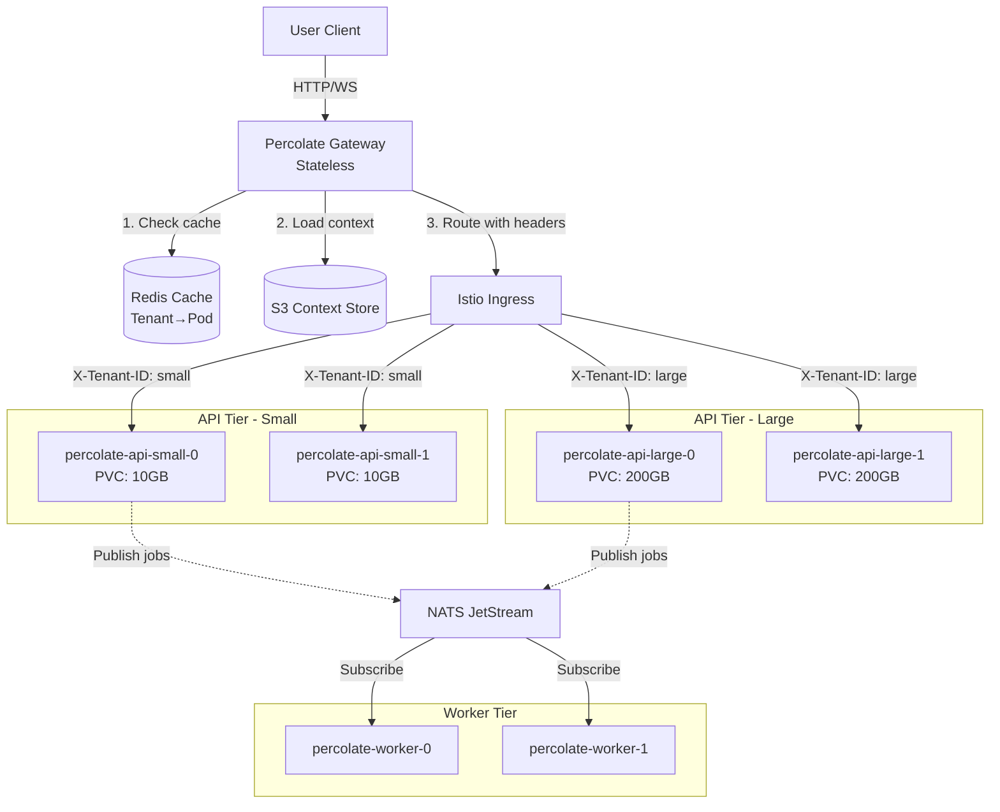
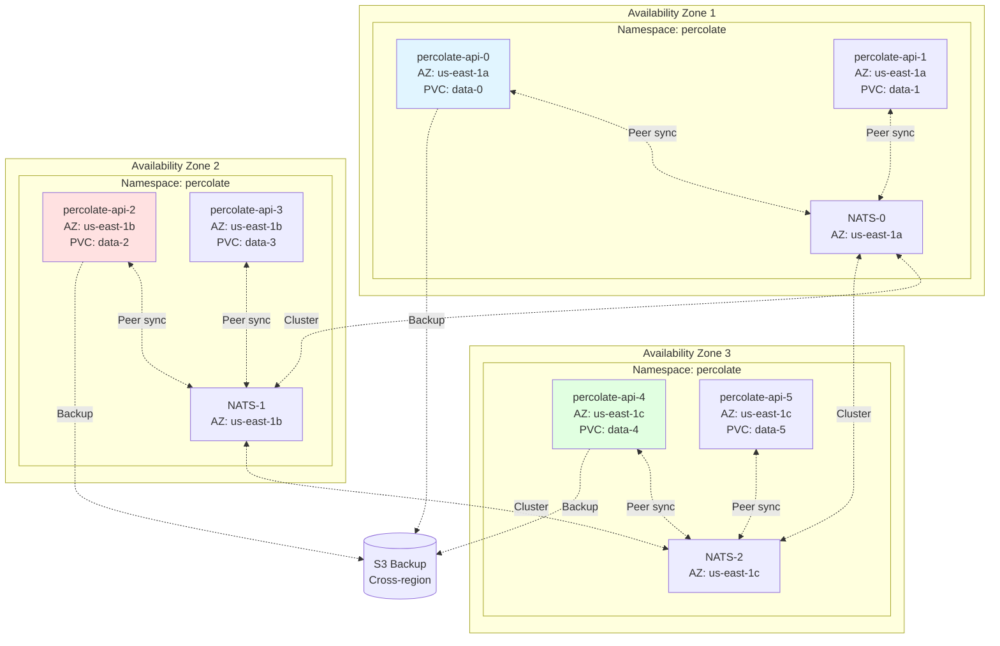
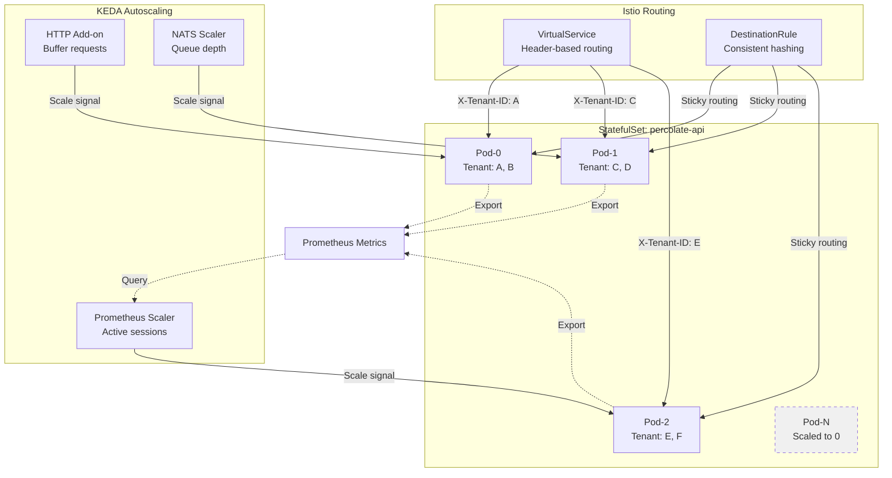
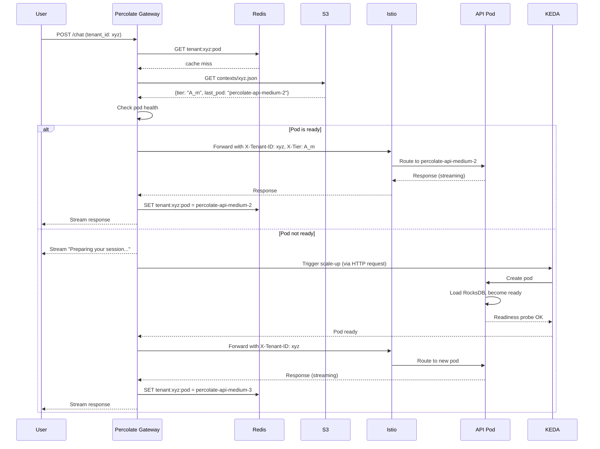

# Percolate Kubernetes deployment architecture

## Overview

Multi-tenant stateful deployment with tiered capacity, tenant affinity routing, and horizontal scaling to zero. Uses Kubernetes primitives, Istio for service mesh, and KEDA for autoscaling.

**Core user operations** (REM model):
- **Resources**: Semantic search over documents, chunks, embeddings
  - Search API: Vector similarity, hybrid search, filtering
  - Primary use case: Find relevant documents/chunks by semantic meaning
- **Entities**: Entity graph lookups and neighborhood exploration
  - Entity API: Get entity details, traverse relationships, find connected entities
  - Primary use case: Discover entity connections, build knowledge graphs
- **Moments**: Temporal feed and search over classifications
  - Moments API: Timeline feed, search by time range, filter by classification
  - Primary use case: Browse activity timeline, track events over time
- **Chat**: Conversational interface using REM search under the hood
  - Chat API: Streaming responses, context from Resources/Entities/Moments
  - Primary use case: Natural language interaction with personal knowledge base
- **File upload**: Ingest documents into system (gateway operation + background processing)
  - Upload API: Stream file to S3 staging → return immediately (low-memory, gateway only)
  - Background processing: Workers parse → extract entities → generate embeddings → store (high-memory)
  - Primary use case: Add new documents to knowledge base
  - User experience: Upload returns instantly, processing happens asynchronously via NATS

**API workload characteristics**:
- All REM operations (Resources, Entities, Moments) are low-memory reads (1-4GB pods)
- Chat is low-memory read (uses REM search APIs)
- File upload endpoint is low-memory (gateway streams to S3, no processing)

**Worker workload characteristics**:
- File processing is high-memory write operation (8-32GB pods)
- Triggered asynchronously via NATS after upload completes

**Tenant isolation model**:
- **Shared resource pool**: All tenants share namespaces, pods, nodes, and cluster resources
- **Data isolation only**: Tenant isolation achieved through percolate-rocks database instances
- Each pod can handle multiple tenants by opening/closing tenant-specific RocksDB instances
- No namespace-per-tenant, no pod-per-tenant - resources pooled for efficiency
- Isolation enforced at application layer, not infrastructure layer

## Tier definitions

**API pods** (chat, moments feed, low-memory reads):
- `A_s`: 1 CPU, 1GB RAM (small tenants, handles multiple tenants per pod)
- `A_m`: 2 CPU, 2GB RAM (medium tenants, handles multiple tenants per pod)
- `A_l`: 4 CPU, 4GB RAM (large tenants, handles multiple tenants per pod)
- **Design goal**: Low memory footprint, RocksDB read-only operations, many tenants per pod

**Worker pods** (file processing, parsing, embedding generation):
- `W_s`: 4 CPU, 8GB RAM (small workloads, document parsing)
- `W_m`: 8 CPU, 16GB RAM (medium workloads, batch processing)
- `W_l`: 16 CPU, 32GB RAM (large workloads, heavy ML inference)
- **Design goal**: Higher memory for file processing, one tenant job at a time

**Storage** (per-pod persistent volumes, shared across tenants):
- Small tier: 50GB PVC per pod (stores multiple tenant databases)
- Medium tier: 100GB PVC per pod
- Large tier: 200GB PVC per pod
- Each PVC contains `/data/{tenant_id}/rocks/` directories for all tenants on that pod

**Key difference**: API pods optimized for low-memory, multi-tenant read workloads (chat, feeds). Worker pods have higher memory for file processing, encryption/decryption, and ML operations.

## Primary workload patterns

### File upload and processing workflow

**User uploads document** → Gateway stages to S3 → NATS job triggered → Worker processes → Re-encrypt with user key

**Detailed flow**:

1. **Upload to gateway (stateless)**:
   - User uploads file via HTTP POST to `/ingest`
   - Gateway authenticates tenant, generates upload ID
   - Gateway writes file to **staging area**: `s3://percolate-staging/{tenant_id}/{upload_id}/original`
   - File encrypted at rest with **server key** (temporary)
   - Gateway publishes NATS message: `percolate.jobs.{tenant_id}.parse`

2. **NATS job message**:
   ```json
   {
     "tenant_id": "tenant-123",
     "upload_id": "upload-abc",
     "file_path": "s3://percolate-staging/tenant-123/upload-abc/original",
     "file_type": "application/pdf",
     "encryption": "server-key",
     "user_key_location": "server" | "device"
   }
   ```

3. **Worker processing**:
   - Worker pod picks up NATS message (tenant-specific consumer)
   - Opens tenant RocksDB (single instance, exclusive)
   - Downloads file from S3 staging area
   - Decrypts with server key
   - Parses document (PDF, Excel, audio, etc.)
   - Chunks text, generates embeddings
   - Stores in RocksDB: resources, entities, moments
   - Re-encrypts file with **user key** (if user_key_location = "server")
   - Writes to permanent storage: `s3://percolate-data/{tenant_id}/{resource_id}/encrypted`
   - Deletes staging file
   - Closes tenant RocksDB
   - ACKs NATS message

4. **Dual encryption model**:
   - **Server key encryption** (temporary, staging):
     - Used during upload and before processing
     - Key stored in KMS, accessible to gateway and workers
     - Purpose: Protect data in flight and at rest during processing
   - **User key encryption** (permanent, storage):
     - Used after processing for long-term storage
     - Key location depends on user choice:
       - `server`: User key stored in KMS (convenience, server can decrypt)
       - `device`: User key never leaves device (privacy, server cannot decrypt)
     - Purpose: End-to-end encryption for stored documents

5. **Device key model** (optional, high privacy):
   - User keeps private key on device only
   - Server stores documents encrypted with user's public key
   - Server can store metadata/embeddings but not original content
   - User must provide device key for document retrieval
   - Trade-off: Maximum privacy but server cannot process stored files

**Memory requirements**:
- Gateway: Minimal (streams upload to S3)
- Worker: High (file in memory, parsing, embedding generation)
- API: Low (serves metadata/embeddings, not full documents)

### Chat and moments feed workflow

**User requests chat/feed** → Gateway routes to API pod → API opens tenant RocksDB (read-only) → Stream response

**Detailed flow**:

1. **Chat request**:
   - User sends chat message via WebSocket or SSE
   - Gateway checks Redis cache for tenant→pod mapping
   - Gateway routes to API pod handling that tenant (or triggers scale-up)
   - API pod opens tenant RocksDB (read-only, low memory)
   - Queries recent messages, entities, context
   - Calls LLM with context
   - Streams response back to user
   - Closes RocksDB after request (or keeps cached for 5min)

2. **Moments feed request**:
   - User requests moments feed (timeline of classifications)
   - API pod opens tenant RocksDB
   - Scans `moment:` keyspace for recent entries
   - Returns paginated results (20-50 items)
   - Fast operation (<100ms), minimal memory

**Memory requirements**:
- API pod: 1-2GB sufficient for multiple tenants
- RocksDB read-only: ~100-500MB per tenant in memory
- Goal: 5-10 tenants active per API pod simultaneously

**Warm time expectations**:
- Cold start (pod scaled from 0): <30s
- Warm pod (tenant RocksDB cached): <100ms
- Hot pod (recent activity): <50ms

### Percolate-rocks memory optimization

**Design constraints for low-memory contexts**:

1. **Read-only mode for API pods**:
   - No compaction, no memtables
   - Block cache: 100MB per tenant max
   - No write buffers needed

2. **Memory budget per tenant**:
   - RocksDB block cache: 100MB
   - Index/filter blocks: 20MB
   - Application overhead: 50MB
   - **Total per tenant**: ~170MB

3. **Multi-tenant pod capacity**:
   - A_s (1GB RAM): 5-6 tenants active
   - A_m (2GB RAM): 10-12 tenants active
   - A_l (4GB RAM): 20-25 tenants active

4. **Caching strategy**:
   - Keep recently accessed tenants in memory (LRU)
   - Close inactive tenant DBs after 5min idle
   - Open/close overhead: ~200ms per tenant

5. **Worker pods** (write-heavy):
   - Single tenant at a time (exclusive access)
   - Write buffers: 256MB
   - Compaction resources: 2GB
   - Total: 4-8GB RAM for processing

**RocksDB configuration for low memory**:
```rust
// Read-only API pod config
let mut opts = Options::default();
opts.set_max_open_files(100);  // Limit file handles
opts.set_block_cache(&Cache::new_lru_cache(100 * 1024 * 1024)); // 100MB
opts.set_write_buffer_size(0);  // No writes
opts.set_max_write_buffer_number(0);  // No writes
opts.set_compression_type(DBCompressionType::Lz4);  // Fast decompression

// Worker pod config
let mut opts = Options::default();
opts.set_max_open_files(1000);
opts.set_block_cache(&Cache::new_lru_cache(512 * 1024 * 1024)); // 512MB
opts.set_write_buffer_size(256 * 1024 * 1024);  // 256MB memtable
opts.set_max_write_buffer_number(3);  // Allow compaction
opts.set_max_background_jobs(4);  // Parallel compaction
```

## Key concerns and solutions

### 1. Tenant affinity routing
**Problem**: Route requests to pods that have the tenant's data loaded.

**Solutions**:
- **Istio VirtualService**: Use HTTP headers (`X-Tenant-ID`) to route to specific pod subsets
- **Istio DestinationRule**: Define subsets based on pod labels (`tenant-id=xyz`)
- **Consistent hashing**: Envoy's `ring_hash` load balancer for sticky routing
- **Custom Gateway**: Percolate-gateway reads S3 context, injects tenant routing headers
- **Headless Service**: Direct pod addressing for tenant-pinned connections

**Implementation**:
```yaml
# VirtualService routes by tenant header
apiVersion: networking.istio.io/v1beta1
kind: VirtualService
metadata:
  name: percolate-api
spec:
  hosts:
  - percolate-api
  http:
  - match:
    - headers:
        x-tenant-id:
          exact: "tenant-123"
    route:
    - destination:
        host: percolate-api
        subset: tenant-123
```

### 2. Scale to zero with fast warm-up
**Problem**: Keep costs low by scaling to zero, but handle requests while pods start.

**Solutions**:
- **KEDA ScaledObject**: Scale StatefulSets based on NATS queue depth or HTTP metrics
- **KEDA HTTP Add-on**: Intercept requests, scale up, buffer while starting
- **Percolate-gateway stall**: Keep WebSocket/SSE open, stream "thinking" messages while waiting
- **S3 context preload**: Gateway fetches tenant context from S3, streams to user immediately
- **Pod readiness probes**: Only route when RocksDB is loaded and ready
- **PreStop hooks**: Graceful shutdown with connection draining - ensure peer database synced

**Implementation**:
```yaml
# KEDA HTTP Add-on intercepts and buffers
apiVersion: http.keda.sh/v1alpha1
kind: HTTPScaledObject
metadata:
  name: percolate-api-scaler
spec:
  scaleTargetRef:
    deployment: percolate-api-statefulset
  replicas:
    min: 0
    max: 10
  scalingMetric:
    requestRate:
      targetValue: 100
      granularity: 1s
```

### 3. Multi-AZ deployment with peer sync
**Problem**: Replicate tenant data across AZs, route to nearest available pod.

**Solutions**:
- **StatefulSet with topology spread**: Use `topologySpreadConstraints` to bind pods to AZs
- **PVC per pod**: Each pod gets its own PersistentVolume in its AZ
- **Istio locality load balancing**: Prefer pods in same AZ, failover to others
- **NATS JetStream**: Replicate state changes between AZ peers
- **Custom sync agent**: Percolate-rocks replication via NATS or direct gRPC
- **Headless service + DNS**: Discover peer pods via DNS SRV records

**Implementation**:
```yaml
# StatefulSet with AZ spreading
apiVersion: apps/v1
kind: StatefulSet
metadata:
  name: percolate-api
spec:
  podManagementPolicy: Parallel
  topologySpreadConstraints:
  - maxSkew: 1
    topologyKey: topology.kubernetes.io/zone
    whenUnsatisfiable: DoNotSchedule
    labelSelector:
      matchLabels:
        app: percolate-api
  volumeClaimTemplates:
  - metadata:
      name: data
    spec:
      accessModes: ["ReadWriteOnce"]
      storageClassName: regional-ssd
      resources:
        requests:
          storage: 50Gi
```

### 4. Tiered capacity allocation
**Problem**: Assign tenants to appropriate resource tiers, enforce limits.

**Solutions**:
- **Multiple StatefulSets**: One per tier (e.g., `percolate-api-small`, `percolate-api-large`)
- **Resource limits**: `resources.limits` and `requests` per tier
- **Node affinity**: Use node labels (`tier=large`) to schedule on appropriate nodes
- **PriorityClass**: Higher priority for larger tiers
- **Gateway routing**: Route tenant to correct tier based on subscription level
- **Admission webhook**: Validate tier assignments, reject oversubscription

**Implementation**:
```yaml
# Tier-specific StatefulSet
apiVersion: apps/v1
kind: StatefulSet
metadata:
  name: percolate-api-large
spec:
  replicas: 3
  template:
    spec:
      priorityClassName: percolate-large
      nodeSelector:
        tier: large
      containers:
      - name: api
        resources:
          requests:
            cpu: "8"
            memory: "16Gi"
          limits:
            cpu: "8"
            memory: "16Gi"
```

### 5. Gateway context management
**Problem**: Centralized gateway needs to route to correct backend without full state.

**Solutions**:
- **S3 context store**: Gateway reads tenant context (last pod, tier, AZ) from S3
- **Redis cache**: Cache tenant→pod mapping for low latency
- **Istio EnvoyFilter**: Inject routing headers based on Redis lookup
- **NATS request-reply**: Query tenant location from control plane
- **Consistent hashing fallback**: If no mapping, use hash(tenant_id) → pod
- **Health-aware routing**: Don't route to pods in terminating state

**Implementation**:
```python
# Gateway routing logic
async def route_request(tenant_id: str, request: Request):
    # 1. Check Redis cache for tenant→pod mapping
    pod_address = await redis.get(f"tenant:{tenant_id}:pod")

    if pod_address and await is_pod_ready(pod_address):
        # Direct route to pod
        return await proxy_to_pod(pod_address, request)

    # 2. Check S3 for tenant context
    context = await s3.get(f"contexts/{tenant_id}.json")
    tier = context["tier"]  # A_s, A_m, A_l

    # 3. Route to tier service, let Istio handle pod selection
    request.headers["X-Tenant-ID"] = tenant_id
    request.headers["X-Tier"] = tier
    return await proxy_to_service(f"percolate-api-{tier}", request)
```

### 6. NATS JetStream for background workers
**Problem**: Process background jobs with tenant affinity.

**Solutions**:
- **NATS JetStream**: Durable queues per tenant or tier
- **Consumer groups**: Workers subscribe to tenant-specific subjects
- **KEDA NATS scaler**: Scale workers based on queue depth
- **Worker affinity**: Workers prefer tenants they have data for
- **Message routing**: Include tenant_id in NATS subject (`percolate.jobs.{tenant_id}`)
- **Priority streams**: Separate streams for different tiers

**Implementation**:
```yaml
# KEDA scaler for NATS
apiVersion: keda.sh/v1alpha1
kind: ScaledObject
metadata:
  name: percolate-worker-scaler
spec:
  scaleTargetRef:
    name: percolate-worker
  minReplicaCount: 0
  maxReplicaCount: 20
  triggers:
  - type: nats-jetstream
    metadata:
      natsServerMonitoringEndpoint: "nats:8222"
      account: "percolate"
      stream: "percolate-jobs"
      consumer: "workers"
      lagThreshold: "10"
```

### 7. Low-latency chat sessions
**Problem**: Real-time chat requires fast routing, can't wait for cold start.

**Solutions**:
- **Keep-alive pods**: Maintain min 1 replica for active tenants
- **Predictive scaling**: KEDA custom metrics based on recent activity
- **Gateway stalling**: Stream "typing" indicators while warming up
- **Hot standby**: Pre-warmed pods with common tenant data
- **Sticky sessions**: Istio consistent hashing keeps user on same pod
- **WebSocket upgrade**: Upgrade to WS after first response, maintain connection

**Implementation**:
```yaml
# KEDA scale based on active sessions
apiVersion: keda.sh/v1alpha1
kind: ScaledObject
metadata:
  name: percolate-api-activity
spec:
  scaleTargetRef:
    name: percolate-api
  minReplicaCount: 0
  maxReplicaCount: 50
  triggers:
  - type: prometheus
    metadata:
      serverAddress: http://prometheus:9090
      metricName: percolate_active_sessions
      threshold: "10"
      query: |
        sum(rate(percolate_chat_messages_total[5m])) by (tenant_id)
```

## Architecture components

### Core services

**Percolate-gateway** (stateless):
- Receives all user requests (chat, file upload, moments)
- **File uploads**: Streams to S3 staging, publishes NATS job
- **Chat/feeds**: Routes to API pods via Istio
- Fetches tenant context from S3/Redis
- Injects routing headers (tenant_id, tier)
- Streams responses while backend warms up
- Manages WebSocket/SSE connections

**Percolate-api** (stateful, low-memory):
- StatefulSet per tier (A_s: 1GB, A_m: 2GB, A_l: 4GB RAM)
- Each pod has PVC with RocksDB data (shared across tenants)
- **Opens multiple tenant RocksDB instances** (5-25 tenants per pod, ~170MB each)
- **LRU cache**: Keeps recently accessed tenant DBs open for 5min, closes idle ones
- **Read-only access**: API pods only read from RocksDB (no writes)
- **User keys**: Fetched from OpenBao KMS on demand (if server-stored)
- Handles chat completions, moments feeds, OAuth
- Peers with other pods in AZs via NATS
- Exports Prometheus metrics for scaling

**Percolate-worker** (stateful, high-memory):
- StatefulSet per tier (W_s: 8GB, W_m: 16GB, W_l: 32GB RAM)
- Processes background jobs from NATS (file parsing, embedding generation)
- Each pod has PVC with RocksDB data (shared across tenants)
- **Opens tenant RocksDB instance per job** (read-write access)
- **Processes one tenant job at a time** (ensures write isolation)
- Can process multiple tenants over time (sequentially, not concurrently)
- **File processing workflow**:
  1. Download from S3 staging (encrypted with server key)
  2. Decrypt with server key from OpenBao
  3. Parse document (PDF, Excel, audio)
  4. Write to RocksDB (resources, entities, moments)
  5. Re-encrypt with user key (if server-stored)
  6. Upload to S3 permanent storage
  7. Delete staging file
- Scales to zero when idle

**NATS JetStream** (stateful):
- Streams for job queues
- Streams for peer-to-peer sync
- KV store for tenant→pod mapping
- Object store for large payloads

**Control plane**:
- Tenant provisioning service
- Capacity management
- Health monitoring
- S3 context writer

### Supporting infrastructure

**Istio**:
- VirtualService: Tenant routing rules
- DestinationRule: Subset definitions, locality LB
- EnvoyFilter: Custom routing logic
- Gateway: Ingress controller

**KEDA**:
- HTTP Add-on: Scale-to-zero for API pods
- NATS scaler: Scale workers by queue depth
- Prometheus scaler: Scale by activity metrics

**Storage**:
- **S3 staging**: Uploaded files (temporary, server key encryption)
  - `s3://percolate-staging/{tenant_id}/{upload_id}/`
- **S3 permanent**: Processed files (user key encryption)
  - `s3://percolate-data/{tenant_id}/{resource_id}/`
- **S3 context**: Tenant metadata, preferences
  - `s3://percolate-context/{tenant_id}/context.json`
- **PVC**: Shared per-pod storage for multiple tenant RocksDB databases (regional-ssd)
  - Pod PVC contains `/data/{tenant_id}/rocks/` directories for all tenants
  - 50-200GB per pod depending on tier
- **Redis**: Tenant→pod mapping cache, hot state
- **OpenBao**: Encryption keys (self-hosted KMS)
  - Server keys (temporary, for staging)
  - User keys (permanent, optional server-stored)

## Tenant data isolation

### RocksDB instance model

**Multiple tenant databases per pod with LRU caching**:
- Each pod can handle multiple tenants (5-25 depending on tier)
- When request arrives with `X-Tenant-ID` header, pod opens that tenant's RocksDB if not already cached
- Database path: `/data/{tenant_id}/rocks/`
- Multiple tenant databases can be open simultaneously (each ~170MB in memory)
- LRU cache: Recently accessed tenants kept open for 5min, then closed to free memory
- Prevents cross-tenant data leakage at application level (separate DB instances)

**Benefits**:
- Strong isolation: Each tenant has separate RocksDB instance, no shared data structures
- Efficient: Reuse open databases for active tenants, close idle ones
- Simple model: No complex multi-tenant RocksDB key prefixing
- Resource control: Predictable memory usage (~170MB per active tenant)
- Security: Minimize attack surface for data exfiltration

**Memory management**:
- API pod opens tenant DB on first request
- Keeps DB open while tenant active (within 5min window)
- Closes least-recently-used tenant DB when memory pressure or idle timeout
- Can serve concurrent requests for different tenants from same pod

### Cryptographic key storage

**Open-source KMS for self-hosted deployment**:
- All tenant keys stored in self-hosted open-source KMS
- **Primary option**: OpenBao (MPL 2.0, Linux Foundation fork of Vault)
- **Alternative options**: Infisical (MIT license), Mozilla SOPS (file-based)
- Keys never stored on disk or in Kubernetes Secrets
- Pods fetch keys on-demand via KMS API
- Envelope encryption: DEK (per-secret) encrypted by KEK (in KMS)

**Why OpenBao**:
- Community fork of HashiCorp Vault (pre-BSL license change)
- MPL 2.0 license (truly open source)
- Compatible with Vault APIs and workflows
- Supports dynamic secrets, PKI, flexible storage backends
- Active development under Linux Foundation
- No vendor lock-in to hyperscalers (AWS/GCP/Azure)

**Key types per tenant**:
- **Server key** (temporary, for staging):
  - ChaCha20-Poly1305 symmetric key
  - Used to encrypt uploaded files in S3 staging
  - Accessible to gateway and worker pods
  - Stored in KMS: `percolate/server-keys/{tenant_id}`

- **User key** (permanent, for storage):
  - ChaCha20-Poly1305 symmetric key (if server-stored)
  - Ed25519 keypair for device-to-device encryption (optional)
  - User choice: store in KMS or keep on device only
  - If server-stored: `percolate/user-keys/{tenant_id}`
  - If device-stored: Not accessible to server

**Key access pattern** (OpenBao/Vault-compatible API):
```rust
// Gateway encrypting uploaded file
let server_key = openbao_client
    .transit()
    .get_data_key(format!("percolate/server-keys/{}", tenant_id))
    .await?;

// Worker re-encrypting with user key (if server-stored)
let user_key = openbao_client
    .transit()
    .get_data_key(format!("percolate/user-keys/{}", tenant_id))
    .await?;
```

**Security properties**:
- Keys never touch filesystem or etcd
- KMS audit logging for all key access
- Key rotation handled by KMS (automatic DEK regeneration)
- FIPS 140-2 compliance (if using HSM-backed KMS)
- Per-tenant key isolation at KMS level
- Temporary credentials via IAM/workload identity

**Why not Kubernetes Secrets or hostPath**:
- ❌ Kubernetes Secrets: Stored in etcd, wider attack surface
- ❌ hostPath: Keys persist on node, accessible after pod deletion
- ✅ KMS: Keys never leave KMS, full audit trail, automatic rotation

## Architecture diagrams

### File upload and processing flow



### Chat request flow



### Request flow



### Multi-AZ deployment



### Scaling and tenant affinity



### Tenant context lifecycle



## Implementation phases

### Phase 1: Single-tier MVP
- Deploy one StatefulSet for API (tier A_m)
- Deploy one StatefulSet for Worker (tier W_m)
- NATS JetStream for job queues
- S3 for context storage
- Basic gateway with Redis cache
- No autoscaling (fixed replicas)

### Phase 2: Multi-tier capacity
- Add StatefulSets for A_s, A_l, W_s, W_l
- Implement tier-based routing in gateway
- Add resource limits per tier
- Tenant provisioning API

### Phase 3: Autoscaling
- KEDA HTTP Add-on for APIs
- KEDA NATS scaler for workers
- Prometheus metrics export
- Scale-to-zero configuration

### Phase 4: Multi-AZ replication
- Deploy StatefulSets across 3 AZs
- Topology spread constraints
- NATS peer sync between AZs
- Istio locality load balancing

### Phase 5: Advanced routing
- Consistent hashing for tenant affinity
- Health-aware routing
- Predictive scaling based on usage patterns
- WebSocket connection pooling

## 2025 best practices review and recommendations

Based on research of 2025 Kubernetes multi-tenancy, Istio, KEDA, and secrets management patterns:

### Multi-tenancy isolation improvements

**Design decision: Shared resource pool with application-level isolation** ✅
- **Current architecture**: All tenants share namespaces, pods, nodes
- Isolation enforced at application layer via percolate-rocks database instances
- No namespace-per-tenant, no pod-per-tenant
- Benefits:
  - **Efficiency**: Maximum resource utilization, 5-25 tenants per API pod
  - **Simplicity**: Single namespace, standard Kubernetes primitives
  - **Cost**: Dramatically lower overhead than dedicated resources
  - **Scalability**: Thousands of tenants without namespace explosion

**Recommendation 1: Add Policy Enforcement with Kyverno**
- **Add Kyverno**: Enforce security policies across all pods (simpler than OPA)
- Policies to implement:
  - Require resource limits on all pods
  - Disallow privileged containers
  - Enforce read-only root filesystem
  - Require security context constraints
- Reference: Kyverno is Kubernetes-native and easier than OPA for standard policies

**Recommendation 2: Network segmentation with Istio AuthorizationPolicy**
- **Add**: Istio AuthorizationPolicy to restrict pod-to-pod communication
- Benefits: Enforce which services can communicate (gateway, NATS, API, Worker)
- Example: Only gateway can reach API pods, only API/Worker can reach NATS
- No per-tenant policies needed (shared pool model)

**Recommendation 3: Resource quotas per tier**
- **Add**: ResourceQuota per tier namespace (e.g., `percolate-api-small`)
- Prevents runaway resource consumption at tier level
- Benefits: Noisy neighbor protection without per-tenant overhead

### Istio routing simplifications

**Recommendation 5: Use Istio Sidecar resource**
- Current design: All sidecars get all namespace configs
- **Add**: Sidecar resource to limit egress hosts per namespace
- Benefits: Reduce sidecar memory footprint, faster config propagation
- Reference: Istio 1.1+ feature, critical for multi-tenant performance

**Recommendation 6: Istio locality load balancing**
- Already planned in design
- **Verify**: Use `distribute` with failover settings
- Configuration:
  ```yaml
  trafficPolicy:
    loadBalancer:
      localityLbSetting:
        enabled: true
        distribute:
        - from: us-east-1a/*
          to:
            "us-east-1a/*": 80
            "us-east-1b/*": 20
  ```

**Recommendation 7: Simplify routing - avoid per-tenant VirtualService**
- Current design shows VirtualService with `exact: "tenant-123"`
- **Improvement**: Use consistent hashing on X-Tenant-ID header instead
- Benefits: No VirtualService per tenant, scales to thousands of tenants
- Istio DestinationRule with `RING_HASH` handles tenant affinity automatically

### KEDA autoscaling best practices

**Recommendation 8: KEDA v2 activation vs scaling phases**
- Critical distinction:
  - **0→1 scaling**: KEDA controls this via scaler `IsActive` function
  - **1→N scaling**: HPA controls this via metrics
- **Tune separately**: Different thresholds for activation vs scaling
- Example:
  ```yaml
  triggers:
  - type: prometheus
    metadata:
      threshold: "1"           # Activation: any activity
      activationThreshold: "10" # Scaling: sustained load
  ```

**Recommendation 9: KEDA cooldown period configuration**
- Cooldown only applies to scale-to-zero (N→0)
- **Set conservatively**: 300s-600s to avoid flapping
- **Separate from HPA behavior**: HPA handles 1→N with its own policies
- Reference: KEDA 2.15+ breaking changes - verify authentication method

**Recommendation 10: Do NOT combine KEDA with manual HPA**
- KEDA creates HPA internally
- **Critical**: Don't create separate HPA for same workload
- Results in "odd scaling behavior" per KEDA docs

**Recommendation 11: StatefulSet scale-to-zero requires KEDA 2.10+**
- Verify KEDA version supports StatefulSet scaling
- **Note**: `idleReplicaCount` must be 0 (can't use 1)
- Reference: Due to HPA controller limitations

### Secrets and cryptographic key storage

**Design decision: KMS v2 with direct API access** ✅
- **Current architecture**: Pods fetch keys directly from KMS via API
- No keys stored on disk, in etcd, or in Kubernetes Secrets
- Server keys and user keys stored in external KMS
- Per-tenant key isolation at KMS level
- Benefits:
  - Keys never touch node filesystem or cluster storage
  - Envelope encryption (DEK encrypted by KEK)
  - Full audit logging built-in
  - FIPS 140-2 compliance (if using HSM-backed KMS)
  - Automatic key rotation via KMS

**Recommendation 12: Use Secrets Store CSI Driver (optional enhancement)**
- **Future consideration**: Mount secrets as volume instead of API calls
- Secrets Store CSI Driver with AWS Secrets Manager, Azure Key Vault, GCP Secret Manager
- Benefits: Automatic rotation without pod restart, no application code changes
- Trade-off: Adds complexity, but reduces API calls to KMS
- Current design (direct API) is simpler and meets security requirements

**Recommendation 13: Consider External Secrets Operator (optional enhancement)**
- **Alternative approach**: Sync external secrets into Kubernetes Secrets
- Use External Secrets Operator to fetch from Vault/AWS Secrets Manager
- Benefits: Kubernetes-native secret management, automatic sync
- Trade-off: Secrets stored in etcd (encrypted), but adds convenience
- Current design (direct KMS API) avoids etcd storage entirely

### Simplicity-focused recommendations

**Priority recommendations for simplicity, isolation, security, scaling**:

1. **Shared resource pool** ✅ (current design, application-level isolation)
2. **OpenBao for KMS** ✅ (open source, self-hosted, Vault-compatible)
3. **Istio consistent hashing** (avoid per-tenant VirtualServices)
4. **KEDA with proper cooldown** (reliable scale-to-zero)
5. **Kyverno for policies** (enforce standards without custom code)
6. **Istio Sidecar resource** (reduce config bloat)

These align with your goals:
- **Simplicity**: Shared resources, standard Kubernetes primitives, no per-tenant infrastructure
- **Tenant isolation**: Application-layer data isolation via percolate-rocks instances
- **Security**: OpenBao KMS (self-hosted), policy enforcement, audit logging
- **Easy scaling**: 5-25 tenants per pod, KEDA handles 0→N, Istio handles routing
- **No hyperscaler lock-in**: Self-hosted on any infrastructure (Hetzner, bare metal, etc.)

## Key design decisions

1. **Shared resource pool**: All tenants share namespaces, pods, nodes - isolation at application layer only
2. **Use StatefulSets, not Deployments**: Pods need stable identity for PVC binding and peer discovery
3. **Lean on Istio for routing**: Don't build custom proxy, use Istio's VirtualService and DestinationRule
4. **KEDA for autoscaling**: Built-in support for NATS, HTTP, Prometheus triggers
5. **NATS for everything async**: Job queues, peer sync, pub/sub events
6. **Redis for hot cache**: Tenant→pod mappings, session state
7. **S3 for storage**: Staging (temporary), permanent (encrypted), context (Hetzner S3 by default)
8. **Gateway as orchestrator**: Stall users, trigger scale-ups, manage context, stream uploads to S3
9. **No custom scheduler**: Use Kubernetes scheduling primitives (affinity, taints, priority)
10. **OpenBao for KMS**: Open source, self-hosted, Vault-compatible, no hyperscaler lock-in
11. **Keys via OpenBao API**: Keys never touch disk/etcd, fetched on-demand via transit engine
12. **Kyverno for policy enforcement** (simpler than custom admission webhooks)
13. **Istio consistent hashing for tenant affinity** (scales to thousands of tenants)
14. **Dual encryption model**: Server key (staging) → User key (permanent storage)
15. **Low-memory API pods**: 1-4GB RAM, read-only RocksDB, 5-25 tenants per pod
16. **High-memory worker pods**: 8-32GB RAM, one tenant job at a time, write access

## Next steps

1. Review architecture and diagrams
2. Create Kubernetes manifests:
   - StatefulSet for API (3 tiers)
   - StatefulSet for Worker (3 tiers)
   - NATS JetStream deployment
   - Gateway deployment
   - Istio VirtualService and DestinationRule
   - KEDA ScaledObjects
   - PVC templates
3. Implement gateway routing logic
4. Add Prometheus metrics to percolate-api
5. Create Helm chart for deployment
6. Write deployment runbook
