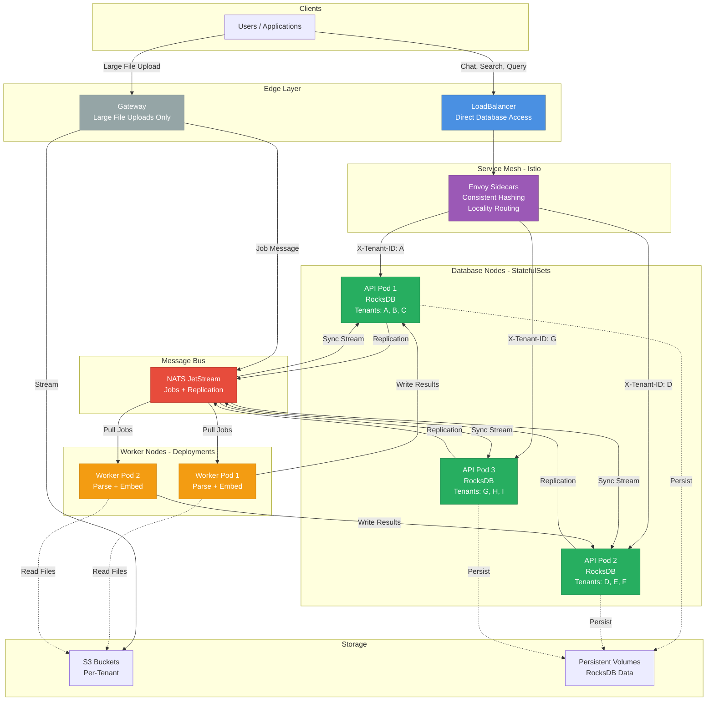
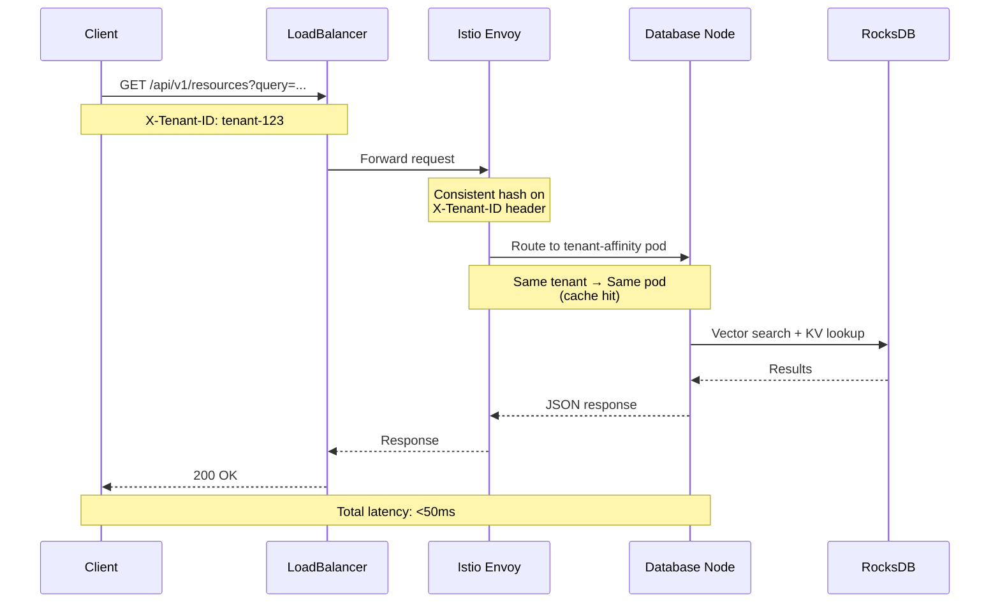
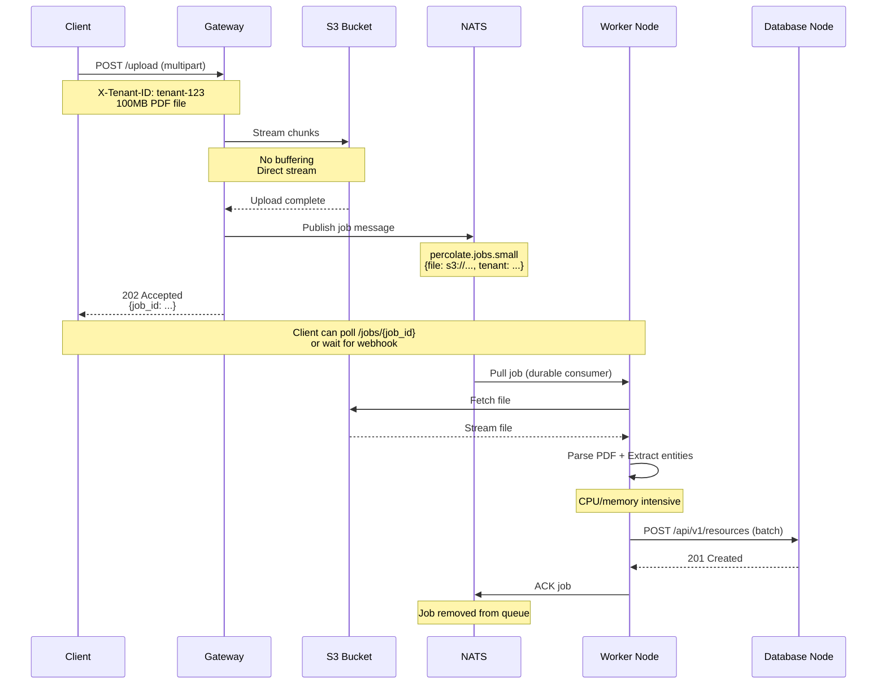
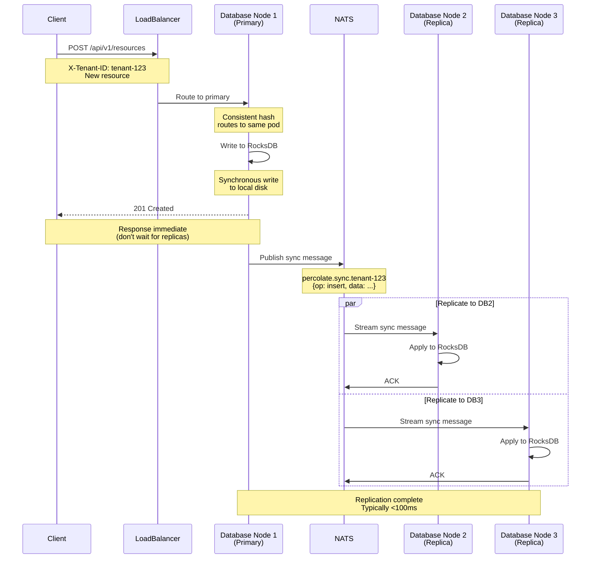
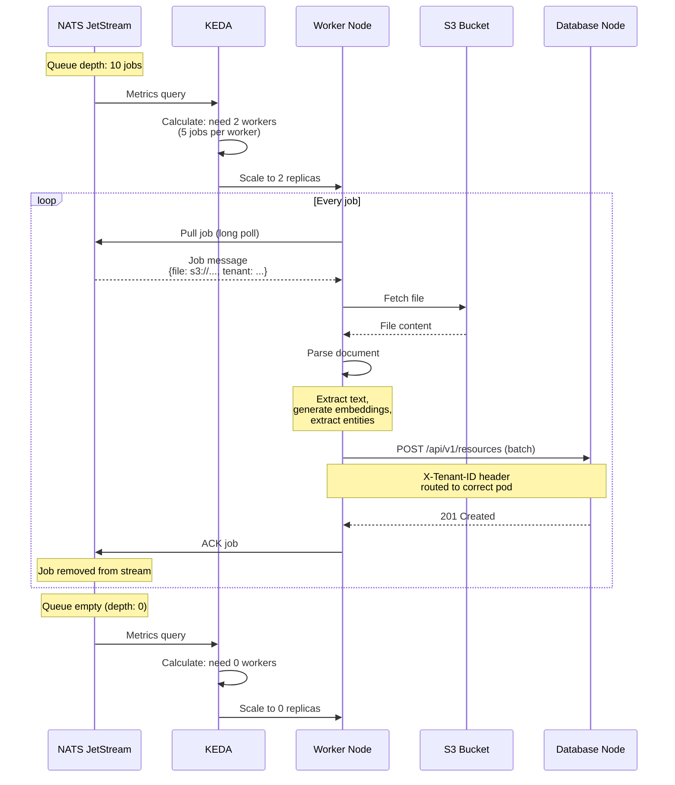
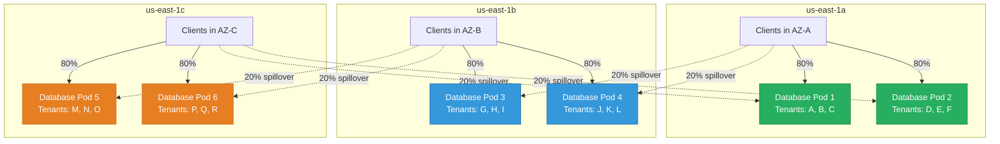

# Percolate Kubernetes architecture - Database-first design

## Core principle: Percolate is a distributed database

**Percolate is fundamentally a distributed REM database** with HTTP/gRPC APIs for access. The architecture should reflect this reality:

- **Database nodes** (API pods) are the primary component
- **Worker nodes** handle background jobs (parsing, embedding, indexing)
- **Gateway** is optional, only for large file uploads (not in critical path)
- **Direct access** via LoadBalancer for all read/write operations
- **Real-time sync** between database replicas via NATS

**Key architectural shift**:
- ❌ Gateway as single point of failure for all requests
- ✅ Direct LoadBalancer → Database node routing
- ✅ Gateway only for large file uploads (streams to S3)
- ✅ Istio/Envoy handles intelligent routing (tenant affinity, locality)

## Architecture overview

### System topology



### Key architectural shift

**Before (Gateway SPOF):**
```
Client → Gateway → API Pods
         ↑
    Single Point of Failure
```

**After (Direct Database Access):**
```
Client → LoadBalancer → Istio Envoy → API Pod (tenant-aware)
         ↑              ↑
    No SPOF        Smart Routing
```

## Component roles

### Database nodes (API pods)

**Primary component** - Multi-tenant REM database with HTTP/gRPC APIs:

- **Role**: Stateful database replicas with tenant-aware routing
- **Workload**: Read/write REM operations (Resources, Entities, Moments)
- **Memory**: 1-4GB per pod (5-25 tenants per pod)
- **Storage**: Local PVC with RocksDB databases (50-200GB)
- **Access**: Direct via LoadBalancer + Istio consistent hashing
- **Replication**: Real-time sync to peer nodes via NATS
- **Scaling**: KEDA based on active tenants (Prometheus metrics)

**Operations**:
- `GET /api/v1/resources?query=...` - Semantic search
- `GET /api/v1/entities/{id}` - Entity graph lookup
- `POST /api/v1/chat` - Chat completion (reads REM context)
- `GET /api/v1/moments` - Temporal feed
- `POST /api/v1/resources` - Insert resource (lightweight)
- `POST /api/v1/sync` - Receive replication updates from peers

### Worker nodes (Worker pods)

**Background job processors** - Handle heavy operations:

- **Role**: Stateless workers for CPU/memory-intensive tasks
- **Workload**: Parse documents, generate embeddings, build indexes
- **Memory**: 8-32GB per pod (single tenant job at a time)
- **Storage**: Temporary local storage only
- **Access**: Pull jobs from NATS JetStream queues
- **Scaling**: KEDA based on NATS queue depth

**Operations**:
- Parse PDF/Excel/Audio → structured text
- Generate embeddings (large models)
- Extract entities and relationships
- Write results back to database nodes (via API or direct RocksDB)

### Gateway (optional, not in critical path)

**File upload service only** - Handles large file streams:

- **Role**: Stream large files to S3 staging area
- **Workload**: HTTP multipart upload → S3 stream
- **Memory**: 256-512MB (stateless, no file buffering)
- **Access**: Public LoadBalancer (optional, separate from database LB)
- **Why separate**: Don't want large file uploads to impact low-latency database queries

**Operations**:
- `POST /upload` - Stream file to S3, publish NATS job

### LoadBalancer + Istio

**Direct database access** - Intelligent routing without SPOF:

- **Role**: L7 load balancer with tenant-aware routing
- **Features**:
  - Consistent hashing on `X-Tenant-ID` header
  - Locality-aware routing (prefer same-AZ database nodes)
  - Health checking (don't route to unhealthy nodes)
  - TLS termination
  - Rate limiting per tenant
- **No SPOF**: Istio Envoy sidecars run on every node
- **Failover**: Automatic rerouting on node failure

### NATS JetStream

**Message bus for async work and replication**:

- **Role**: Durable job queues + pub/sub for replication
- **Streams**:
  - `percolate.jobs.{tier}` - Worker job queues
  - `percolate.sync.{tenant_id}` - Database replication streams
- **Consumers**:
  - Workers consume job streams
  - Database nodes consume sync streams
- **Persistence**: 7-day retention, 3x replication

## Request flow patterns

### Pattern 1: Low-latency database read (no gateway)



**Example**: Chat completion, semantic search, entity lookup

**Latency**: <50ms (no gateway hop)

**Why no gateway**:
- Gateway adds 10-20ms overhead
- Database reads are low-latency operations
- Direct LoadBalancer routing is sufficient
- Istio provides intelligent routing (tenant affinity, locality)

### Pattern 2: Large file upload (gateway only)



**Example**: PDF upload, audio transcription

**Latency**: Immediate return (202 Accepted), async processing

**Why gateway**:
- Large files (100MB+) need streaming
- Don't want file upload load on database nodes
- Gateway is stateless, scales independently
- S3 provides durable staging area

### Pattern 3: Database write with replication



**Example**: Insert new resource, update entity

**Consistency**: Eventual (async replication)

**Replication model**:
- Primary writes immediately return (low latency)
- Replicas apply asynchronously via NATS
- Typically consistent within 100ms
- NATS ensures at-least-once delivery
- Idempotent operations for safety

### Pattern 4: Worker processing background job



**Example**: Parse PDF, generate embeddings

**Scaling**: KEDA scales workers based on queue depth

**Scaling logic**:
- KEDA monitors NATS consumer lag (pending jobs)
- Threshold: 5 jobs per worker
- Scale-up: <30s (pod startup)
- Scale-down: After 60s cooldown
- Scale-to-zero when queue empty

## Tenant affinity and routing

### Challenge

**Multi-tenant database with tenant-to-pod affinity**:
- Each database node caches 5-25 tenant RocksDB instances
- Want same tenant → same pod (cache hit rate)
- But pods scale up/down dynamically

### Solution: Istio Consistent Hashing

```mermaid
graph LR
    subgraph "Clients"
        C1[Client A<br/>X-Tenant-ID: tenant-123]
        C2[Client B<br/>X-Tenant-ID: tenant-456]
        C3[Client C<br/>X-Tenant-ID: tenant-789]
    end

    subgraph "Istio Envoy - Consistent Hash Ring"
        E[Consistent Hash<br/>on X-Tenant-ID]
    end

    subgraph "Database Nodes"
        DB1[API Pod 1<br/>Cached Tenants:<br/>123, 456, 999]
        DB2[API Pod 2<br/>Cached Tenants:<br/>789, 101, 202]
        DB3[API Pod 3<br/>Cached Tenants:<br/>303, 404, 505]
    end

    C1 -->|hash(123) = pod1| E
    C2 -->|hash(456) = pod1| E
    C3 -->|hash(789) = pod2| E

    E -->|123 → pod1| DB1
    E -->|456 → pod1| DB1
    E -->|789 → pod2| DB2

    style DB1 fill:#27ae60,stroke:#1e8449,color:#fff
    style DB2 fill:#27ae60,stroke:#1e8449,color:#fff
    style DB3 fill:#27ae60,stroke:#1e8449,color:#fff
    style E fill:#9b59b6,stroke:#6c3483,color:#fff
```

```yaml
apiVersion: networking.istio.io/v1beta1
kind: DestinationRule
metadata:
  name: database-affinity
spec:
  host: percolate-api.percolate.svc.cluster.local
  trafficPolicy:
    loadBalancer:
      consistentHash:
        httpHeaderName: x-tenant-id
```

**How it works**:
1. Client sends request with `X-Tenant-ID: tenant-123`
2. Istio Envoy hashes `tenant-123` → pod index
3. Request routes to same pod every time (until scaling event)
4. Pod has tenant RocksDB cached in memory (fast)

**On scale-up**:
- Consistent hash ring rebalances
- ~1/N tenants remapped to new pod (N = number of pods)
- New pod opens tenant RocksDB on first request (~200ms cold start)

**On scale-down**:
- Consistent hash ring rebalances
- Terminated pod's tenants remap to remaining pods
- PreStop hook drains connections gracefully

### Multi-AZ locality routing



```yaml
trafficPolicy:
  loadBalancer:
    localityLbSetting:
      enabled: true
      distribute:
      - from: us-east-1a/*
        to:
          "us-east-1a/*": 80
          "us-east-1b/*": 20
```

**Benefits**:
- 80% of requests stay in same AZ (low latency, reduced cross-AZ costs)
- 20% spillover to other AZs (load balancing, capacity headroom)
- Automatic failover if AZ goes down (no configuration change)
- Cross-AZ replication via NATS (disaster recovery)

## Database replication via NATS

### Replication model

**Eventual consistency** with real-time sync:

1. **Write to primary**: Client writes to any database node
2. **Publish to NATS**: Primary publishes change to `percolate.sync.{tenant_id}`
3. **Replicas apply**: Other nodes subscribed to tenant stream apply change
4. **Acknowledgment**: Replicas ACK to NATS (3-way replication)

### NATS stream configuration

```javascript
{
  name: "percolate-sync-tenant-123",
  subjects: ["percolate.sync.tenant-123.>"],
  retention: "workqueue",  // Remove after all consumers ACK
  replicas: 3,             // 3-way replication in NATS cluster
  max_age: 86400,          // 24 hour retention (safety)
  storage: "file"          // Persistent storage
}
```

### Conflict resolution

**Last-write-wins** with timestamp:
- Each write has `timestamp` and `node_id`
- Replicas compare timestamps
- Later timestamp wins
- If tie, higher `node_id` wins

**For REM model**:
- Resources: Immutable (no conflicts)
- Entities: Merge properties (CRDTs)
- Moments: Immutable (no conflicts)

## Scaling behavior

### API pods (database nodes)

**Scale based on active tenants**:

```yaml
apiVersion: keda.sh/v1alpha1
kind: ScaledObject
metadata:
  name: api-small-scaler
spec:
  scaleTargetRef:
    name: api-small
  minReplicaCount: 0
  maxReplicaCount: 10
  triggers:
  - type: prometheus
    metadata:
      query: sum(percolate_active_tenants{tier="small"})
      threshold: "5"  # 5 tenants per pod
```

**Metrics**:
- `percolate_active_tenants{tier="small"}` - Number of active tenants
- Active = request in last 5 minutes
- Exported by each database node

**Scaling logic**:
- 0 active tenants → 0 pods (scale to zero)
- 1-5 active tenants → 1 pod
- 6-10 active tenants → 2 pods
- Cold start: <30s (pod startup + RocksDB open)

### Worker pods

**Scale based on NATS queue depth**:

```yaml
triggers:
- type: nats-jetstream
  metadata:
    stream: "percolate-jobs-small"
    consumer: "workers-small"
    lagThreshold: "5"  # 5 pending jobs
```

**Scaling logic**:
- 0 jobs → 0 workers
- 1-5 jobs → 1 worker
- 6-10 jobs → 2 workers
- Max workers = tier limit (5/10/15)

## Tier definitions

### Small tier

| Component | CPU | RAM | Storage | Replicas | Max Scale |
|-----------|-----|-----|---------|----------|-----------|
| Database  | 1   | 1GB | 50GB    | 0→10     | 10 tenants |
| Worker    | 4   | 8GB | 5GB     | 0→5      | 5 jobs     |

### Medium tier

| Component | CPU | RAM  | Storage | Replicas | Max Scale  |
|-----------|-----|------|---------|----------|------------|
| Database  | 2   | 2GB  | 100GB   | 0→20     | 20 tenants |
| Worker    | 8   | 16GB | 10GB    | 0→10     | 10 jobs    |

### Large tier

| Component | CPU | RAM  | Storage | Replicas | Max Scale  |
|-----------|-----|------|---------|----------|------------|
| Database  | 4   | 4GB  | 200GB   | 0→30     | 30 tenants |
| Worker    | 16  | 32GB | 20GB    | 0→15     | 15 jobs    |

## Testing topology

Focus on validating the interesting distributed database behavior:

1. **Tenant-aware routing**
   - Consistent hashing keeps tenant → pod mapping stable
   - Cache hit rate >95% under normal operation

2. **Scale-to-zero and warm-up**
   - Database nodes scale 0→N based on active tenants
   - Cold start <30s (pod ready + RocksDB open)

3. **NATS-driven worker scaling**
   - Workers scale based on job queue depth
   - Process jobs and write back to database nodes

4. **Database replication**
   - Writes replicate to peer nodes via NATS
   - Eventual consistency (typically <100ms)

5. **Multi-AZ locality**
   - Requests prefer same-AZ database nodes
   - Automatic failover to other AZs

See [test-topology.md](test-topology.md) for minimal test environment.

## Key design decisions

1. **Database-first**: Percolate is a distributed REM database, not a monolithic app
2. **No gateway SPOF**: Direct LoadBalancer access for all database operations
3. **Gateway optional**: Only for large file uploads (not in critical path)
4. **Tenant affinity**: Istio consistent hashing on `X-Tenant-ID`
5. **Multi-AZ by default**: Locality-aware routing with automatic failover
6. **Scale-to-zero**: Both database and worker nodes scale to zero when idle
7. **NATS for everything async**: Job queues + database replication
8. **Shared resource pool**: All tenants share pods/nodes (not namespace-per-tenant)
9. **Application-layer isolation**: Separate RocksDB instances per tenant
10. **Eventual consistency**: Real-time NATS replication between database nodes

## References

- [test-topology.md](test-topology.md) - Minimal test environment for validation
- [KIND.md](KIND.md) - Local testing with Kind
- [README.md](README.md) - Kubernetes deployment guide
