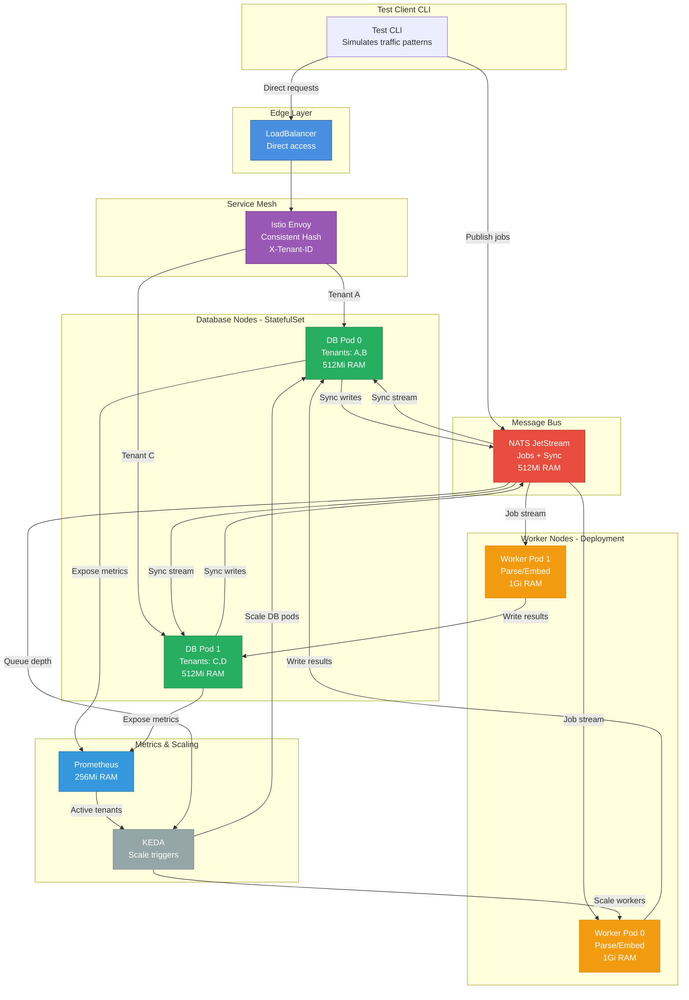

# Test topology for database-first architecture

Minimal Kind setup to test the database-first, distributed REM architecture with real-time syncing and worker scaling.

## Overview

This test topology focuses on **validating the distributed database behavior**:

1. **Direct database access** - LoadBalancer → Istio → Database nodes (no gateway SPOF)
2. **Tenant affinity routing** - Requests for same tenant go to same database pod
3. **Database node scaling** - Scale based on active tenants (KEDA + Prometheus)
4. **Worker node scaling** - Scale based on NATS queue depth (KEDA + NATS)
5. **Database replication** - NATS-driven sync between database replicas
6. **Multi-AZ locality** - Prefer same-AZ routing with failover

**What we include** (testing the interesting parts):
- **NATS JetStream** - Message bus for jobs + replication
- **Database nodes** - API pods with mock RocksDB
- **Worker nodes** - Background job processors
- **Istio** - Consistent hashing + locality routing
- **KEDA** - Dual scaling triggers (Prometheus + NATS)
- **Prometheus** - Metrics for database node scaling

**What we skip** (not needed for topology testing):
- OpenBao (use environment variables)
- Redis (not needed)
- S3 (use mock file system)
- Full RocksDB (use in-memory map)

**Resource budget**: ~3GB total (NATS adds ~500MB overhead)

## Architecture



## Components

### 1. Test Database Node (mock percolate-api)

FastAPI service that simulates database behavior:

**Endpoints:**
- `GET /api/v1/resources?query=...` - Semantic search (mock)
- `GET /api/v1/entities/{id}` - Entity lookup
- `POST /api/v1/resources` - Insert resource
- `POST /api/v1/sync` - Receive replication from peers
- `GET /metrics` - Prometheus metrics
- `GET /health` - Health check
- `GET /ready` - Readiness check

**Behavior:**
- Maintains in-memory tenant→data map (mock RocksDB)
- On write: publishes to NATS sync stream
- On sync: applies changes from peer nodes
- Exports metrics: `percolate_active_tenants{tier="small"}`
- Tracks last request time per tenant (5-minute window)

**Memory**: 512Mi per pod

### 2. Test Worker Node (mock percolate-worker)

FastAPI service that simulates background jobs:

**Behavior:**
- Pulls jobs from NATS JetStream consumer
- Simulates parsing (sleep 2-5 seconds)
- Writes results back to database nodes via API
- ACKs job to NATS on success
- NAKs job on failure (retry)
- Scales to zero when queue empty

**Memory**: 1Gi per pod (simulates embedding model memory)

### 3. Test CLI (percolate test-topology)

Command-line tool for topology testing:

**Commands:**
```bash
# Simulate tenant traffic patterns
percolate test-topology simulate-tenant tenant-a --duration 120 --rate 10

# Simulate multiple tenants
percolate test-topology simulate-tenants --tenants 5 --duration 300 --rate 5

# Submit background jobs
percolate test-topology submit-jobs --count 10 --tenant tenant-a

# Verify tenant affinity
percolate test-topology verify-affinity tenant-a --requests 100

# Check replication lag
percolate test-topology check-replication tenant-a

# Observe scaling behavior
percolate test-topology observe-scaling --duration 600
```

**Verification:**
- Tenant affinity: Same tenant → same pod >95% of requests
- Scaling up: New tenants trigger pod creation <30s
- Scaling down: Idle tenants trigger scale-down after 60s cooldown
- Worker scaling: Job queue depth triggers worker pods
- Replication: Writes appear on replicas <100ms

### 4. NATS JetStream

Two stream types:

**Job Stream** (`percolate-test-jobs`):
- Subjects: `percolate.test.jobs.*`
- Consumers: `workers` (pull-based, durable)
- Retention: Work queue (remove after ACK)
- Storage: File (persistent)

**Sync Stream** (`percolate-test-sync-{tenant}`):
- Subjects: `percolate.test.sync.{tenant}.*`
- Consumers: Database pods (push-based)
- Retention: 24 hours
- Storage: File (persistent)

### 5. KEDA Scalers

**Database Node Scaler:**
```yaml
triggers:
- type: prometheus
  metadata:
    serverAddress: http://prometheus:9090
    metricName: percolate_active_tenants
    threshold: "2"  # 2 tenants per pod
    query: sum(percolate_active_tenants{tier="small"})
```

**Worker Node Scaler:**
```yaml
triggers:
- type: nats-jetstream
  metadata:
    natsServerMonitoringEndpoint: nats:8222
    stream: percolate-test-jobs
    consumer: workers
    lagThreshold: "5"  # 5 jobs per worker
```

### 6. Istio Routing

**DestinationRule** (consistent hashing):
```yaml
trafficPolicy:
  loadBalancer:
    consistentHash:
      httpHeaderName: x-tenant-id
  connectionPool:
    tcp:
      maxConnections: 100
    http:
      http1MaxPendingRequests: 50
```

## Setup

### Automated setup

```bash
cd k8s/test-topology-v2
./setup.sh
```

The script will:
1. Create Kind cluster with local registry
2. Build test images (database, worker, CLI)
3. Install Istio (minimal profile)
4. Install KEDA
5. Install NATS JetStream
6. Deploy Prometheus
7. Deploy test database StatefulSet (scale 0→N)
8. Deploy test worker Deployment (scale 0→N)
9. Deploy KEDA scalers
10. Deploy Istio routing rules
11. Install test CLI to local machine

### Manual setup

See [MANUAL_SETUP.md](test-topology-v2/MANUAL_SETUP.md) for step-by-step instructions.

## Test Scenarios

### Scenario 1: Tenant affinity validation

**Goal**: Verify same tenant always routes to same database pod

```bash
# Start with 0 pods
kubectl get pods -n percolate-test

# Simulate tenant A for 2 minutes
percolate test-topology simulate-tenant tenant-a --duration 120 --rate 10

# Verify scaling
kubectl get pods -n percolate-test
# Should see: test-db-small-0 (Running)

# Verify affinity
percolate test-topology verify-affinity tenant-a --requests 100
# Expected: >95% hit rate to same pod
```

**Validation**:
- Database pod scales from 0→1 within 30s
- All requests for tenant-a go to same pod (consistent hash)
- Prometheus shows `percolate_active_tenants{tier="small"} = 1`

### Scenario 2: Multi-tenant scaling

**Goal**: Verify pods scale up with multiple tenants

```bash
# Simulate 5 tenants concurrently
percolate test-topology simulate-tenants --tenants 5 --duration 300 --rate 5

# Watch scaling
watch kubectl get pods -n percolate-test

# Expected: Scale from 0→3 pods (5 tenants / 2 per pod = 2.5 → 3)
```

**Validation**:
- Pods scale up based on active tenant count
- Each pod serves ~2 tenants (threshold)
- KEDA logs show prometheus metric trigger
- Tenant affinity maintained during scale-up

### Scenario 3: Scale-to-zero

**Goal**: Verify pods scale down when idle

```bash
# Simulate tenant for 2 minutes
percolate test-topology simulate-tenant tenant-a --duration 120

# Stop sending requests
# Wait 5 minutes for tenant to become inactive
sleep 300

# Verify scale-down
kubectl get pods -n percolate-test
# Expected: 0 database pods after cooldown
```

**Validation**:
- After 5 minutes of no requests, tenant marked inactive
- After 60s cooldown, pod scales to 0
- Prometheus shows `percolate_active_tenants{tier="small"} = 0`

### Scenario 4: Worker scaling from job queue

**Goal**: Verify workers scale based on NATS queue depth

```bash
# Submit 20 jobs
percolate test-topology submit-jobs --count 20 --tenant tenant-a

# Watch scaling
watch kubectl get pods -n percolate-test

# Expected:
# - Database pod scales up (tenant-a becomes active)
# - Worker pods scale up (20 jobs / 5 per worker = 4 workers)
```

**Validation**:
- Workers scale from 0→4 based on queue depth
- Workers pull jobs from NATS stream
- Workers write results to database nodes
- Workers scale to 0 when queue empty

### Scenario 5: Database replication

**Goal**: Verify writes replicate to peer database nodes

```bash
# Start 2 database pods
percolate test-topology simulate-tenants --tenants 4 --duration 300

# Verify 2 pods running
kubectl get pods -n percolate-test | grep test-db

# Write to tenant-a (routes to pod 0)
curl -H "X-Tenant-ID: tenant-a" \
  http://localhost:8000/api/v1/resources \
  -d '{"content": "test document"}'

# Check replication lag
percolate test-topology check-replication tenant-a

# Expected: Write appears on pod 1 within <100ms
```

**Validation**:
- Write to pod 0 publishes to NATS sync stream
- Pod 1 receives sync message and applies write
- Replication lag < 100ms (check timestamps)
- Both pods have identical data for tenant-a

### Scenario 6: End-to-end workflow

**Goal**: Validate full request→job→database flow

```bash
# 1. Submit large file upload (simulated)
percolate test-topology submit-upload --file test.pdf --tenant tenant-a

# 2. Observe:
# - Database pod scales up (tenant-a active)
# - Job published to NATS
# - Worker pod scales up (job in queue)
# - Worker processes job (simulated parse)
# - Worker writes results to database
# - Database replicates to peers
# - Worker scales down (queue empty)

# 3. Query results
curl -H "X-Tenant-ID: tenant-a" \
  "http://localhost:8000/api/v1/resources?query=test"

# 4. Verify replication
percolate test-topology check-replication tenant-a
```

**Validation**:
- Database node scaling (KEDA + Prometheus)
- Worker node scaling (KEDA + NATS)
- Job processing (NATS consumer)
- Database write (tenant affinity maintained)
- Replication (NATS sync stream)

## Observability

### Prometheus metrics

```bash
# Port-forward Prometheus
kubectl port-forward -n percolate-test svc/prometheus 9090:9090

# Query active tenants
http://localhost:9090/graph?g0.expr=percolate_active_tenants

# Query request rate
http://localhost:9090/graph?g0.expr=rate(percolate_tenant_requests_total[1m])

# Query tenant affinity hits
http://localhost:9090/graph?g0.expr=percolate_affinity_hits_total
```

### KEDA status

```bash
# Check scaled objects
kubectl get scaledobjects -n percolate-test

# Check HPA (created by KEDA)
kubectl get hpa -n percolate-test

# Check KEDA logs
kubectl logs -n keda deploy/keda-operator
```

### NATS monitoring

```bash
# Port-forward NATS monitoring
kubectl port-forward -n percolate-test svc/nats 8222:8222

# Check streams
curl http://localhost:8222/streaming/channelsz

# Check consumers
curl http://localhost:8222/streaming/channelsz?channel=percolate-test-jobs

# Check replication lag
percolate test-topology check-replication --all-tenants
```

### Database node logs

```bash
# Follow logs for tenant affinity
kubectl logs -n percolate-test test-db-small-0 -f | grep "tenant="

# Check replication events
kubectl logs -n percolate-test test-db-small-0 -f | grep "sync:"

# Watch scaling events
kubectl logs -n percolate-test test-db-small-0 -f | grep "scale:"
```

### Worker node logs

```bash
# Follow job processing
kubectl logs -n percolate-test test-worker-0 -f

# Check job ACK/NAK
kubectl logs -n percolate-test test-worker-0 -f | grep "job:"
```

## Performance Benchmarks

Expected performance characteristics:

| Metric | Target | Measurement |
|--------|--------|-------------|
| Database pod cold start | <30s | Time from tenant request to pod ready |
| Worker pod cold start | <30s | Time from job publish to worker ready |
| Tenant affinity hit rate | >95% | Same tenant → same pod consistency |
| Replication lag | <100ms | Time from write to replica apply |
| Scale-to-zero delay | 60s cooldown | Time from idle to scale-down |
| Request latency (cached) | <10ms | Database read with tenant cached |
| Request latency (cold) | <200ms | Database read with tenant not cached |
| NATS job delivery | <50ms | Time from publish to worker receive |
| KEDA scaling decision | <10s | Time from metric change to HPA update |

## Resource Usage

Expected resource consumption:

| Component | Pods | CPU | Memory | Total |
|-----------|------|-----|--------|-------|
| Database nodes | 0-5 | 100m-500m | 512Mi-2.5Gi | 0-2.5Gi |
| Worker nodes | 0-5 | 100m-500m | 1Gi-5Gi | 0-5Gi |
| NATS JetStream | 1 | 100m | 512Mi | 512Mi |
| Prometheus | 1 | 100m | 256Mi | 256Mi |
| Istio sidecars | 0-10 | 10m-100m | 128Mi-1Gi | 0-1Gi |
| KEDA | 2 | 100m | 256Mi | 256Mi |
| **Total** | **4-24** | **510m-1.9** | **1.5Gi-12Gi** | **~3Gi idle, ~9Gi peak** |

## Cleanup

```bash
# Delete test namespace (removes all components)
kubectl delete namespace percolate-test

# Delete Kind cluster
kind delete cluster --name test-topology

# Uninstall test CLI
uv tool uninstall percolate
```

## Troubleshooting

### Database pods not scaling up

**Check KEDA scaler:**
```bash
kubectl describe scaledobject test-db-small-scaler -n percolate-test
```

**Check Prometheus metric:**
```bash
curl http://prometheus:9090/api/v1/query?query=percolate_active_tenants
```

**Fix**: Ensure database pods export `percolate_active_tenants` metric

### Worker pods not scaling up

**Check NATS stream:**
```bash
curl http://nats:8222/streaming/channelsz?channel=percolate-test-jobs
```

**Check KEDA scaler:**
```bash
kubectl describe scaledobject test-worker-scaler -n percolate-test
```

**Fix**: Ensure jobs are published to correct stream

### Tenant affinity broken

**Check Istio routing:**
```bash
kubectl get destinationrule -n percolate-test
kubectl get virtualservice -n percolate-test
```

**Check X-Tenant-ID header:**
```bash
# Verify header is sent
curl -v -H "X-Tenant-ID: tenant-a" http://localhost:8000/api/v1/resources
```

**Fix**: Ensure consistent hashing is configured on correct header

### Replication lag high

**Check NATS sync stream:**
```bash
curl http://nats:8222/streaming/channelsz?channel=percolate-test-sync-tenant-a
```

**Check database logs:**
```bash
kubectl logs -n percolate-test test-db-small-0 | grep "sync:"
```

**Fix**: Increase NATS stream throughput or reduce write rate

## Next Steps

After validating the test topology:

1. **Port to production manifests** - Apply learnings to main k8s manifests
2. **Add multi-AZ testing** - Test locality-aware routing in 3-AZ setup
3. **Load testing** - Stress test with realistic tenant counts and request rates
4. **Chaos engineering** - Test failure scenarios (pod termination, network partition)
5. **Production deployment** - Deploy to staging/production clusters

## References

- [system-v2.md](system-v2.md) - Database-first architecture design
- [KIND.md](KIND.md) - Local Kind cluster setup
- [test-topology/](test-topology/) - Original topology testing (pre-NATS)
