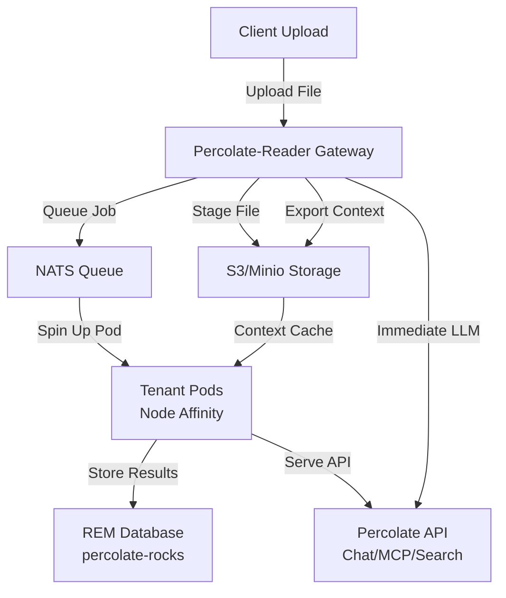

# Percolate-Reader

**Heavy multimedia processing service for Percolate** - implements the REM parse protocol for PDF, Excel, DOCX, audio parsing with semantic extraction and iterative OCR capabilities.

## Overview

Percolate-Reader is a **stateless processing service** that handles:

- **Document parsing**: PDF, Excel, DOCX, ZIP → structured markdown (Kreuzberg-based)
- **Image OCR**: Multi-pass OCR with LLM vision for complex layouts
- **Audio transcription**: Whisper/OpenAI-based speech-to-text with intelligent chunking
- **Heavy embeddings**: GPU-accelerated batch embedding generation
- **Job management**: Filesystem + RocksDB job tracking with WebSocket notifications

**Key characteristics:**
- Best-effort structured markdown creation with quality flags
- Iterative OCR with agent-based verification
- Asynchronous job processing with real-time status updates
- Optional authentication (disabled by default)
- Multipart upload support with callback webhooks
- Shared service in cloud deployments (scales independently)

## Deployment Models

### Local (Desktop)

Reading node runs alongside REM node on same machine:
```bash
# Terminal 1: Start REM node
cd percolate
uv run percolate serve

# Terminal 2: Start reading node
cd percolate-reading
uv run percolate-reading serve
```

### Cloud (Tiered Architecture with Gateway)

Percolate-Reader acts as a **cloud gateway** that stages files, caches context, and orchestrates tenant pod scaling:



**Gateway Responsibilities:**
1. **File Staging**: Receive uploads, stage in S3/Minio
2. **Context Export**: Cache conversation history, uploaded files, metadata in S3
3. **Pod Orchestration**: Send NATS messages to scale tenant pods with node affinity
4. **Immediate Serving**: Export context enables instant LLM serving while pods spin up
5. **Job Distribution**: Queue heavy processing to tenant-specific pods
6. **On-Demand Processing**: Launch ephemeral pods for large file processing with arbitrary resources

**Tiered Tenant Pods:**
- **Node Affinity**: Pods run on dedicated nodes per tenant tier
- **REM Database**: Each pod runs percolate-rocks (embedded REM)
- **Percolate API**: Each pod serves chat, MCP, search endpoints
- **Auto-scaling**: NATS triggers pod creation based on load
- **Shared Codebase**: All parsing code lives in percolate-reading server (same Docker image)
- **Tenant Isolation**: Pods run on behalf of tenants with access to user keys and credentials
- **Resource Flexibility**: Gateway can spawn pods with arbitrary CPU/GPU/memory for large file processing

**S3/Minio Storage:**
- **Staged Files**: Uploaded documents awaiting processing
- **Parsed Artifacts**: Parse job results (.fs/parse-jobs/{job_id}/)
- **Context Cache**: Last conversations, files, metadata for fast LLM serving
- **Shared Access**: Gateway and tenant pods access same bucket

**Flow:**
```
1. Client uploads file → Gateway
2. Gateway stages file in S3
3. Gateway exports tenant context to S3 (conversations, files, metadata)
4. Gateway sends NATS message with tenant_id, job_id
5. NATS triggers tenant pod spin-up (node affinity based on tier)
6. Gateway serves immediate LLM queries using cached context (while pod starts)
7. Tenant pod reads context from S3, processes job
8. Tenant pod stores results in REM (percolate-rocks)
9. Tenant pod serves full API (chat, MCP, search)
10. Results written back to S3 for gateway access
```

**Benefits:**
- **Instant Response**: Context caching enables immediate LLM serving
- **Cost-effective**: Share gateway, scale tenant pods independently
- **Tenant Isolation**: Dedicated pods with node affinity per tier
- **Efficient Scaling**: Only spin up pods when needed (NATS queue depth)
- **Durable Storage**: S3/Minio for fault-tolerant file staging
- **GPU Sharing**: Gateway handles GPU-heavy tasks (embeddings, transcription)

### Gateway-Orchestrated Processing Pattern

> **📖 Full Kubernetes Architecture**: See [docs/k8s-architecture.md](./docs/k8s-architecture.md) for complete deployment manifests, NATS JetStream configuration, and KEDA auto-scaling setup.

**Important:** The gateway doesn't do heavy processing itself. Instead, it orchestrates ephemeral pods that run the same percolate-reading codebase on behalf of tenants.

**Architecture:**
```
Gateway (Lightweight)           Tenant Pods (On-Demand)
├── Receive upload              ├── Same Docker image (percolate-reading)
├── Stage to S3                 ├── Access to tenant credentials/keys
├── Queue job (NATS)            ├── Arbitrary resources (CPU/GPU/memory)
├── Export context              ├── Process large files (GB-scale PDFs, videos)
└── Return 202 Accepted         ├── Write results to S3
                                ├── Update REM database
                                └── Send webhook callback
```

**Why This Pattern:**

1. **Security**: Tenant pods have access to user keys and credentials (secrets mounted via K8s)
2. **Resource Flexibility**: Gateway can request pods with arbitrary resources:
   - Small files: 1 CPU, 2GB RAM (basic parsing)
   - Large PDFs: 4 CPU, 16GB RAM (complex layouts)
   - Video transcription: 8 CPU, 1x GPU, 32GB RAM
3. **Cost Optimization**: Only pay for compute during processing, not idle time
4. **Shared Codebase**: All parsing logic in one place (percolate-reading server)
5. **Tenant Isolation**: Each pod runs in tenant context with tenant-scoped credentials

**Example Flow (Large File):**
```
1. User uploads 500MB PDF with complex tables
2. Gateway receives upload, stages to S3
3. Gateway sends NATS message:
   {
     "tenant_id": "acme-corp",
     "job_id": "550e8400...",
     "file_uri": "s3://percolate-files/acme-corp/550e8400.pdf",
     "resources": {
       "cpu": "4",
       "memory": "16Gi",
       "gpu": "0"
     }
   }
4. K8s spins up pod with requested resources
5. Pod reads file from S3, processes with Kreuzberg
6. Pod writes artifacts to S3, updates REM
7. Pod sends webhook to user, terminates
```

**Configuration (Gateway Mode):**
```bash
# Gateway settings
PERCOLATE_READING_GATEWAY_MODE=true        # Enable gateway mode
PERCOLATE_READING_S3_ENABLED=true          # Use S3 for staging
PERCOLATE_READING_NATS_ENABLED=true        # Use NATS for job queue

# Processing pod settings (same codebase, different mode)
PERCOLATE_READING_GATEWAY_MODE=false       # Process mode (not gateway)
PERCOLATE_READING_S3_ENABLED=true          # Read from S3
PERCOLATE_READING_NATS_ENABLED=true        # Listen to NATS queue
```

## Parse Protocol

Implements the REM parse protocol (see `.spikes/percolate-rocks/docs/parsing.md`).

### Workflow

```
1. Client uploads file → POST /v1/parse
2. Server creates job_id → Returns 202 Accepted with status_uri and websocket_uri
3. Background worker processes file
4. Worker updates job status and notifies via WebSocket
5. Client polls GET /v1/parse/{job_id} OR receives WS updates
6. On completion, artifacts stored in .fs/parse-jobs/{job_id}/
7. Optional: Callback webhook fired with completion status
```

### Job Lifecycle

```
PENDING → PROCESSING → COMPLETED
                    ↓
                   FAILED
```

### Storage Structure

```
.fs/parse-jobs/{job_id}/
├── metadata.json              # Job metadata (ParseJob model)
├── structured.md              # Primary markdown output
├── tables/
│   ├── table_0.csv           # Extracted tables
│   ├── table_0_cropped.png   # Table screenshots (for verification)
│   └── table_1.csv
├── images/
│   ├── image_0.png           # Extracted images
│   └── image_1.png
└── nested/                    # For ZIP archives
    └── invoice.pdf/
        └── structured.md
```

## API Endpoints

### Parse Endpoints

#### POST /v1/parse

Submit file for parsing.

**Request:**
```http
POST /v1/parse HTTP/1.1
Content-Type: multipart/form-data
Authorization: Bearer {token}  (optional, disabled by default)

file: <binary>
extract_types: ["text", "tables", "images", "metadata"]  (optional)
storage_strategy: "local"  (optional)
callback_url: "https://client.com/webhook"  (optional)
```

**Response (202 Accepted):**
```json
{
  "job_id": "550e8400-e29b-41d4-a716-446655440000",
  "status": "pending",
  "status_uri": "/v1/parse/550e8400-e29b-41d4-a716-446655440000",
  "websocket_uri": "/v1/parse/550e8400-e29b-41d4-a716-446655440000/ws",
  "estimated_duration_ms": 5000,
  "accepted_at": "2025-10-25T10:30:00Z"
}
```

#### GET /v1/parse/{job_id}

Get job status and result.

**Response (completed):**
```json
{
  "job_id": "550e8400-e29b-41d4-a716-446655440000",
  "status": "completed",
  "progress": 1.0,
  "result": {
    "file_name": "report.pdf",
    "file_type": "application/pdf",
    "storage": {
      "strategy": "local",
      "base_path": ".fs/parse-jobs/550e8400-e29b-41d4-a716-446655440000",
      "artifacts": {
        "structured_md": "structured.md",
        "tables": ["tables/table_0.csv"],
        "images": ["images/image_0.png"],
        "metadata": "metadata.json"
      }
    },
    "content": {
      "text_length": 45234,
      "num_tables": 2,
      "num_images": 1,
      "num_pages": 7,
      "languages": ["en"]
    },
    "quality": {
      "overall_score": 0.85,
      "flags": [
        {"type": "COMPLEX_TABLE", "location": "page 5", "confidence": 0.75}
      ]
    }
  }
}
```

#### WebSocket /v1/parse/{job_id}/ws

Subscribe to real-time job updates.

```javascript
const ws = new WebSocket('ws://localhost:8001/v1/parse/550e8400.../ws');
ws.onmessage = (event) => {
  const update = JSON.parse(event.data);
  console.log(`Progress: ${update.progress}`);
};
```

### Embedding Endpoints

#### POST /v1/embed/batch

```json
{
  "texts": ["text 1", "text 2"],
  "model": "nomic-embed-text-v1.5"
}
```

### Vision Endpoints

#### POST /v1/vision/explain

Explain image using LLM vision.

```http
POST /v1/vision/explain
Content-Type: multipart/form-data

image: <binary>
prompt: "Describe this diagram"
model: "claude-3-5-sonnet-20241022"
```

#### POST /v1/vision/embed

Get image embeddings.

```http
POST /v1/vision/embed
Content-Type: multipart/form-data

image: <binary>
model: "openai:clip-vit-large-patch14"
```

### Health Endpoints

- **GET /health**: Health check
- **GET /metrics**: Prometheus metrics

## Parser Implementations

### PDF Parser (Kreuzberg)

Best-effort semantic extraction with quality flags based on carrier patterns:

```python
from percolate_reading.parsers.pdf import PDFParser

parser = PDFParser()
result = await parser.parse(file_path)

# Quality assessment
for table in result.tables:
    if table.quality.needs_verification:
        # Use vision API for verification
        verified = await vision_client.verify_table(
            image_path=table.cropped_image_path,
            context=table.surrounding_text
        )
```

**Quality flags:**
- `MULTI_COLUMN_LAYOUT`: Column boundaries may be lost
- `COMPLEX_TABLE`: Nested headers, merged cells
- `LOW_OCR_CONFIDENCE`: OCR confidence < 0.8
- `MISSING_STRUCTURE`: Expected structure not found
- `DATA_LOSS_SUSPECTED`: Heuristic detected issues

### Excel Parser

Multi-sheet analysis with structure detection:

```python
from percolate_reading.parsers.excel import ExcelParser

parser = ExcelParser()
result = await parser.parse(file_path)

# Per-sheet results
for sheet in result.sheets:
    print(f"Sheet: {sheet.name}")
    print(f"Structure: {sheet.detected_structure}")  # TABLE | FORM | PIVOT | MIXED
```

### Audio Parser

Whisper/OpenAI-based transcription with intelligent chunking (based on p8fs-node patterns):

```python
from percolate_reading.parsers.audio import AudioParser

parser = AudioParser()
result = await parser.parse(
    file_path,
    language="en",  # Optional, auto-detected if not specified
    chunk_strategy="sentences"  # sentences | fixed_time | whole_file
)

# Timestamped segments (if available)
for segment in result.segments:
    print(f"[{segment.start}s - {segment.end}s]: {segment.text}")
```

**Chunking strategies:**
- `sentences`: Split by sentences, group into ~150 word chunks (default)
- `fixed_time`: Fixed duration segments (e.g., 30s chunks)
- `whole_file`: Single chunk for entire file (fastest)

### Image Parser

Multi-pass OCR with LLM vision fallback:

```python
from percolate_reading.parsers.image import ImageParser

parser = ImageParser()
result = await parser.parse(
    file_path,
    ocr_engine="tesseract",  # tesseract | easyocr | paddleocr
    use_vision_fallback=True  # Use Claude/GPT if OCR confidence < 0.8
)
```

**OCR engines:**
- `tesseract`: Fast, good for clean documents
- `easyocr`: Better for handwriting, multiple languages
- `paddleocr`: Best for complex layouts, Chinese text

## Job Management

### RocksDB Schema

Jobs tracked in embedded RocksDB database:

**Column families:**
- `jobs`: Job metadata (job_id → ParseJob)
- `queue`: Pending jobs (priority:timestamp:job_id → job_id)
- `active`: Currently processing (job_id → worker_id)
- `completed`: Completed jobs index (timestamp:job_id → job_id)

**Keys:**
```
jobs:550e8400-e29b-41d4-a716-446655440000 → ParseJob (JSON)
queue:5:2025-10-25T10:30:00:550e8400... → 550e8400...
active:550e8400-e29b-41d4-a716-446655440000 → worker-1
completed:2025-10-25T10:30:05:550e8400... → 550e8400...
```

### Background Workers

Asyncio task pool processes jobs:

```python
# Worker pool configuration
WORKER_COUNT = 4  # Concurrent jobs
QUEUE_POLL_INTERVAL = 1000  # ms
MAX_RETRIES = 3
RETRY_BACKOFF = [1000, 5000, 15000]  # ms
```

**Worker lifecycle:**
1. Poll queue for next job (by priority, then timestamp)
2. Mark job as active (with worker_id)
3. Process file using appropriate parser
4. Update progress via WebSocket (if connected)
5. Store artifacts in filesystem
6. Update job status to completed/failed
7. Fire callback webhook (if configured)
8. Move to completed index
9. Return to step 1

## Structure

```
percolate-reading/
├── src/percolate_reading/
│   ├── api/                # FastAPI server
│   │   ├── main.py             # Application entry point
│   │   └── routers/            # API route handlers
│   │       ├── parse.py        # Document parsing endpoints
│   │       ├── embed.py        # Embedding endpoints
│   │       └── ocr.py          # OCR endpoints
│   ├── parsers/            # Document parsing implementations
│   │   ├── pdf.py              # PDF parser
│   │   ├── excel.py            # Excel parser
│   │   ├── audio.py            # Audio transcription
│   │   └── models.py           # Parse result models
│   ├── embeddings/         # Embedding model management
│   │   ├── manager.py          # Model loading and caching
│   │   └── models.py           # Supported embedding models
│   ├── ocr/                # OCR services
│   │   ├── tesseract.py        # Tesseract OCR
│   │   └── vision.py           # LLM vision for complex layouts
│   ├── transcription/      # Audio transcription
│   │   ├── whisper.py          # Whisper model
│   │   └── diarization.py      # Speaker diarization
│   ├── cli/                # Command-line interface
│   │   └── main.py             # CLI entry point
│   └── settings.py         # Pydantic settings
└── tests/                  # Test suite
```

## Development

### Setup

```bash
# Install uv (if not already installed)
curl -LsSf https://astral.sh/uv/install.sh | sh

# Create virtual environment and install dependencies
cd percolate-reading
uv venv
source .venv/bin/activate
uv pip install -e ".[dev]"

# For GPU support (CUDA)
uv pip install -e ".[dev,gpu]"
```

### Running

```bash
# Start reading service
uv run percolate-reading serve --port 8001

# With GPU
uv run percolate-reading serve --port 8001 --device cuda

# With custom models
uv run percolate-reading serve --embedding-model nomic-embed-text-v1.5
```

### Testing

```bash
# Run tests
uv run pytest

# With coverage
uv run pytest --cov=percolate_reading

# Test specific endpoint
uv run pytest tests/api/test_parse.py -v
```

## Configuration

### Local Mode

Environment variables for local deployment (Pydantic Settings):

```bash
# API Server
PERCOLATE_READING_HOST=0.0.0.0
PERCOLATE_READING_PORT=8001
PERCOLATE_READING_WORKERS=4

# Storage
PERCOLATE_READING_STORAGE_PATH=.fs/parse-jobs
PERCOLATE_READING_DB_PATH=.fs/reader-db

# Auth (optional)
PERCOLATE_READING_AUTH_ENABLED=false
PERCOLATE_READING_API_TOKEN=secret-token

# Models
PERCOLATE_READING_EMBEDDING_MODEL=nomic-embed-text-v1.5
PERCOLATE_READING_WHISPER_MODEL=base
PERCOLATE_READING_DEVICE=cpu  # cpu | cuda | mps

# Model Cache
PERCOLATE_READING_MODEL_CACHE=.fs/model-cache

# LLM Providers
ANTHROPIC_API_KEY=sk-ant-...
OPENAI_API_KEY=sk-...

# Observability
PERCOLATE_READING_OTEL_ENABLED=true
PERCOLATE_READING_OTEL_ENDPOINT=http://localhost:4318
```

### Cloud Gateway Mode

Additional configuration for cloud deployment with S3/Minio and NATS:

```bash
# Gateway Mode
PERCOLATE_READING_GATEWAY_MODE=true

# S3/Minio Configuration
PERCOLATE_READING_S3_ENABLED=true
PERCOLATE_READING_S3_ENDPOINT=http://minio:9000
PERCOLATE_READING_S3_ACCESS_KEY=minioadmin
PERCOLATE_READING_S3_SECRET_KEY=minioadmin
PERCOLATE_READING_S3_BUCKET=percolate-files
PERCOLATE_READING_S3_REGION=us-east-1

# NATS Configuration
PERCOLATE_READING_NATS_ENABLED=true
PERCOLATE_READING_NATS_URL=nats://nats:4222
PERCOLATE_READING_NATS_QUEUE_SUBJECT=percolate.jobs
```

### Docker Compose (Cloud Gateway Testing)

Test cloud gateway mode with Minio and NATS using Docker:

```yaml
# docker-compose.yml
version: '3.8'

services:
  # Minio (S3-compatible storage)
  minio:
    image: minio/minio:latest
    command: server /data --console-address ":9001"
    ports:
      - "9000:9000"
      - "9001:9001"
    environment:
      MINIO_ROOT_USER: minioadmin
      MINIO_ROOT_PASSWORD: minioadmin
    volumes:
      - minio-data:/data

  # NATS (message queue)
  nats:
    image: nats:latest
    ports:
      - "4222:4222"
      - "8222:8222"

  # Percolate-Reader Gateway
  gateway:
    build: .
    ports:
      - "8001:8001"
    environment:
      PERCOLATE_READING_GATEWAY_MODE: "true"
      PERCOLATE_READING_S3_ENABLED: "true"
      PERCOLATE_READING_S3_ENDPOINT: "http://minio:9000"
      PERCOLATE_READING_S3_ACCESS_KEY: "minioadmin"
      PERCOLATE_READING_S3_SECRET_KEY: "minioadmin"
      PERCOLATE_READING_S3_BUCKET: "percolate-files"
      PERCOLATE_READING_NATS_ENABLED: "true"
      PERCOLATE_READING_NATS_URL: "nats://nats:4222"
    depends_on:
      - minio
      - nats

volumes:
  minio-data:
```

**Start services:**
```bash
docker-compose up -d

# Create S3 bucket (first time only)
docker exec -it $(docker ps -qf "name=minio") \
  mc mb minio/percolate-files

# Test upload
curl -F "file=@test.pdf" http://localhost:8001/v1/parse

# Check Minio console
open http://localhost:9001  # minioadmin/minioadmin
```

## Resource Requirements

### CPU-only (Minimal)

- CPU: 4 cores
- RAM: 8GB
- Disk: 10GB (for models)

### GPU-accelerated (Recommended)

- CPU: 8 cores
- RAM: 16GB
- GPU: NVIDIA with 8GB+ VRAM (e.g., RTX 3060)
- Disk: 20GB (for models)

## Performance

### Throughput (GPU)

| Operation | Throughput | Latency (p50) | Latency (p95) |
|-----------|------------|---------------|---------------|
| PDF parsing (10 pages) | 50 docs/min | 1.2s | 2.5s |
| Excel parsing (5 sheets) | 100 docs/min | 0.6s | 1.2s |
| Audio transcription (1 hour) | 10 files/min | 5.8s | 8.2s |
| Embeddings (batch of 100) | 1000 batches/min | 0.08s | 0.15s |
| OCR (single page) | 200 pages/min | 0.3s | 0.6s |
| Vision explain (image) | 120 images/min | 0.5s | 1.2s |

### Scaling

**Horizontal scaling:**
- Stateless design (no shared state between workers)
- Jobs stored in RocksDB (can be replicated)
- WebSocket connections handled by individual instances
- Load balance by queue depth

**Vertical scaling:**
- GPU acceleration for embeddings, transcription, vision
- Multi-worker async processing (4-16 workers per instance)
- Memory: 8-16GB per instance (model caching)

## Multi-Provider Merge Strategy

**Recommended:** When using multiple parsing providers, store all results in a single row using the `parsing_data` field.

### Pattern

```python
# FileResource in REM with multiple provider results
file_resource = {
    "uri": "file://doc.pdf",
    "status": "parsed",
    "parsing_data": {
        "kreuzberg": {
            "provider": "kreuzberg",
            "parsed_at": "2025-10-25T10:30:00Z",
            "quality_score": 0.85,
            "artifacts": {"md": ".fs/parse-jobs/abc-123/structured.md"},
            "tables": 5,
            "confidence": 0.85
        },
        "claude_vision": {
            "provider": "claude_vision",
            "parsed_at": "2025-10-25T10:35:00Z",
            "quality_score": 0.95,
            "artifacts": {"verified_tables": ["table_3.md", "table_4.md"]},
            "verified_count": 2
        }
    }
}
```

### Benefits

1. **Single source of truth**: All parse results in one row
2. **Provider comparison**: Compare quality scores, confidence
3. **Merge strategies**: Take best result per element
4. **Performance tracking**: Monitor provider effectiveness over time
5. **Iterative verification**: Start with fast provider, verify with slow/accurate one

### Merge Example

```python
def merge_parse_results(parsing_data: dict) -> dict:
    """Merge best results from multiple providers."""

    # Take tables from provider with highest confidence
    best_tables = max(
        parsing_data.values(),
        key=lambda x: x.get("confidence", 0)
    ).get("artifacts", {}).get("tables", [])

    # Use verified tables from vision provider if available
    if "claude_vision" in parsing_data:
        verified = parsing_data["claude_vision"]["artifacts"]["verified_tables"]
        # Replace corresponding tables with verified versions
        ...

    return {"tables": best_tables, ...}
```

## Security

### Authentication

**Optional token-based auth** (disabled by default):

```bash
# Enable auth
export PERCOLATE_READING_AUTH_ENABLED=true
export PERCOLATE_READING_API_TOKEN=secret-token

# Client request
curl -H "Authorization: Bearer secret-token" \
  -F "file=@report.pdf" \
  http://localhost:8001/v1/parse
```

### Tenant Isolation

**No persistent tenant data:**
- Jobs processed in isolated async tasks
- Artifacts stored in unique job directories
- No cross-job data access
- Results returned via API or webhook (no long-term storage)

### Data Retention

**Automatic cleanup:**
- Completed jobs retained for 7 days (configurable)
- Failed jobs retained for 30 days (debugging)
- Artifacts cleaned up after retention period
- No model fine-tuning on user data

## References

- **Kreuzberg**: <https://github.com/jenslw/kreuzberg> - Fast PDF/DOCX parsing
- **Whisper**: <https://github.com/openai/whisper> - Audio transcription
- **FastAPI**: <https://fastapi.tiangolo.com> - Web framework
- **RocksDB**: <https://rocksdb.org> - Job storage
- **Parse Protocol**: `../.spikes/percolate-rocks/docs/parsing.md` - Full protocol spec
- **Carrier Parsers**: `../carrier/src/carrier/parsers/` - Reference implementation patterns
