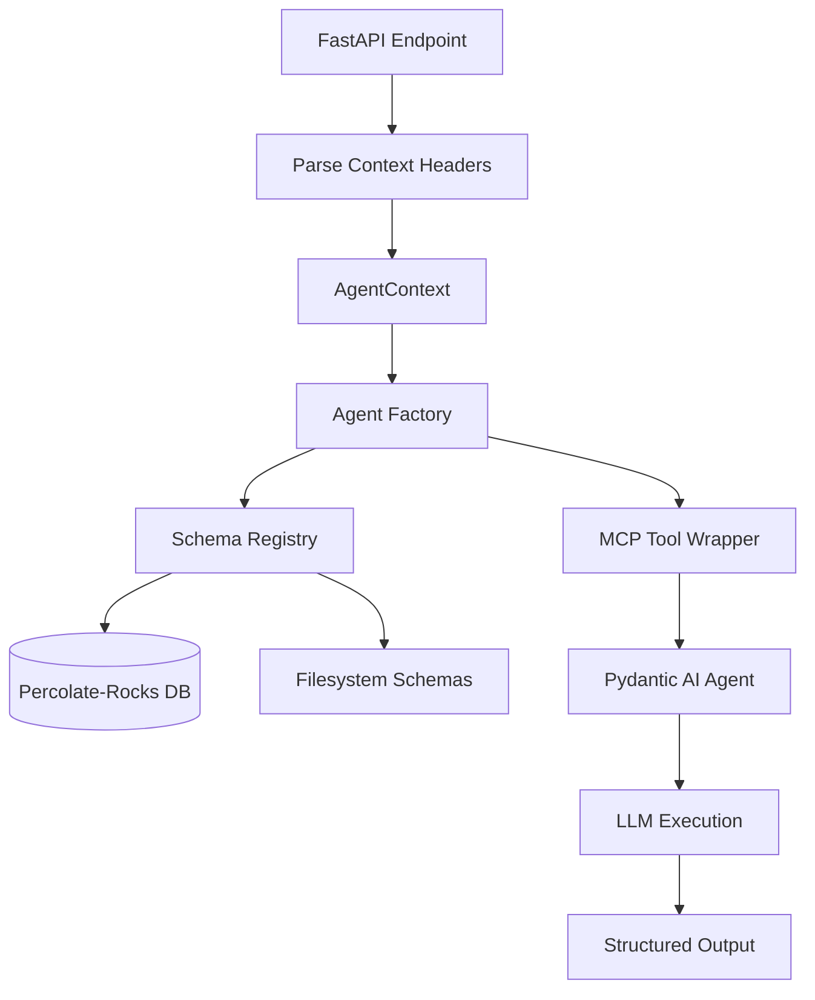

# Agent-let Framework for Percolate-Rocks

**Pydantic AI-based agent factory with dynamic MCP tool integration and percolate-rocks database persistence.**

## Overview

This implementation provides a complete agent-let framework based on the carrier MCP server patterns, adapted for percolate-rocks database integration. Agent-lets are JSON Schema-defined AI skills stored as entities in the REM database.

**Key features:**
- Dynamic agent creation from JSON schemas
- MCP tool dynamic loading and wrapping for Pydantic AI
- Tenant isolation via percolate-rocks database
- Context propagation through HTTP headers
- Structured output validation
- OpenTelemetry instrumentation (future)

## Architecture



## Components

### 1. AgentContext (`src/agents/context.py`)

Execution context carrying configuration through the stack:

```python
from agents import AgentContext

# Create from headers
ctx = AgentContext.from_headers(
    headers=request.headers,
    tenant_id="tenant-123"
)

# Or manually
ctx = AgentContext(
    tenant_id="tenant-123",
    user_id="user-456",
    session_id="session-abc",
    agent_schema_uri="researcher",
    default_model="claude-sonnet-4.5",
    db_path="~/.p8/db/"
)
```

**Fields:**
- `tenant_id`: Required. Data isolation scope in percolate-rocks
- `user_id`: Optional. User identifier
- `session_id`: Optional. Session/chat identifier for history
- `device_id`: Optional. Device identifier for auth
- `default_model`: LLM model (default: claude-sonnet-4.5)
- `agent_schema_uri`: URI to agent schema (e.g., 'researcher')
- `db_path`: Path to percolate-rocks database (None = default)

### 2. Schema Registry (`src/agents/registry.py`)

Loads agent-let schemas from percolate-rocks database or filesystem:

```python
from agents import load_agentlet_schema

# System agent from filesystem
schema = load_agentlet_schema("test-agent", tenant_id="default")

# User agent from database (TODO: implement DB query)
schema = load_agentlet_schema(
    "user/tenant-123/my-agent",
    tenant_id="tenant-123",
    db_path="~/.p8/db/"
)
```

**URI formats:**
- System: `researcher`, `test-agent` → `schema/agentlets/{name}.json`
- User: `user/{tenant_id}/{name}` → percolate-rocks entity lookup

**Database integration (TODO):**
```python
# Future: Query percolate-rocks for user agent-lets
# db = Database(db_path)
# result = db.query(
#     "SELECT * FROM agentlet WHERE tenant_id = ? AND short_name = ?",
#     params=[tenant_id, agent_name]
# )
```

### 3. Tool Wrapper (`src/agents/tool_wrapper.py`)

Bridges MCP tools to Pydantic AI:

```python
from agents import create_pydantic_tool

# MCP tool function (with ctx parameter)
async def search_memory(ctx, query: str, limit: int = 10) -> list:
    """Search memory for relevant documents."""
    # Implementation
    pass

# Convert to Pydantic AI tool
tool = create_pydantic_tool(search_memory)

# Use in agent
agent = Agent(model, tools=[tool])
```

**How it works:**
1. Extracts function signature (skips `ctx` parameter)
2. Builds JSON schema from type hints
3. Creates async wrapper calling MCP tool with `ctx=None`
4. Returns `Tool.from_schema()` with `takes_ctx=False`

### 4. Agent Factory (`src/agents/factory.py`)

Creates Pydantic AI agents from schemas:

```python
from agents import create_agent, AgentContext

ctx = AgentContext(
    tenant_id="tenant-123",
    agent_schema_uri="researcher"
)

# Create agent
agent = await create_agent(ctx)

# Execute
result = await agent.run("Research the history of databases")

# Access structured output
print(result.data.summary)
print(result.data.key_insights)
print(result.data.confidence)
```

**Features:**
- Dynamic Pydantic model generation from JSON schema
- MCP tool loading from schema metadata
- Schema wrapper to strip redundant descriptions
- Model override support
- Structured output validation

## Agent-let Schemas

Agent-let schemas are JSON Schema documents with extensions:

```json
{
  "title": "ResearchAgent",
  "description": "You are an expert research assistant...",
  "version": "1.0.0",
  "short_name": "researcher",
  "fully_qualified_name": "percolate.agents.researcher.ResearchAgent",
  "json_schema_extra": {
    "tools": [
      {
        "mcp_server": "percolate",
        "tool_name": "search_memory",
        "usage": "Use this to perform semantic search"
      }
    ],
    "resources": [],
    "embedding_fields": ["description"]
  },
  "properties": {
    "summary": {
      "type": "string",
      "description": "Research summary"
    },
    "confidence": {
      "type": "number",
      "minimum": 0.0,
      "maximum": 1.0
    }
  },
  "required": ["summary", "confidence"]
}
```

**Key fields:**
- `description`: System prompt for the agent
- `properties`: Structured output schema
- `required`: Required output fields
- `json_schema_extra.tools`: MCP tools to attach
- `json_schema_extra.embedding_fields`: Fields to embed for similarity search

**Provided schemas:**
- `test-agent.json`: Simple test agent with answer/reasoning/confidence
- `researcher.json`: Research agent with search_memory and lookup_entity tools

## API Integration

FastAPI example with context header parsing:

```python
from fastapi import FastAPI, Header, Request
from agents import AgentContext, create_agent

app = FastAPI()

@app.post("/v1/agents/ask")
async def ask_agent(
    body: AgentRequest,
    x_tenant_id: str = Header(alias="X-Tenant-ID"),
    x_user_id: str | None = Header(default=None, alias="X-User-ID"),
    x_session_id: str | None = Header(default=None, alias="X-Session-ID"),
    x_model_name: str | None = Header(default=None, alias="X-Model-Name"),
):
    # Extract context from headers
    ctx = AgentContext(
        tenant_id=x_tenant_id,
        user_id=x_user_id,
        session_id=x_session_id,
        default_model=x_model_name or "claude-sonnet-4.5",
        agent_schema_uri=body.agent_uri,
    )

    # Create and execute agent
    agent = await create_agent(ctx)
    result = await agent.run(body.prompt)

    return {"result": result.data.model_dump()}
```

**Standard headers:**
- `X-Tenant-ID`: Required. Tenant identifier
- `X-User-ID`: Optional. User identifier
- `X-Session-ID`: Optional. Session identifier
- `X-Device-ID`: Optional. Device identifier
- `X-Model-Name`: Optional. Override default model
- `X-Agent-Schema`: Optional. Agent schema URI
- `X-DB-Path`: Optional. Database path override

**Example request:**
```bash
curl -X POST http://localhost:8000/v1/agents/ask \
  -H "Content-Type: application/json" \
  -H "X-Tenant-ID: tenant-123" \
  -H "X-Session-ID: session-abc" \
  -d '{
    "agent_uri": "test-agent",
    "prompt": "What is 2 + 2?"
  }'
```

## Database Integration (TODO)

Agent-let schemas will be stored in percolate-rocks as entities:

**Schema registration:**
```python
# TODO: Implement once percolate-rocks Python bindings are ready
from rem_db import Database

db = Database("~/.p8/db/")

# Register agentlet schema
db.insert(
    schema_name="agentlet",
    data={
        "title": "MyAgent",
        "description": "Custom agent...",
        "tenant_id": "tenant-123",
        "short_name": "my-agent",
        "fully_qualified_name": "user.tenant-123.my-agent",
        # ... rest of schema
    }
)

# Query agentlets for tenant
results = db.query(
    "SELECT * FROM agentlet WHERE tenant_id = ?",
    params=["tenant-123"]
)
```

**Semantic search for agents:**
```python
# TODO: Implement agent discovery via embeddings
results = db.search(
    schema_name="agentlet",
    query="research and knowledge synthesis",
    limit=5,
    filters={"tenant_id": "tenant-123"}
)
```

## Testing

Run integration tests:

```bash
# Install dependencies
pip install pytest pytest-asyncio pydantic-ai

# Run tests
pytest tests/integration/test_agent_framework.py -v

# Skip tests requiring API key
pytest tests/integration/test_agent_framework.py -v -m "not skip"
```

**Test coverage:**
- Schema loading (filesystem and database placeholders)
- Context creation and header parsing
- Agent factory and model generation
- Agent execution (requires API key, skipped by default)

## Implementation Status

**✅ Completed:**
- AgentContext model with header parsing
- Schema registry with filesystem loading
- Tool wrapper for MCP → Pydantic AI conversion
- Agent factory with dynamic model generation
- Schema wrapper to avoid description duplication
- Example schemas (test-agent, researcher)
- API integration example
- Integration tests

**🔨 TODO:**
- Percolate-rocks database query integration
- User agent-let storage and retrieval
- MCP tool implementations (search_memory, lookup_entity)
- Agent discovery via semantic search
- OpenTelemetry instrumentation
- Session and message history storage
- Agent evaluation framework

## Key Design Patterns

### 1. Schema Dumper Pattern

The model's docstring IS the system prompt. We strip it from the LLM schema to avoid duplication:

```python
class SchemaWrapper(result_type):
    @classmethod
    def model_json_schema(cls, **kwargs):
        schema = super().model_json_schema(**kwargs)
        schema.pop("description", None)  # Remove to avoid duplication
        return schema
```

### 2. Context Propagation

Context flows through the entire stack via `AgentContext`:

```
HTTP Headers → AgentContext → create_agent() → load_agentlet_schema()
                            → _build_mcp_tools() → Tool execution
```

### 3. Dynamic Model Generation

JSON Schema properties → Pydantic model at runtime:

```python
field_definitions = {}
for field_name, field_spec in properties.items():
    field_type = type_map.get(field_spec.get("type"))
    field_definitions[field_name] = (field_type, Field(description=...))

return create_model(model_name, **field_definitions)
```

### 4. Tool Factory Pattern

MCP tools are loaded and wrapped dynamically from schema metadata:

```python
tools = []
for tool_config in schema["json_schema_extra"]["tools"]:
    mcp_tool_func = mcp_tools[tool_config["tool_name"]]
    tool = create_pydantic_tool(mcp_tool_func)
    tools.append(tool)
```

## References

- **Carrier project**: Source of agent-let patterns
- **Pydantic AI**: https://ai.pydantic.dev
- **FastMCP**: https://github.com/jlowin/fastmcp
- **Percolate-Rocks**: REM database implementation

## Next Steps

1. **Implement percolate-rocks Python bindings** for database queries
2. **Create MCP tool implementations** (search_memory, lookup_entity, etc.)
3. **Add OpenTelemetry instrumentation** for observability
4. **Implement agent evaluation framework** with Phoenix integration
5. **Add session/message history** storage in percolate-rocks
6. **Build agent discovery UI** with semantic search
