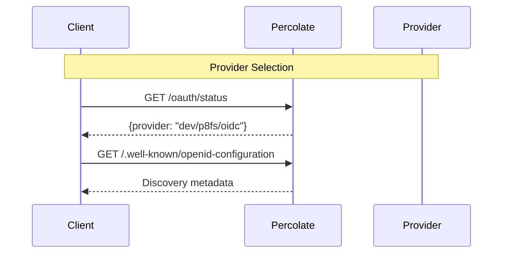
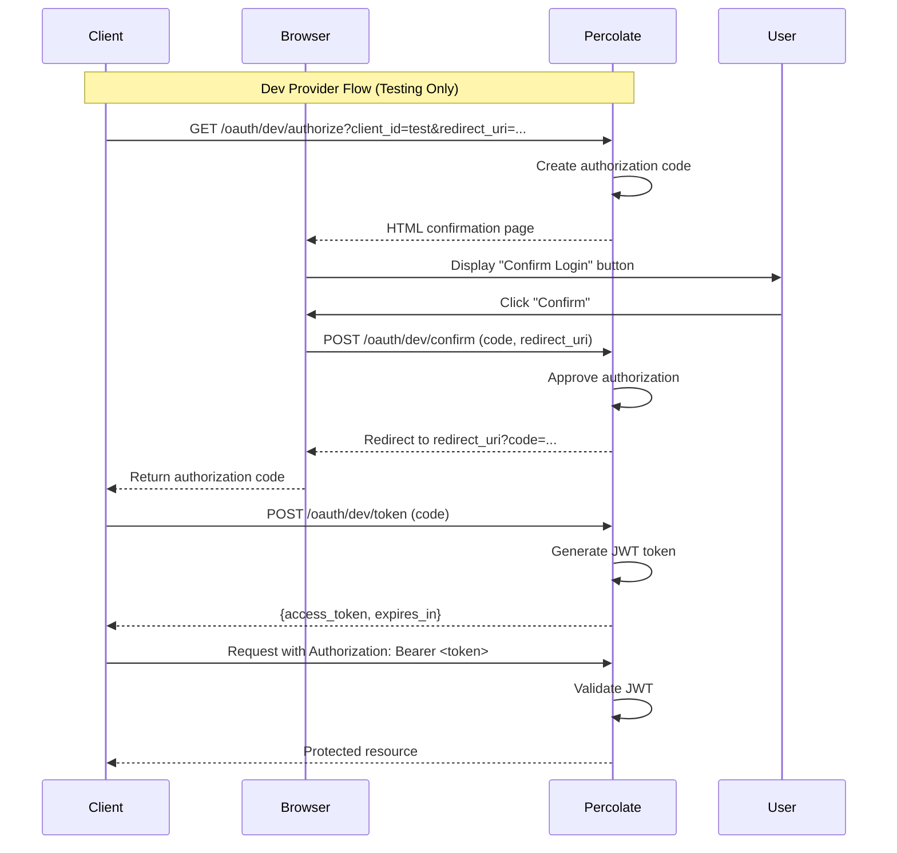
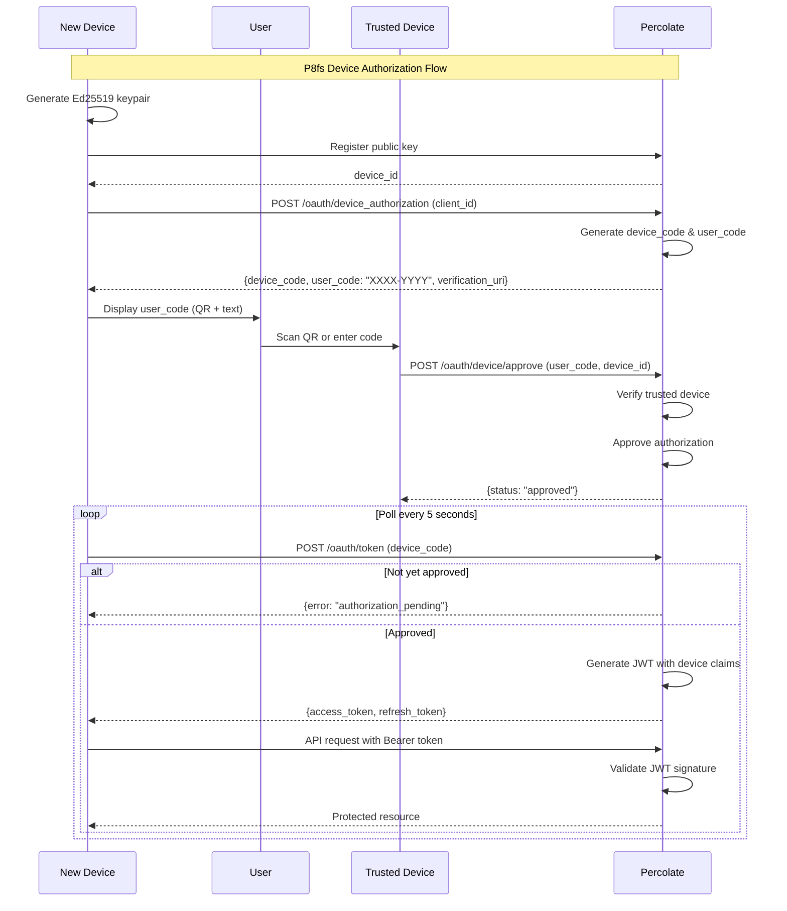
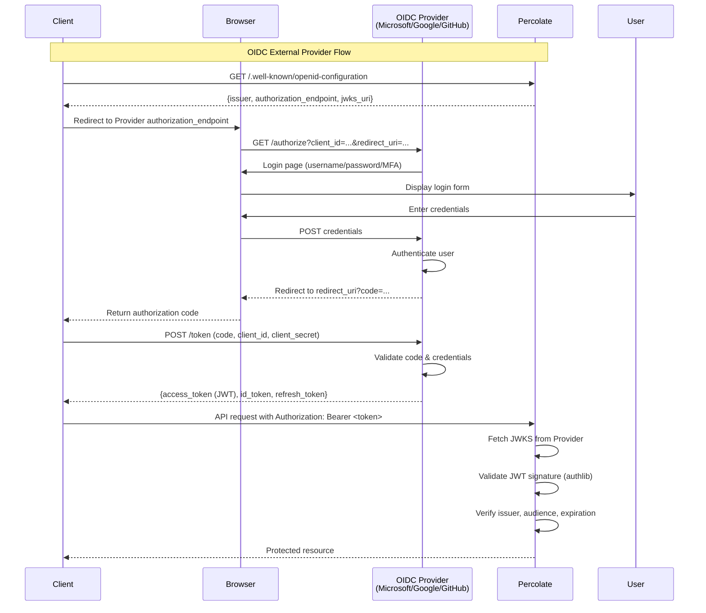

# Percolate Authentication System

OAuth 2.1 authentication with pluggable provider support.

## Overview

**Authentication Flows:**



Percolate supports multiple authentication providers for different deployment scenarios:

| Provider | Use Case | Security Level | Production Ready |
|----------|----------|----------------|------------------|
| **disabled** | Local development, testing | None | No |
| **dev** | MCP testing, CI/CD | Minimal | No |
| **p8fs** | Mobile-first, custom auth | High | Yes |
| **oidc** | Enterprise SSO (Microsoft, Google, GitHub) | High | Yes |

## Configuration

Authentication is configured via environment variables using nested `AUTH__` prefix:

```bash
# Enable/disable authentication
AUTH__ENABLED=false

# Provider selection (disabled, dev, p8fs, oidc)
AUTH__PROVIDER=p8fs

# JWT settings (for p8fs and dev providers)
AUTH__JWT_SECRET_KEY=your-secret-key-change-in-production
AUTH__JWT_ALGORITHM=ES256
AUTH__ACCESS_TOKEN_EXPIRE_MINUTES=60
AUTH__REFRESH_TOKEN_EXPIRE_DAYS=30

# OIDC external provider settings (for oidc provider)
AUTH__OIDC_ISSUER_URL=https://login.microsoftonline.com/{tenant}/v2.0
AUTH__OIDC_AUDIENCE=api
AUTH__OIDC_CLIENT_ID=your-client-id
AUTH__OIDC_CLIENT_SECRET=your-client-secret
AUTH__OIDC_JWKS_CACHE_TTL=3600
```

## Provider Details

### Disabled Provider

No authentication required - all endpoints are public.

**Configuration:**
```bash
AUTH__ENABLED=false
```

**Use for:**
- Local development
- Internal tools
- Testing

**NOT for production.**

### Dev Provider

Simple click-to-confirm authentication for testing OAuth flows.

**Configuration:**
```bash
AUTH__ENABLED=true
AUTH__PROVIDER=dev
```

**Flow:**



**Steps:**
1. Client initiates OAuth → redirects to `/oauth/dev/authorize`
2. User clicks "Confirm" button → auto-approves
3. Client exchanges code for JWT token at `/oauth/dev/token`

**Endpoints:**
- `GET /oauth/dev/authorize` - Authorization page (HTML)
- `POST /oauth/dev/confirm` - Confirm authorization
- `POST /oauth/dev/token` - Exchange code for token

**Use for:**
- MCP client testing
- OAuth flow development
- CI/CD pipelines
- Integration testing

**NOT for production** - no real credentials, in-memory state, self-signed tokens.

### P8fs Provider

Mobile-first authentication with device authorization flow (RFC 8628).

**Configuration:**
```bash
AUTH__ENABLED=true
AUTH__PROVIDER=p8fs
AUTH__JWT_SECRET_KEY=your-secret-key
AUTH__JWT_ALGORITHM=ES256
```

**Flow:**



**Steps:**
1. Device generates Ed25519 keypair (private key never leaves device)
2. Device registers public key → gets `device_id`
3. Device initiates flow → gets `user_code` (XXXX-YYYY format)
4. User approves via trusted device (QR scan or manual code entry)
5. Device polls token endpoint → receives JWT access token

**Security features:**
- Ed25519 public key cryptography
- Progressive trust levels (unverified → email_verified → trusted)
- Device-bound tokens
- QR code + manual approval

**Use for:**
- Mobile apps
- Desktop apps
- IoT devices
- Personal AI systems

**Production ready:** Yes

### OIDC Provider

External OpenID Connect providers (Microsoft Entra ID, Google, GitHub, etc.).

**Configuration for Microsoft Entra ID:**
```bash
AUTH__ENABLED=true
AUTH__PROVIDER=oidc
AUTH__OIDC_ISSUER_URL=https://login.microsoftonline.com/{tenant-id}/v2.0
AUTH__OIDC_AUDIENCE=api://percolate-api
AUTH__OIDC_CLIENT_ID=your-application-client-id
AUTH__OIDC_CLIENT_SECRET=your-client-secret
```

**Configuration for Google:**
```bash
AUTH__ENABLED=true
AUTH__PROVIDER=oidc
AUTH__OIDC_ISSUER_URL=https://accounts.google.com
AUTH__OIDC_AUDIENCE={client-id}.apps.googleusercontent.com
AUTH__OIDC_CLIENT_ID=your-client-id
AUTH__OIDC_CLIENT_SECRET=your-client-secret
```

**Flow:**



**Steps:**
1. Client redirects user to external provider (Microsoft/Google/GitHub)
2. User authenticates with provider
3. Provider issues JWT token
4. Client includes token in `Authorization: Bearer {token}` header
5. Percolate validates token against provider's JWKS

**Security features:**
- JWKS-based token validation (authlib/joserfc)
- Automatic key rotation support
- Standard OAuth 2.1/OIDC compliance
- MFA support (via provider)

**Use for:**
- Enterprise deployments
- Multi-tenant SaaS
- SSO integration
- Compliance requirements

**Production ready:** Yes

## Public Endpoints

These endpoints are **always public** (no authentication required):

- `GET /` - API information
- `GET /health` - Health check
- `GET /status` - System status
- `GET /version` - Version information
- `GET /docs` - OpenAPI documentation
- `GET /oauth/.well-known/openid-configuration` - OAuth discovery
- `GET /oauth/status` - Auth status and configuration
- `GET /oauth/userinfo` - User information (requires token)

## Protected Endpoints

These endpoints **require authentication** when `AUTH__ENABLED=true`:

- `POST /v1/agents/eval` - Agent evaluation
- `POST /mcp` - MCP protocol endpoint

## FastAPI Integration

### Protecting Routes

Use FastAPI dependencies to require authentication:

```python
from fastapi import APIRouter, Depends
from percolate.auth import OptionalUser, RequiredUser, User

router = APIRouter()

# Optional authentication (works with auth enabled or disabled)
@router.get("/optional")
async def optional_endpoint(user: OptionalUser):
    if user:
        return {"message": f"Hello {user.name}"}
    return {"message": "Hello anonymous"}

# Required authentication (401 if not authenticated)
@router.get("/protected")
async def protected_endpoint(user: RequiredUser):
    return {"user_id": user.user_id, "email": user.email}

# Manual dependency
@router.get("/manual")
async def manual_endpoint(user: User = Depends(require_auth)):
    return {"message": f"Authenticated as {user.user_id}"}
```

### User Object

```python
class User(BaseModel):
    user_id: str              # User ID (sub claim)
    email: str | None         # User email
    name: str | None          # Display name
    tenant_id: str | None     # Tenant identifier
    scopes: list[str]         # Granted scopes
    metadata: dict[str, Any]  # Provider-specific data
```

## OAuth Discovery

OAuth/OIDC discovery metadata is available at:

```bash
GET /.well-known/openid-configuration
```

Returns provider configuration:
```json
{
  "issuer": "https://api.percolate.app",
  "authorization_endpoint": "...",
  "token_endpoint": "...",
  "jwks_uri": "...",
  "response_types_supported": ["code"],
  "grant_types_supported": ["authorization_code", "refresh_token"],
  "scopes_supported": ["read", "write", "admin"]
}
```

## Testing Authentication

### Test with dev provider

1. Enable dev provider:
```bash
AUTH__ENABLED=true
AUTH__PROVIDER=dev
```

2. Start server:
```bash
uv run percolate serve
```

3. Open authorization URL:
```
http://localhost:8000/oauth/dev/authorize?client_id=test&redirect_uri=http://localhost:8000/callback&response_type=code
```

4. Click "Confirm" button

5. Exchange code for token:
```bash
curl -X POST http://localhost:8000/oauth/dev/token \
  -d "grant_type=authorization_code" \
  -d "code=YOUR_CODE" \
  -d "redirect_uri=http://localhost:8000/callback"
```

6. Use token:
```bash
curl http://localhost:8000/v1/agents/eval \
  -H "Authorization: Bearer YOUR_TOKEN" \
  -H "Content-Type: application/json" \
  -d '{"agent_uri": "test", "prompt": "hello"}'
```

### Test with disabled auth

```bash
AUTH__ENABLED=false
```

All endpoints are public - no token required.

## MCP Authentication

FastMCP clients automatically discover and authenticate:

1. Client connects to MCP endpoint
2. If auth required, server returns 401 with OAuth discovery metadata
3. Client initiates OAuth flow (device flow or authorization code)
4. User approves authorization
5. Client receives token and includes in subsequent requests

**Dev provider** is ideal for MCP testing - simple click-to-confirm flow.

## Security Best Practices

### Development

- Use `AUTH__ENABLED=false` or `AUTH__PROVIDER=dev`
- Never commit secrets to git
- Use `.env` file (ignored by git)

### Production

- Always use `AUTH__ENABLED=true`
- Use strong `AUTH__JWT_SECRET_KEY` (32+ random bytes)
- Use `AUTH__PROVIDER=oidc` for enterprise SSO
- Use `AUTH__PROVIDER=p8fs` for mobile/IoT devices
- Enable HTTPS (OAuth 2.1 requirement)
- Configure CORS properly
- Use environment variables (never hardcode secrets)
- Rotate secrets periodically
- Monitor failed authentication attempts
- Enable rate limiting

### OIDC Provider Setup

**Microsoft Entra ID:**
1. Register app in Azure Portal
2. Add redirect URI: `https://your-domain.com/callback`
3. Create client secret
4. Configure `AUTH__OIDC_*` variables

**Google:**
1. Create project in Google Cloud Console
2. Enable Google Sign-In API
3. Create OAuth 2.0 credentials
4. Configure authorized redirect URIs
5. Configure `AUTH__OIDC_*` variables

## Troubleshooting

### Authentication disabled but getting 401

Check `AUTH__ENABLED` is explicitly `false`:
```bash
echo $AUTH__ENABLED  # Should print "false"
```

### Token validation failing

1. Check issuer URL matches:
```bash
# OIDC provider
curl $AUTH__OIDC_ISSUER_URL/.well-known/openid-configuration
```

2. Check audience claim:
```bash
# Decode JWT (jwt.io)
# Verify "aud" matches AUTH__OIDC_AUDIENCE
```

3. Check JWKS cache:
```bash
# Increase cache TTL
AUTH__OIDC_JWKS_CACHE_TTL=7200
```

### Dev provider not working

1. Check provider is configured:
```bash
AUTH__ENABLED=true
AUTH__PROVIDER=dev
```

2. Check authorization flow:
```
GET /oauth/dev/authorize?client_id=test&redirect_uri=http://localhost/callback&response_type=code
```

3. Check server logs for errors

## Implementation Details

### Provider Interface

All providers implement `OAuthProvider` interface:

```python
class OAuthProvider(ABC):
    @abstractmethod
    async def validate_token(self, token: str) -> User:
        """Validate bearer token and return user."""
        pass

    @abstractmethod
    async def get_discovery_metadata(self, base_url: str) -> dict[str, Any]:
        """Get OAuth/OIDC discovery metadata."""
        pass

    @abstractmethod
    def get_provider_name(self) -> str:
        """Get provider identifier."""
        pass
```

### JWT Validation

- **P8FS/Dev:** Self-signed JWTs validated with `JWTManager`
- **OIDC:** External JWTs validated with authlib/joserfc (2025 best practice)

### Token Storage

- **Dev provider:** In-memory (lost on restart)
- **P8FS provider:** Redis/PostgreSQL (persistent)
- **OIDC provider:** No storage (tokens validated via JWKS)

## References

- [OAuth 2.1 Specification](https://oauth.net/2.1/)
- [RFC 8628 - Device Authorization Grant](https://www.rfc-editor.org/rfc/rfc8628.html)
- [OpenID Connect Discovery](https://openid.net/specs/openid-connect-discovery-1_0.html)
- [FastAPI Security](https://fastapi.tiangolo.com/tutorial/security/)
- [FastMCP Authentication](https://github.com/jlowin/fastmcp#authentication)
- [Authlib](https://docs.authlib.org/)
