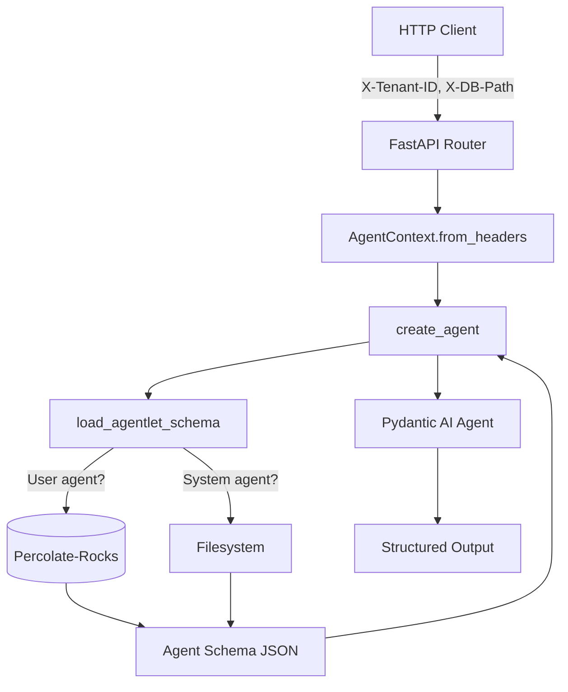

# Percolate-Rocks Database Integration Points

**Updated:** 2025-10-25

This document describes the integration points where the percolate package will connect to the percolate-rocks database for agent-let persistence and retrieval.

## Overview

The agent-let framework in `percolate/src/percolate/agents/` is ready for percolate-rocks integration. All database operations are clearly marked with `TODO` comments and placeholder implementations showing the expected API usage.

## Updated Files

### 1. AgentContext (`src/percolate/agents/context.py`)

**Added field:**
```python
db_path: str | None = Field(
    default=None,
    description="Path to percolate-rocks database (None = default ~/.p8/db/)"
)
```

**Updated `from_headers()` method:**
- Now parses `X-DB-Path` header
- Passes `db_path` to agent creation flow

### 2. Schema Registry (`src/percolate/agents/registry.py`)

**Updated function signatures:**
- `load_agentlet_schema(uri, tenant_id="default", db_path=None)`
- `list_user_agentlets(tenant_id, db_path=None)`

**New helper functions:**
- `_load_user_agentlet()`: User agent loading with tenant isolation
- `_load_system_agentlet()`: System agent loading from filesystem

**Integration points marked with TODO:**

```python
# TODO: Import percolate-rocks package once available
# from percolate_rocks import Database

def _load_user_agentlet(uri: str, tenant_id: str, db_path: str | None):
    # TODO: Replace with percolate-rocks database query
    # db = Database(db_path or "~/.p8/db/")
    # result = db.query(
    #     """
    #     SELECT * FROM agentlet
    #     WHERE tenant_id = ? AND short_name = ?
    #     """,
    #     params=[tenant_id, agent_name]
    # )
    # if not result:
    #     raise FileNotFoundError(f"Agent-let not found: {uri}")
    # return result[0]

    raise FileNotFoundError("TODO: Implement percolate-rocks entity lookup...")
```

### 3. Agent Factory (`src/percolate/agents/factory.py`)

**Updated schema loading:**
```python
if agent_schema is None and context and context.agent_schema_uri:
    # Load from percolate-rocks database or filesystem
    agent_schema = load_agentlet_schema(
        uri=context.agent_schema_uri,
        tenant_id=context.tenant_id,
        db_path=context.db_path
    )
```

### 4. API Router (`src/percolate/api/routers/agents.py`)

**Already supports context headers:**
- `X-Tenant-Id`: Tenant identifier (required)
- `X-Session-Id`: Session identifier (optional)
- `X-User-Id`: User identifier (optional)

**To add:**
- `X-DB-Path`: Database path override (optional)

## Percolate-Rocks Schema for Agent-lets

Agent-let schemas should be stored as entities in percolate-rocks:

```python
# Expected agentlet entity schema
class AgentletEntity(BaseModel):
    """Agent-let stored in percolate-rocks."""

    # Identity fields
    fully_qualified_name: str = Field(description="Unique identifier")
    short_name: str = Field(description="Short name for CLI/API")
    title: str = Field(description="Human-readable title")

    # Tenant isolation
    tenant_id: str = Field(description="Owner tenant ID")

    # Agent configuration
    description: str = Field(description="System prompt for agent")
    version: str = Field(default="1.0.0", description="Semantic version")

    # Schema structure
    properties: dict[str, Any] = Field(description="Output schema properties")
    required: list[str] = Field(default_factory=list, description="Required fields")

    # MCP integration
    json_schema_extra: dict[str, Any] = Field(
        default_factory=dict,
        description="Tools, resources, embedding config"
    )

    # Metadata
    created_at: str = Field(description="Creation timestamp")
    updated_at: str = Field(description="Last update timestamp")

    model_config = ConfigDict(
        json_schema_extra={
            "embedding_fields": ["description"],  # For agent similarity search
            "indexed_fields": ["tenant_id", "short_name"],  # For fast queries
            "key_field": "fully_qualified_name"
        }
    )
```

## Database Operations Required

### 1. Load User Agent-let

**Location:** `src/percolate/agents/registry.py:_load_user_agentlet()`

```python
from percolate_rocks import Database

db = Database(db_path or "~/.p8/db/")
result = db.query(
    """
    SELECT * FROM agentlet
    WHERE tenant_id = ? AND short_name = ?
    """,
    params=[tenant_id, agent_name]
)

if not result:
    raise FileNotFoundError(f"Agent-let not found: {uri}")

return result[0]  # Return first match as dict
```

**Expected behavior:**
- Query `agentlet` schema in percolate-rocks
- Filter by `tenant_id` for isolation
- Filter by `short_name` for agent lookup
- Return full JSON schema dict

### 2. List User Agent-lets

**Location:** `src/percolate/agents/registry.py:list_user_agentlets()`

```python
db = Database(db_path or "~/.p8/db/")
results = db.query(
    "SELECT * FROM agentlet WHERE tenant_id = ?",
    params=[tenant_id]
)

return results  # List of dicts
```

**Expected behavior:**
- Query all agent-lets for tenant
- Return list of agent metadata dicts

### 3. Create User Agent-let

**Location:** `src/percolate/mcp/tools/agent.py:create_agent()`

```python
db = Database(db_path or "~/.p8/db/")

# Build agent schema
agent_schema = {
    "title": agent_name.title().replace("-", ""),
    "description": description,
    "fully_qualified_name": f"user.{tenant_id}.{agent_name}",
    "short_name": agent_name,
    "tenant_id": tenant_id,
    "version": "1.0.0",
    "properties": output_schema.get("properties", {}),
    "required": output_schema.get("required", []),
    "json_schema_extra": {
        "tools": tools or [],
        "resources": [],
        "embedding_fields": ["description"]
    },
    "created_at": datetime.utcnow().isoformat(),
    "updated_at": datetime.utcnow().isoformat(),
}

# Insert into percolate-rocks
db.insert(
    schema_name="agentlet",
    data=agent_schema
)

return {
    "status": "success",
    "uri": f"user/{tenant_id}/{agent_name}",
    "fully_qualified_name": agent_schema["fully_qualified_name"]
}
```

**Expected behavior:**
- Insert agent-let entity into percolate-rocks
- Auto-generate embeddings for `description` field
- Create deterministic UUID from `fully_qualified_name`
- Support upsert (update if exists)

### 4. Search Agent-lets by Similarity

**Location:** Future feature (not yet implemented)

```python
db = Database(db_path or "~/.p8/db/")

# Semantic search for agent-lets
results = db.search(
    schema_name="agentlet",
    query="research and knowledge synthesis",
    limit=10,
    filters={"tenant_id": tenant_id}  # Tenant isolation
)

return results
```

**Expected behavior:**
- Semantic search using embeddings
- Filter by tenant_id
- Return ranked results with similarity scores

## Context Header Flow



**Headers supported:**
- `X-Tenant-ID`: Required. Tenant identifier for database scoping
- `X-User-ID`: Optional. User identifier
- `X-Session-ID`: Optional. Session identifier for history
- `X-Device-ID`: Optional. Device identifier
- `X-Model-Name`: Optional. Override default model
- `X-Agent-Schema`: Optional. Agent schema URI
- `X-DB-Path`: Optional. Database path override

## Testing Integration

Once percolate-rocks Python package is available:

```python
import pytest
from percolate_rocks import Database
from percolate.agents import AgentContext, create_agent

@pytest.fixture
def db():
    """Create test database."""
    db = Database(":memory:")  # Or temp path
    # Register agentlet schema
    db.register_schema("agentlet", AgentletEntity)
    return db

def test_create_and_load_user_agent(db):
    """Test creating and loading user agent from database."""
    # Create agent
    agent_data = {
        "title": "TestAgent",
        "short_name": "test-agent",
        "tenant_id": "tenant-123",
        "fully_qualified_name": "user.tenant-123.test-agent",
        "description": "Test agent",
        "properties": {"answer": {"type": "string"}},
        "required": ["answer"],
        "json_schema_extra": {"tools": []},
        "created_at": "2025-01-01T00:00:00Z",
        "updated_at": "2025-01-01T00:00:00Z",
    }

    db.insert(schema_name="agentlet", data=agent_data)

    # Load agent
    from percolate.agents.registry import load_agentlet_schema

    schema = load_agentlet_schema(
        uri="user/tenant-123/test-agent",
        tenant_id="tenant-123",
        db_path=db.path
    )

    assert schema["title"] == "TestAgent"
    assert schema["tenant_id"] == "tenant-123"
```

## Next Steps

1. **Implement percolate-rocks Python package** with:
   - `Database` class with `query()` and `insert()` methods
   - Schema registration via Pydantic models
   - Auto-embedding on insert
   - Tenant isolation support

2. **Update agent-let framework** to use real database:
   - Replace TODO placeholders in `registry.py`
   - Implement `create_agent` in `mcp/tools/agent.py`
   - Add tests with actual database

3. **Add semantic agent search**:
   - Implement agent discovery via embeddings
   - Add `/v1/agents/search` endpoint
   - Support "find agents similar to..." queries

4. **Session and message history**:
   - Store agent interactions in percolate-rocks
   - Link sessions to agent-lets
   - Support conversation history retrieval

## Summary

**✅ Ready for integration:**
- AgentContext with db_path field
- Schema registry with database placeholders
- Agent factory with proper parameter passing
- API routers with context header support
- Clear TODO markers for all database operations

**🔨 Next:**
- Implement percolate-rocks Python bindings
- Replace TODO placeholders with actual DB calls
- Add comprehensive integration tests
- Document agent-let schema in percolate-rocks

All placeholder code includes example API usage showing exactly what the percolate-rocks package should provide.
