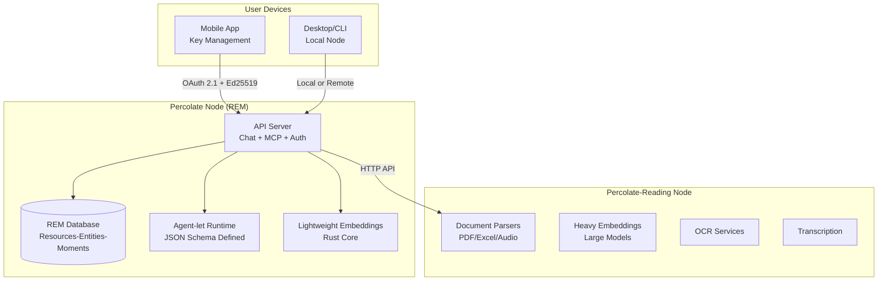
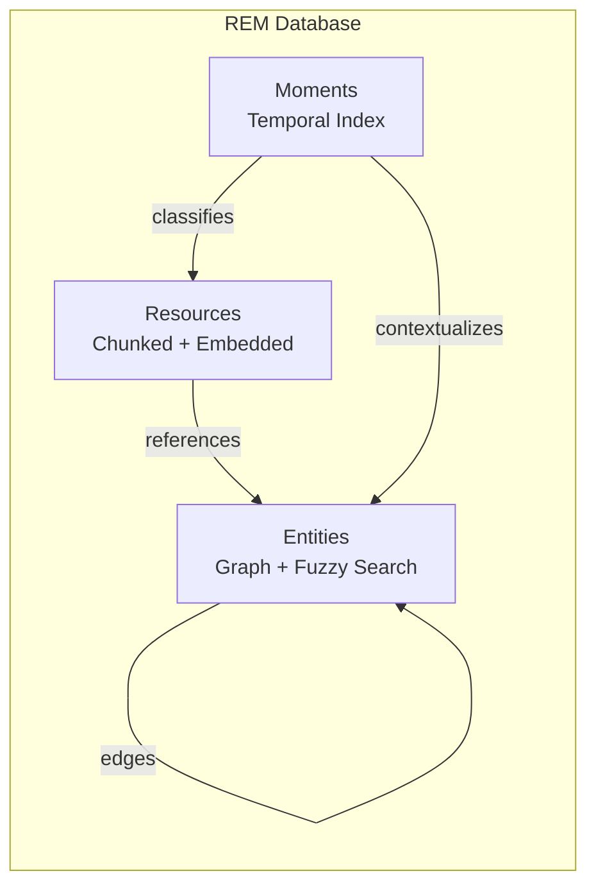
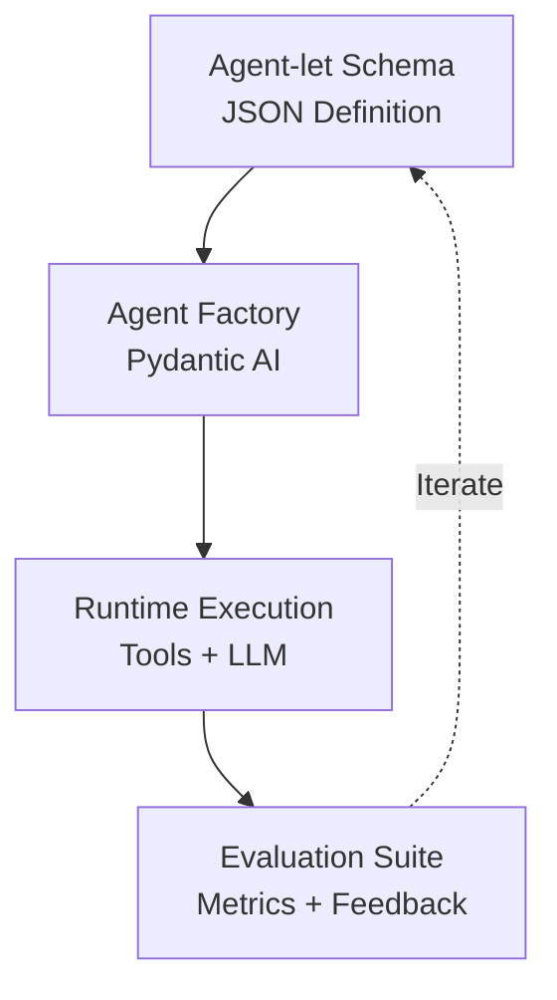
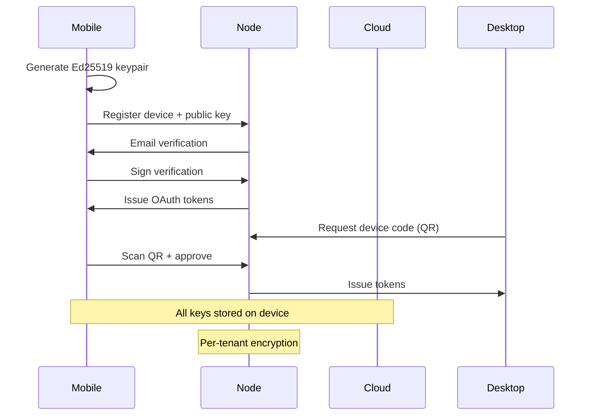

# System Overview

## Table of Contents

- [Architecture](#architecture)
- [Core Components](#core-components)
- [Technology Stack](#technology-stack)
- [Deployment Models](#deployment-models)
- [API Surface](#api-surface)

## Architecture

Percolate is a privacy-first personal AI node that runs anywhere. It combines bio-inspired memory systems, privacy-first architecture, and trainable agent-lets into infrastructure for owning, training, and deploying personal AI systems.

### Two-Node Architecture

Percolate uses a specialized node architecture for optimal performance and resource usage:

| Node | Purpose | Runs On | Key Features |
|------|---------|---------|--------------|
| **Percolate (REM)** | Memory, agents, API | Desktop, mobile, cloud | Lightweight, embedded DB, fast |
| **Percolate-Reading** | Document processing | Cloud, dedicated server | Heavy models, OCR, transcription |



**Why Two Nodes?**

- **Percolate**: Runs everywhere with minimal resources
- **Percolate-Reading**: Deployed separately for heavy processing, scales independently
- **API boundary**: Clean separation via HTTP, both use Pydantic Settings

## Core Components

### 1. REM Memory System

**Resources-Entities-Moments** is a bio-inspired memory architecture:

| Memory Type | Description | Storage | Use Case |
|------------|-------------|---------|----------|
| **Resources** | Semantic searchable chunks | Vector embeddings | Documents, files, content |
| **Entities** | Key-value domain knowledge | Graph + KV | People, concepts, patterns |
| **Moments** | Temporal classifications | Time-indexed | Events, conversations, history |



**Features:**
- Iterated retrieval through entity relationships
- Hybrid search combining vectors, fuzzy matching, graph traversal
- Tenant scoped with complete data isolation
- Efficient storage in embedded RocksDB or PostgreSQL

### 2. Agent-let Framework

Agent-lets are AI skills defined as JSON schemas:



**Characteristics:**
- Data-driven (system prompts, tools, outputs in JSON)
- Versioned (semantic versioning)
- Evaluable (cost/quality metrics)
- Composable (agents call agents via MCP)
- Observable (OpenTelemetry instrumentation)

### 3. Privacy-First Authentication



**Security Features:**
- Mobile as keychain (private keys never leave device)
- OAuth 2.1 compliance (PKCE mandatory)
- Ed25519 signatures for device authentication
- Per-tenant encryption at rest
- S3 credential derivation via HKDF

## Technology Stack

| Layer | Technology | Purpose |
|-------|-----------|---------|
| **Runtime** | Python (uv) | API server, orchestration |
| **Core** | Rust (PyO3) | Memory engine, embeddings, parsing |
| **Database** | RocksDB / PostgreSQL | Embedded / enterprise |
| **Vectors** | HNSW (Rust) / pgvector | Semantic search |
| **API** | FastAPI | HTTP server |
| **Auth** | OAuth 2.1 + JWT | Authentication |
| **Agents** | Pydantic AI | Agent framework |
| **MCP** | FastMCP | Tool protocol |
| **Observability** | OpenTelemetry + Phoenix | Tracing and evaluation |

## Deployment Models

### Local (Desktop/Mobile)

```bash
percolate run --local
```

- Embedded RocksDB database
- Local file storage
- Optional cloud LLM API calls
- Full offline operation (with local models)

### Cloud (Multi-tenant)

```
tenant.percolationlabs.ai
```

- Isolated RocksDB per tenant
- Encrypted S3 storage
- Gateway routing to tenant nodes
- Shared embedding/LLM services
- Cold archival for old data

### Hybrid

- Primary node on device
- Cloud sync for backup
- Shared agent-lets across devices
- Gateway for mobile app API

## API Surface

| Endpoint | Purpose | Protocol |
|----------|---------|----------|
| `/v1/chat/completions` | OpenAI-compatible chat | HTTP/SSE streaming |
| `/v1/ingest/upload` | Document upload + parsing | HTTP multipart |
| `/mcp` | Model Context Protocol | SSE |
| `/oauth/*` | OAuth 2.1 flows | HTTP |
| `/.well-known/openid-configuration` | OIDC discovery | HTTP |

**MCP Tools Exposed:**
- `search_knowledge_base` - Unified search across REM
- `lookup_entity` - Entity graph navigation
- `parse_document` - Document processing
- `create_agent` - Dynamic agent-let instantiation
- `submit_feedback` - Evaluation feedback collection
