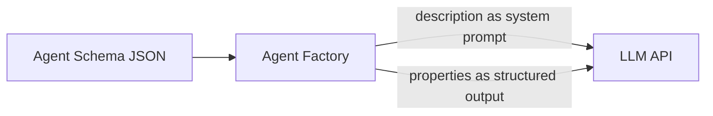

# Agent-lets

## Table of Contents

- [Overview](#overview)
- [Schema Structure](#schema-structure)
- [System Prompts and Structured Output](#system-prompts-and-structured-output)
- [Factory Pattern](#factory-pattern)
- [Tool Integration](#tool-integration)
- [Versioning](#versioning)

## Overview

Agent-lets are AI skills defined as JSON schemas. They are data artifacts that can be trained, evaluated, versioned, and shared.

**Key Principles:**
- Agents are data, not code
- System prompts and output schemas defined in JSON
- MCP tool references (not inline functions)
- Semantic versioning for iteration
- Observable via OpenTelemetry

## Schema Structure

### Minimal Example

```json
{
  "fully_qualified_name": "percolate-agents-researcher",
  "short_name": "researcher",
  "version": "1.0.0",
  "description": "You are a research assistant...",
  "output_schema": {
    "type": "object",
    "properties": {
      "findings": {
        "type": "array",
        "description": "Research findings"
      },
      "sources": {
        "type": "array",
        "description": "Source references"
      }
    },
    "required": ["findings", "sources"]
  },
  "tools": [
    {
      "mcp_server": "percolate",
      "tool_name": "search_knowledge_base",
      "usage": "Search REM memory for relevant information"
    }
  ]
}
```

### Schema Fields

| Field | Type | Required | Description |
|-------|------|----------|-------------|
| `fully_qualified_name` | string | Yes | Unique identifier (namespace-agents-name) |
| `short_name` | string | Yes | Short name for CLI/UI |
| `version` | string | Yes | Semantic version (1.0.0) |
| `description` | string | Yes | System prompt (instructions, role, process) |
| `output_schema` | object | Yes | JSON Schema for structured output |
| `tools` | array | No | MCP tool references |
| `metadata` | object | No | Additional metadata (tags, author, etc.) |

## System Prompts and Structured Output

Agent schemas have **two critical components** that both get sent to the LLM:

1. **`description` field** - System prompt (agent's instructions, role, process)
2. **`properties` field** - Structured output schema (field definitions, types, constraints)

### How It Works



When creating an agent:

```python
# Agent schema loaded from JSON
schema = {
    "description": "You are a CDA Mapping Expert...",  # System prompt
    "properties": {                                     # Output schema
        "carrier_name": {"type": "string", "description": "..."},
        "mappings": {"type": "array", "description": "...", ...}
    }
}

# Pydantic AI agent created
agent = Agent(
    model="claude-sonnet-4-5-20250929",
    system_prompt=schema["description"],      # Instructions sent to LLM
    output_type=OutputModel,                   # Schema sent to LLM
    tools=[...]
)
```

**What gets sent to the LLM:**
- The entire `description` as system prompt
- JSON schema from `properties` (field names, types, descriptions)
- For Anthropic: uses "tool use" feature for structured output
- For OpenAI: uses "function calling" feature

### Pydantic Convention

In our codebase, we map Pydantic model docstrings to system prompts:

```python
class ResearchAgent(BaseModel):
    """You are a research assistant that searches REM memory.

    Process:
    1. Search for relevant information
    2. Synthesize findings
    3. Cite sources"""  # This becomes the system prompt

    findings: list[str] = Field(description="Research findings")
    sources: list[str] = Field(description="Source references")
```

**Mapping:**
- Model docstring → System prompt (`system_prompt` parameter)
- Field descriptions → Structured output schema (sent to LLM)
- Model-level description → Stripped from schema to avoid redundancy

## Factory Pattern

### Creating Agents

```python
from percolate.agents.factory import create_pydantic_ai_agent
from percolate.agents.context import ExecutionContext

# Create context
context = ExecutionContext(
    tenant_id="user-123",
    session_id="session-abc"
)

# Create agent from Pydantic model
agent = await create_pydantic_ai_agent(
    context=context,
    result_type=ResearchAgent,
    model="claude-sonnet-4-5-20250929"
)

# Run agent
result = await agent.run("Research topic X")
```

### Factory Responsibilities

The factory function:
1. Validates schema structure
2. Extracts system prompt from model docstring
3. Configures structured output from model fields
4. Registers MCP tools
5. Adds OpenTelemetry instrumentation
6. Returns configured Pydantic AI agent

## Tool Integration

### MCP Tool References

Tools are referenced by MCP server and tool name:

```json
{
  "tools": [
    {
      "mcp_server": "percolate",
      "tool_name": "search_knowledge_base",
      "usage": "Search REM memory for relevant information"
    },
    {
      "mcp_server": "percolate",
      "tool_name": "lookup_entity",
      "usage": "Look up entity by name or ID"
    }
  ]
}
```

### Tool Discovery

The factory resolves tool references:

```python
# Factory loads tool implementations
for tool_ref in schema["tools"]:
    tool = mcp_server.get_tool(
        server=tool_ref["mcp_server"],
        name=tool_ref["tool_name"]
    )
    agent.register_tool(tool)
```

### Agent Composition

Agents can call other agents via MCP tools:

```json
{
  "tools": [
    {
      "mcp_server": "percolate",
      "tool_name": "ask_agent",
      "usage": "Delegate to another agent"
    }
  ]
}
```

## Versioning

### Semantic Versioning

Agent-lets use semantic versioning:

| Version | Change Type | Example |
|---------|------------|---------|
| `1.0.0` | Initial release | First working version |
| `1.1.0` | Minor (backwards compatible) | Add new optional field |
| `1.0.1` | Patch (bug fix) | Fix typo in prompt |
| `2.0.0` | Major (breaking change) | Change output schema |

### Version Evolution

```json
// Version 1.0.0
{
  "version": "1.0.0",
  "output_schema": {
    "properties": {
      "findings": {"type": "array"}
    }
  }
}

// Version 1.1.0 - add optional field
{
  "version": "1.1.0",
  "output_schema": {
    "properties": {
      "findings": {"type": "array"},
      "confidence": {"type": "number"}  // New optional field
    }
  }
}

// Version 2.0.0 - breaking change
{
  "version": "2.0.0",
  "output_schema": {
    "properties": {
      "results": {"type": "array"}  // Renamed field (breaking)
    }
  }
}
```

### Best Practices

1. **Start with 1.0.0** - no 0.x versions for production agents
2. **Increment major version** - for breaking changes to output schema
3. **Increment minor version** - for backwards-compatible additions
4. **Increment patch version** - for prompt improvements without schema changes
5. **Track versions in git** - tag releases (v1.0.0)
6. **Document changes** - maintain CHANGELOG.md
