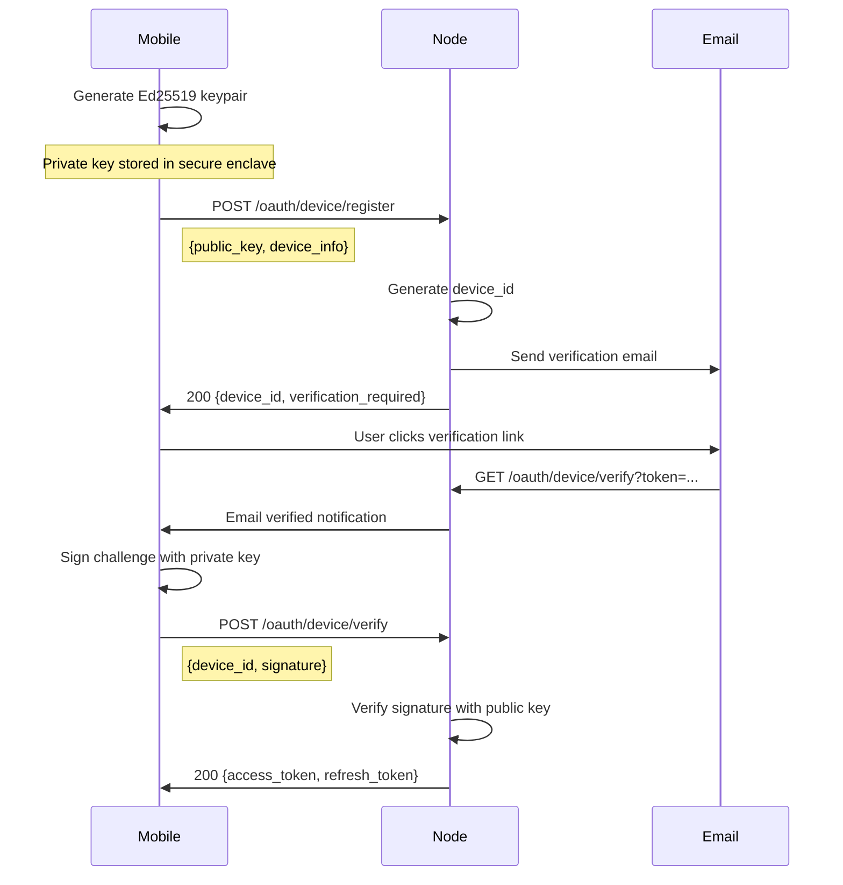
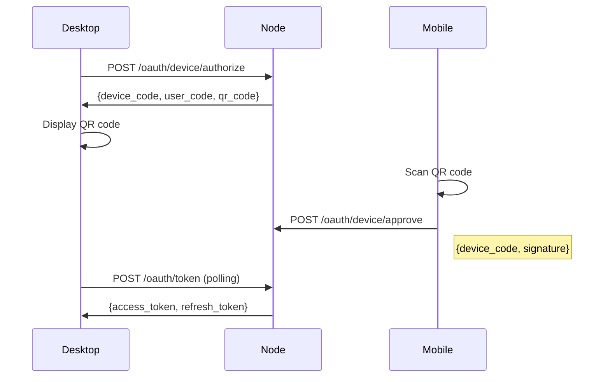
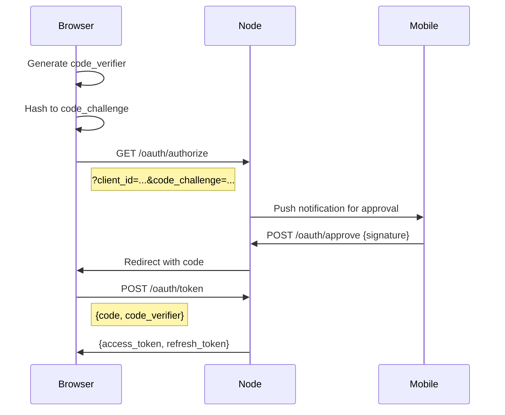

# Authentication

## Table of Contents

- [Overview](#overview)
- [Cryptographic Standards](#cryptographic-standards)
- [Device Registration Flow](#device-registration-flow)
- [OAuth 2.1 Flows](#oauth-21-flows)
- [Tenant Isolation](#tenant-isolation)
- [Security Best Practices](#security-best-practices)

## Overview

Percolate uses **mobile-first authentication** where private keys never leave the device. The mobile app acts as a secure keychain for all authentication operations.

**Key Principles:**
- Private keys stored in device secure enclave
- OAuth 2.1 compliance (PKCE mandatory)
- Ed25519 signatures for device authentication
- Per-tenant encryption at rest
- No implicit grant flow

## Cryptographic Standards

| Use Case | Algorithm | Key Size | Notes |
|----------|-----------|----------|-------|
| **Device Auth** | Ed25519 | 256-bit | Digital signatures |
| **Key Exchange** | X25519 | 256-bit | ECDH for key agreement |
| **JWT Signing** | ES256 | 256-bit | ECDSA P-256 |
| **Key Derivation** | HKDF-SHA256 | - | For S3 credentials |
| **Encryption** | ChaCha20-Poly1305 | 256-bit | AEAD for data at rest |
| **Session Tokens** | Random | 256-bit | Opaque random tokens |

## Device Registration Flow

### Mobile Device Registration



### Registration Request

```http
POST /oauth/device/register
Content-Type: application/json

{
  "public_key": "base64-encoded-ed25519-public-key",
  "device_info": {
    "platform": "iOS",
    "version": "1.0.0",
    "model": "iPhone 15"
  }
}
```

### Verification Request

```http
POST /oauth/device/verify
Content-Type: application/json

{
  "device_id": "uuid",
  "signature": "base64-encoded-signature",
  "challenge": "base64-encoded-challenge"
}
```

## OAuth 2.1 Flows

### Device Code Flow (Desktop)

Used for desktop clients that need to authenticate via mobile:



### Authorization Code Flow (PKCE)

Used for web applications:



### Token Refresh

```http
POST /oauth/token
Content-Type: application/x-www-form-urlencoded

grant_type=refresh_token&
refresh_token=...&
client_id=...
```

## Tenant Isolation

### Storage Isolation

Each tenant has isolated storage:

```
# RocksDB
/data/tenants/{tenant_id}/rocksdb/

# S3 Buckets
s3://percolate-{tenant_id}/
```

### Database Keys

All database keys are scoped to tenant:

```
# Resources
resource:{tenant_id}:{resource_id} → {content, metadata}

# Entities
entity:{tenant_id}:{entity_id} → {type, properties}

# Moments
moment:{tenant_id}:{timestamp}:{moment_id} → {classifications}
```

### Encryption at Rest

Per-tenant encryption keys:

```python
# Derive tenant-specific key from master key
tenant_key = HKDF(
    master_key,
    salt=tenant_id,
    info=b"percolate-tenant-encryption"
)

# Encrypt data with ChaCha20-Poly1305
ciphertext = ChaCha20Poly1305(tenant_key).encrypt(
    nonce=random_nonce(),
    data=plaintext,
    associated_data=tenant_id
)
```

## Security Best Practices

### Token Management

| Token Type | Lifetime | Storage | Refresh |
|-----------|----------|---------|---------|
| **Access Token** | 1 hour | Memory only | Via refresh token |
| **Refresh Token** | 30 days | Secure storage | Rotation on use |
| **Session Token** | 24 hours | HTTP-only cookie | On activity |

### Rate Limiting

Authentication endpoints have rate limiting:

| Endpoint | Limit | Window |
|----------|-------|--------|
| `/oauth/device/register` | 5 requests | 1 hour |
| `/oauth/token` | 10 requests | 1 minute |
| `/oauth/device/verify` | 3 requests | 5 minutes |

### Audit Logging

All security events are logged:

```python
audit_log.record({
    "event": "device_registered",
    "tenant_id": tenant_id,
    "device_id": device_id,
    "ip_address": request.ip,
    "timestamp": datetime.utcnow()
})
```

### Security Headers

All responses include security headers:

```http
Strict-Transport-Security: max-age=31536000; includeSubDomains
Content-Security-Policy: default-src 'self'
X-Frame-Options: DENY
X-Content-Type-Options: nosniff
```

### Key Rotation

Master keys should be rotated periodically:

```bash
# Generate new master key
percolate keys rotate --algorithm ed25519

# Re-encrypt all tenant keys
percolate keys migrate --from-key old.key --to-key new.key
```

### Secure Enclave Integration

Mobile apps use secure enclave for key storage:

```swift
// iOS Secure Enclave
let privateKey = SecKeyCreateRandomKey(
    [kSecAttrTokenID: kSecAttrTokenIDSecureEnclave,
     kSecAttrKeyType: kSecAttrKeyTypeECSECPrimeRandom] as CFDictionary,
    &error
)
```

### API Key Management (Optional)

For service-to-service authentication:

```http
Authorization: Bearer {api_key}
```

API keys:
- Generated per tenant
- Scoped to specific permissions
- Can be revoked instantly
- Logged on every use
