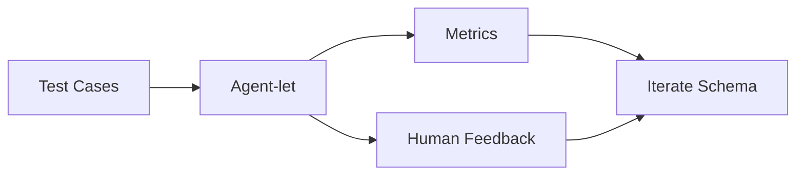
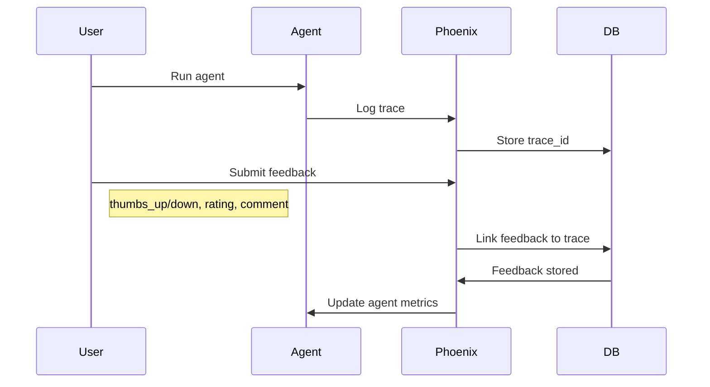

# Evaluations

## Table of Contents

- [Overview](#overview)
- [Evaluation Framework](#evaluation-framework)
- [Metrics](#metrics)
- [Test Cases](#test-cases)
- [Feedback Loop](#feedback-loop)
- [Observability](#observability)

## Overview

Percolate uses systematic evaluation to improve agent-lets through iteration. Evaluation combines automated metrics, test cases, and human feedback to measure agent quality.

**Key Principles:**
- Measure before optimizing
- Track cost and quality together
- Use Phoenix for observability
- Iterate based on data

## Evaluation Framework

### Evaluation Pipeline



### Evaluation Run

```python
from percolate.agents.factory import create_pydantic_ai_agent
from percolate.agents.context import ExecutionContext

# Load test cases
test_cases = load_test_cases("research-agent-v1")

# Create agent
context = ExecutionContext(tenant_id="eval", session_id="eval-123")
agent = await create_pydantic_ai_agent(
    context=context,
    result_type=ResearchAgent
)

# Run evaluations
results = []
for case in test_cases:
    result = await agent.run(case.input)
    metrics = evaluate_result(result, case.expected)
    results.append({
        "case": case,
        "result": result,
        "metrics": metrics
    })

# Aggregate metrics
summary = aggregate_metrics(results)
```

## Metrics

### Automated Metrics

| Metric | Type | Description | Target |
|--------|------|-------------|--------|
| **Accuracy** | Quality | Correct outputs / total | > 90% |
| **Latency** | Performance | P95 response time | < 2s |
| **Cost** | Efficiency | USD per 1k runs | < $0.50 |
| **Token Usage** | Efficiency | Avg tokens per run | < 2000 |
| **Tool Calls** | Efficiency | Avg tools per run | < 5 |

### Quality Metrics

```python
def evaluate_quality(result, expected) -> dict:
    """Evaluate result quality"""
    return {
        "accuracy": calculate_accuracy(result, expected),
        "completeness": calculate_completeness(result, expected),
        "relevance": calculate_relevance(result, expected),
        "format_valid": validate_format(result)
    }
```

### Cost Metrics

```python
def evaluate_cost(result) -> dict:
    """Evaluate result cost"""
    return {
        "total_tokens": result.usage.total_tokens,
        "prompt_tokens": result.usage.prompt_tokens,
        "completion_tokens": result.usage.completion_tokens,
        "cost_usd": calculate_cost(result.usage, result.model),
        "tool_calls": len(result.tool_calls)
    }
```

### Performance Metrics

```python
def evaluate_performance(result) -> dict:
    """Evaluate result performance"""
    return {
        "latency_ms": result.latency_ms,
        "ttft_ms": result.time_to_first_token_ms,
        "tokens_per_second": result.tokens_per_second
    }
```

## Test Cases

### Test Case Format

```json
{
  "id": "test-001",
  "name": "Basic research query",
  "input": "Research authentication flows",
  "expected": {
    "findings": ["...", "..."],
    "sources": ["...", "..."]
  },
  "metadata": {
    "category": "research",
    "difficulty": "easy"
  }
}
```

### Test Case Types

| Type | Purpose | Count | Example |
|------|---------|-------|---------|
| **Happy path** | Typical usage | 10-20 | Standard queries |
| **Edge cases** | Boundary conditions | 5-10 | Empty input, very long input |
| **Error cases** | Invalid input | 5-10 | Missing fields, wrong types |
| **Performance** | Stress testing | 5-10 | Large documents, complex queries |

### Creating Test Cases

```python
from percolate.agents.evals import TestCase

test_cases = [
    TestCase(
        id="test-001",
        name="Basic research query",
        input="Research authentication flows",
        expected={
            "findings": [
                "OAuth 2.1 is the modern standard",
                "PKCE is mandatory"
            ],
            "sources": ["docs/auth.md"]
        }
    ),
    TestCase(
        id="test-002",
        name="Empty query",
        input="",
        expected_error="Query cannot be empty"
    )
]
```

## Feedback Loop

### Human Feedback Collection



### Feedback Types

| Type | Format | Use Case |
|------|--------|----------|
| **Thumbs up/down** | Boolean | Quick feedback |
| **Rating** | 1-5 scale | Quality rating |
| **Comment** | Text | Specific issues |
| **Correction** | JSON | Expected output |

### Submitting Feedback

```python
from percolate.mcp.tools import submit_feedback

# Thumbs up
await submit_feedback(
    session_id="session-123",
    feedback_type="thumbs_up",
    rating="great"
)

# With comment
await submit_feedback(
    session_id="session-123",
    feedback_type="comment",
    feedback_text="Missing source citations"
)

# With correction
await submit_feedback(
    session_id="session-123",
    feedback_type="correction",
    feedback_text="Expected output should include X"
)
```

## Observability

### Phoenix Integration

Percolate uses Arize Phoenix for observability:

```python
from opentelemetry import trace
from opentelemetry.exporter.otlp.proto.http.trace_exporter import OTLPSpanExporter
from opentelemetry.sdk.trace import TracerProvider
from opentelemetry.sdk.trace.export import SimpleSpanProcessor

# Configure Phoenix
tracer_provider = TracerProvider()
tracer_provider.add_span_processor(
    SimpleSpanProcessor(
        OTLPSpanExporter(endpoint="http://localhost:6006/v1/traces")
    )
)
trace.set_tracer_provider(tracer_provider)
```

### Trace Annotation

All agent runs are traced:

```python
from opentelemetry import trace

tracer = trace.get_tracer(__name__)

with tracer.start_as_current_span("agent.run") as span:
    span.set_attribute("agent.name", agent_name)
    span.set_attribute("agent.version", agent_version)
    span.set_attribute("input.length", len(input))

    result = await agent.run(input)

    span.set_attribute("output.length", len(result))
    span.set_attribute("cost.tokens", result.usage.total_tokens)
    span.set_attribute("cost.usd", result.cost_usd)
```

### Metrics Dashboard

Phoenix provides a dashboard for:

- Trace visualization
- Latency distribution
- Cost tracking
- Error rates
- Feedback analysis

### Cost Tracking

```python
# Track cost per agent run
with tracer.start_as_current_span("agent.run") as span:
    result = await agent.run(input)

    span.set_attribute("cost.model", result.model)
    span.set_attribute("cost.prompt_tokens", result.usage.prompt_tokens)
    span.set_attribute("cost.completion_tokens", result.usage.completion_tokens)
    span.set_attribute("cost.total_tokens", result.usage.total_tokens)
    span.set_attribute("cost.usd", result.cost_usd)

# Aggregate cost by agent
total_cost = sum(
    span.attributes.get("cost.usd", 0)
    for span in phoenix.get_spans(agent_name=agent_name)
)
```

### Error Tracking

```python
# Track errors with context
try:
    result = await agent.run(input)
except Exception as e:
    span.record_exception(e)
    span.set_status(Status(StatusCode.ERROR))
    raise
```

## Best Practices

### Evaluation Strategy

1. **Start with test cases** - define expected behavior
2. **Measure baseline** - establish current performance
3. **Iterate schema** - improve based on metrics
4. **Validate improvement** - re-run test cases
5. **Monitor production** - track real usage

### Metric Selection

1. **Quality first** - accuracy > speed
2. **Track cost** - optimize for efficiency
3. **Monitor latency** - ensure responsive UX
4. **Collect feedback** - real user input
5. **Aggregate metrics** - look at trends

### Test Case Design

1. **Realistic inputs** - match production usage
2. **Edge cases** - test boundaries
3. **Expected outputs** - clear success criteria
4. **Version control** - track test case changes
5. **Regular updates** - add new cases as needed

### Feedback Collection

1. **Make it easy** - thumbs up/down buttons
2. **Capture context** - link to traces
3. **Ask specific questions** - guide feedback
4. **Act on feedback** - iterate based on input
5. **Close the loop** - communicate improvements
