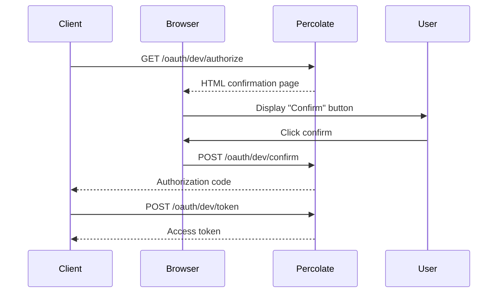
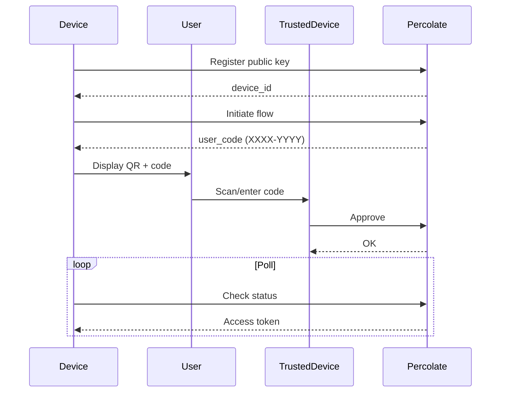
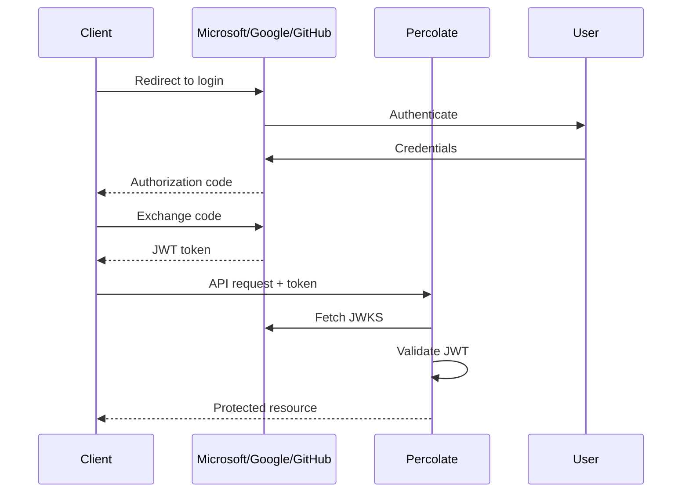

# Authentication Implementation Summary

Comprehensive OAuth 2.1 authentication system with pluggable provider support.

## What Was Implemented

### Core Architecture

**Provider System:**
- Abstract `OAuthProvider` interface for extensibility
- Four providers: disabled, dev, p8fs, oidc
- Factory pattern for provider instantiation
- FastAPI dependency injection for route protection

### Providers

| Provider | Status | Security | Use Case |
|----------|--------|----------|----------|
| **disabled** | ✅ Complete | None | Local development |
| **dev** | ✅ Complete | Minimal | MCP testing, CI/CD |
| **p8fs** | ✅ Complete | High | Mobile/IoT devices |
| **oidc** | ✅ Complete | High | Enterprise SSO |

### Configuration System

**Nested Settings (Pydantic):**
```python
class AuthSettings(BaseSettings):
    enabled: bool
    provider: str
    jwt_secret_key: str
    jwt_algorithm: str
    # OIDC settings
    oidc_issuer_url: str
    oidc_audience: str
    # ...
```

**Environment Variables:**
```bash
AUTH__ENABLED=true
AUTH__PROVIDER=oidc
AUTH__OIDC_ISSUER_URL=https://...
```

### FastAPI Integration

**Dependencies:**
```python
from percolate.auth import OptionalUser, RequiredUser

# Optional auth (works with enabled or disabled)
@router.get("/endpoint")
async def endpoint(user: OptionalUser):
    if user:
        return {"user_id": user.user_id}
    return {"message": "anonymous"}

# Required auth (401 if not authenticated)
@router.get("/protected")
async def protected(user: RequiredUser):
    return {"email": user.email}
```

**Routes:**
- `/oauth/.well-known/openid-configuration` - OAuth discovery
- `/oauth/status` - Auth status and configuration
- `/oauth/userinfo` - User information (requires token)
- `/oauth/dev/*` - Dev provider endpoints
- `/health`, `/status` - Public health checks

### Dev Provider Features

**HTML Confirmation Page:**
```html
<!-- Simple click-to-confirm for testing -->
<button>✓ Confirm Login</button>
```

**Flow:**
1. Client → `GET /oauth/dev/authorize`
2. User → Click "Confirm"
3. Client → `POST /oauth/dev/token` (exchange code)
4. Client → Use token in API requests

**Perfect for MCP testing** - no complex setup required.

## Sequence Diagrams

### Dev Provider Flow



### P8fs Device Flow



### OIDC External Provider



## Technical Details

### JWT Validation

**P8fs/Dev Providers:**
- Self-signed JWTs with `JWTManager`
- ES256 algorithm (Ed25519)
- Custom claims: `sub`, `tenant`, `device`, `scope`

**OIDC Provider:**
- External JWTs validated via JWKS
- Uses **authlib/joserfc** (2025 best practice)
- Supports RS256, RS384, RS512, ES256
- Automatic key rotation

### Dependencies

**Modern Libraries (2025):**
- `authlib` - JOSE/JWT validation (replaces python-jose)
- `httpx` - Async HTTP client
- `fastapi` - Web framework
- `pydantic-settings` - Configuration
- `loguru` - Logging

### File Structure

```
src/percolate/auth/
├── __init__.py              # Module exports
├── providers.py             # Base provider interface
├── provider_p8fs.py         # P8fs mobile provider
├── provider_oidc.py         # OIDC external provider
├── provider_dev.py          # Dev/test provider
├── provider_factory.py      # Provider factory
├── dependencies.py          # FastAPI dependencies
├── models.py                # Data models
├── device.py                # Device flow logic
├── jwt_manager.py           # JWT operations
└── middleware.py            # Auth middleware

src/percolate/api/routers/
├── oauth.py                 # OAuth discovery routes
├── oauth_dev.py             # Dev provider routes
└── health.py                # Health/status routes
```

## Configuration Examples

### Local Development (No Auth)

```bash
AUTH__ENABLED=false
```

### Testing with Dev Provider

```bash
AUTH__ENABLED=true
AUTH__PROVIDER=dev
AUTH__JWT_SECRET_KEY=dev-secret-key
```

### Production with Microsoft Entra ID

```bash
AUTH__ENABLED=true
AUTH__PROVIDER=oidc
AUTH__OIDC_ISSUER_URL=https://login.microsoftonline.com/{tenant-id}/v2.0
AUTH__OIDC_AUDIENCE=api://percolate-api
AUTH__OIDC_CLIENT_ID=your-client-id
AUTH__OIDC_CLIENT_SECRET=your-client-secret
```

### Production with P8fs

```bash
AUTH__ENABLED=true
AUTH__PROVIDER=p8fs
AUTH__JWT_SECRET_KEY=your-strong-secret-key-here
AUTH__JWT_ALGORITHM=ES256
AUTH__ACCESS_TOKEN_EXPIRE_MINUTES=60
```

## Testing

### Manual Testing with Dev Provider

1. **Start server:**
```bash
AUTH__ENABLED=true AUTH__PROVIDER=dev uv run percolate serve
```

2. **Open browser:**
```
http://localhost:8000/oauth/dev/authorize?client_id=test&redirect_uri=http://localhost/callback&response_type=code
```

3. **Click "Confirm"**

4. **Copy code from URL**

5. **Exchange for token:**
```bash
curl -X POST http://localhost:8000/oauth/dev/token \
  -d "grant_type=authorization_code" \
  -d "code=YOUR_CODE" \
  -d "redirect_uri=http://localhost/callback"
```

6. **Use token:**
```bash
curl http://localhost:8000/oauth/status \
  -H "Authorization: Bearer YOUR_TOKEN"
```

### Automated Testing

```python
import pytest
from fastapi.testclient import TestClient
from percolate.api.main import app

client = TestClient(app)

def test_auth_disabled():
    response = client.get("/oauth/status")
    assert response.status_code == 200
    assert response.json()["enabled"] is False

def test_dev_provider_flow():
    # Authorize
    response = client.get("/oauth/dev/authorize", params={
        "client_id": "test",
        "redirect_uri": "http://localhost/callback",
        "response_type": "code"
    })
    assert response.status_code == 200

    # Confirm
    response = client.post("/oauth/dev/confirm", data={
        "code": "test_code",
        "redirect_uri": "http://localhost/callback"
    })
    assert response.status_code == 302

    # Token
    response = client.post("/oauth/dev/token", data={
        "grant_type": "authorization_code",
        "code": "test_code",
        "redirect_uri": "http://localhost/callback"
    })
    assert response.status_code == 200
    assert "access_token" in response.json()
```

## Security Considerations

### Development

- ✅ Use `AUTH__ENABLED=false` or `AUTH__PROVIDER=dev`
- ✅ Never commit secrets to version control
- ✅ Use `.env` file (gitignored)

### Production

- ✅ Always use `AUTH__ENABLED=true`
- ✅ Use strong random `AUTH__JWT_SECRET_KEY` (32+ bytes)
- ✅ Use `AUTH__PROVIDER=oidc` for enterprise deployments
- ✅ Use `AUTH__PROVIDER=p8fs` for mobile/IoT
- ✅ Enable HTTPS (OAuth 2.1 requirement)
- ✅ Configure proper CORS settings
- ✅ Rotate secrets periodically
- ✅ Monitor authentication failures
- ✅ Enable rate limiting
- ❌ Never use `AUTH__PROVIDER=dev` in production

## Documentation

**Main Documentation:**
- `AUTH.md` - Complete authentication guide with sequence diagrams
- `.env.example` - Configuration examples
- This file - Implementation summary

**API Documentation:**
- Available at `/docs` when server is running
- Includes all OAuth endpoints
- Interactive testing via Swagger UI

## Future Enhancements

### Planned Features

- [ ] P8fs device registration endpoints
- [ ] P8fs device approval UI
- [ ] Refresh token support
- [ ] Token revocation endpoint
- [ ] MCP client auto-authentication
- [ ] Rate limiting middleware
- [ ] Audit logging
- [ ] Multi-factor authentication (MFA)

### Extensibility

Adding new providers is straightforward:

```python
# src/percolate/auth/provider_custom.py
from percolate.auth.providers import OAuthProvider, User

class CustomProvider(OAuthProvider):
    async def validate_token(self, token: str) -> User:
        # Custom validation logic
        pass

    async def get_discovery_metadata(self, base_url: str) -> dict:
        # Provider metadata
        pass

    def get_provider_name(self) -> str:
        return "custom"

# src/percolate/auth/provider_factory.py
def get_auth_provider() -> OAuthProvider | None:
    # ...
    elif provider_name == "custom":
        from percolate.auth.provider_custom import CustomProvider
        return CustomProvider()
```

## References

- [OAuth 2.1 Specification](https://oauth.net/2.1/)
- [RFC 8628 - Device Authorization Grant](https://www.rfc-editor.org/rfc/rfc8628.html)
- [OpenID Connect Discovery](https://openid.net/specs/openid-connect-discovery-1_0.html)
- [FastAPI Security](https://fastapi.tiangolo.com/tutorial/security/)
- [Authlib Documentation](https://docs.authlib.org/)
- [FastMCP Authentication](https://github.com/jlowin/fastmcp)

## Migration Notes

### From Disabled to Dev Provider

```bash
# Before
AUTH__ENABLED=false

# After
AUTH__ENABLED=true
AUTH__PROVIDER=dev
```

No code changes required - all endpoints remain public-accessible.

### From Dev to OIDC Provider

```bash
# Before
AUTH__ENABLED=true
AUTH__PROVIDER=dev

# After
AUTH__ENABLED=true
AUTH__PROVIDER=oidc
AUTH__OIDC_ISSUER_URL=https://login.microsoftonline.com/{tenant}/v2.0
AUTH__OIDC_AUDIENCE=api
AUTH__OIDC_CLIENT_ID=your-client-id
AUTH__OIDC_CLIENT_SECRET=your-client-secret
```

Clients must obtain tokens from external provider instead of dev endpoints.

## Support

For issues or questions:
- Check `AUTH.md` for detailed documentation
- Review sequence diagrams for flow understanding
- Test with dev provider first before production setup
- Enable debug logging: `PERCOLATE_LOG_LEVEL=debug`
